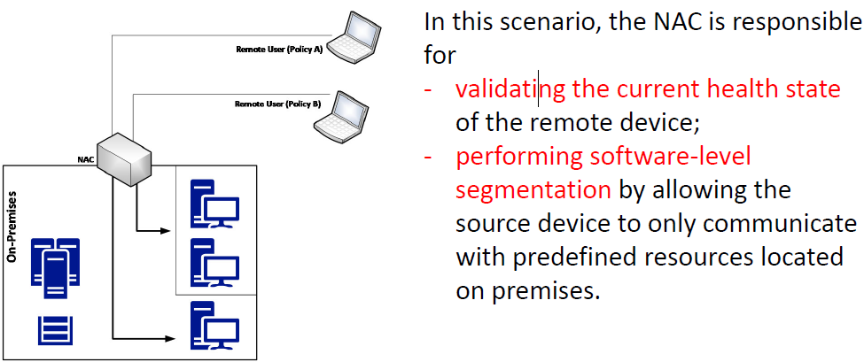
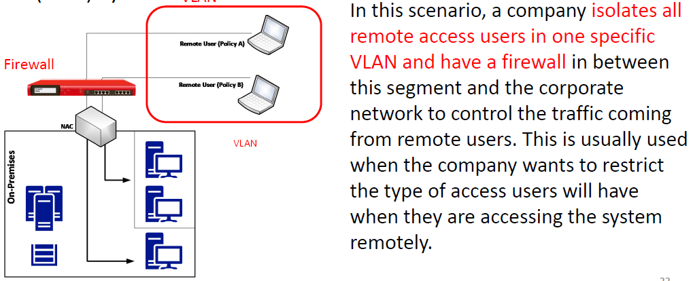
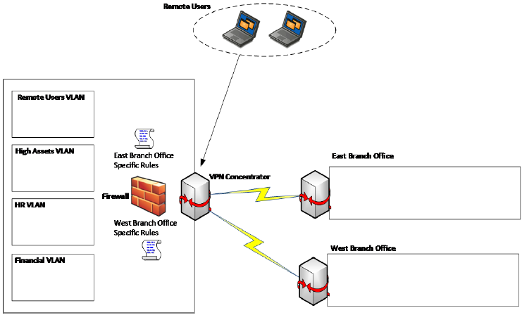
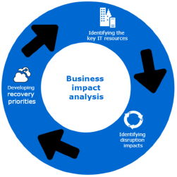

# Table of contents

## Week 1 - Security Posture & Incident Response Process
1. [Security Posture](#security-posture)
2. [Cyber Security Challenges](#cyber-security-challenges)
3. [Red Team and Blue Team](#red-team-and-blue-team)
4. [Incident Response (IR) Process](#incident-response-ir-process)
5. [Cybersecurity Kill Chain](#cybersecurity-kill-chain)
6. [WannaCry](#wannacry)

---

## Week 2 Reconnaissance & Compromising the system
1. [External Reconnaissance](#external-reconnaissance)
2. [Internal Reconnaissance](#internal-reconnaissance)
3. [Compromising the System - Current trends of attack](#compromising-the-system---current-trends-of-attack)
4. [Compromising the system 2](#compromising-the-system-2)
5. [Identity is new Perimeter - BYOD, Cloud Computing](#identity-is-new-perimeter---byod-cloud-computing)
6. [Harvesting Credentials - Unpatched vulnerability and Pass-the-Hash](#harvesting-credentials---unpatched-vulnerability-and-pass-the-hash)
7. [Hacking User's Identity - Brute Force, Social Engineering and Pass-the-Hash](#hacking-users-identity---brute-force-social-engineering-and-pass-the-hash)

---

## Week 3 Lateral Movement and Privilege Escalation & Security Policy and Security Policy Enforcement
1. [Lateral Movement](#lateral-movement)
2. [Windows](#windows)
3. [Privilege Escalation](#privilege-escalation)
4. [What security policies should include](#what-security-policies-should-include)
5. [Differences of Policy, Procedure, Standard, Guidelines and Best Practices](#differences-of-policy-procedure-standard-guidelines-and-best-practices)
6. [The security awareness program – how to make it effective](#the-security-awareness-program--how-to-make-it-effective)
7. [Hardening via The Common Configuration Enumeration (CCE) list](#hardening-via-the-common-configuration-enumeration-cce-list)
8. [Group Policy Object (GPO): Definition/How it can be used](#group-policy-object-gpo-definitionhow-it-can-be-used)
9. [Whitelisting](#whitelisting)

---

## Week 4 Network Segmentation & Active Sensors
1. [Defense‐in‐depth approach](#defenseindepth-approach)
2. [Network Segmentation](#network-segmentation)
3. [Mixed VLAN approach: VLAN designed based on various aspects such as location, business objectives and level of sensitivity](#mixed-vlan-approach-vlan-designed-based-on-various-aspects-such-as-location-business-objectives-and-level-of-sensitivity)
4. [Network Access Control (NAC)](#network-access-control-nac)
5. [Site‐to‐Site VPN: A private channel of communication between the main corporation network and the remote network](#sitetosite-vpn-a-private-channel-of-communication-between-the-main-corporation-network-and-the-remote-network)
6. [Hybrid cloud](#hybrid-cloud)
7. [Traditional defender mindset vs new mindset in relation to monitoring users](#traditional-defender-mindset-vs-new-mindset-in-relation-to-monitoring-users)
8. [Indicator of Compromise (IoC)](#indicator-of-compromise-ioc)
9. [Host-Based IDS vs Network-Based IDS](#host-based-ids-vs-network-based-ids)
10. [Signature-Based IDS vs Behavior-Based IDS](#signature-based-ids-vs-behavior-based-ids)
11. [IDS vs IPS (Intrusion Prevention System)](#ids-vs-ips-intrusion-prevention-system)
12. [Anomaly-Based IPS: The IPS that works by creating baseline model of trustworthy activity through ML and then comparing new behaviour against the model](#anomaly-based-ips-the-ips-that-works-by-creating-baseline-model-of-trustworthy-activity-through-ml-and-then-comparing-new-behaviour-against-the-model)

---

## Week 5 Threat Intelligence and Investigating Incident & Recovery Process
1. [The areas where information obtained from cyberthreat intelligence can be used](#the-areas-where-information-obtained-from-cyberthreat-intelligence-can-be-used)
2. [Example of profiling motivation of the attacker](#example-of-profiling-motivation-of-the-attacker)
3. [Alert triage](#alert-triage)
4. [Scoping in the incident investigation: Definition and Reason](#scoping-in-the-incident-investigation-definition-and-reason)
5. [Disaster Recovery Plan](#disaster-recovery-plan)
6. [Contingency Plan](#contingency-plan)
7. [Business Impact Analysis - Definition, Benefits](#business-impact-analysis---definition-benefits)
8. [Commonly used recovery methods](#commonly-used-recovery-methods)
9. [Live Recovery](#live-recovery)

--- 

## Week 6 Vulnerability Management & Implementing Vulnerability Management
1. [Asset Inventory](#asset-inventory)
2. [Information management](#information-management)
3. [Risk assesment](#risk-assesment)
4. [Role of remediation phase](#role-of-remediation-phase)
5. [An important consideration in reporting phase](#an-important-consideration-in-reporting-phase)
6. [Best practices for vulnerability management](#best-practices-for-vulnerability-management)

---

## Week 7 GDPR, ISO27001, NIST Cybersecurity Framework
1. [GDPR](#gdpr)
2. [ISO27001, NIST CSF](#iso27001-nist-csf)

---

 

## Security Posture

* **SECURITY POSTURE**
    * Detection and Response must be aligned to enhance overall security posture
    
    * Enhancing detection systems to quickly identify attack

    * Enhancing effectiveness of response process to reduce time between infection and containment

 

* **THREAT LANDSCAPE**
    * Remote Access:
        * Number of remote workers are growing. 
        * Employees are using their own infrastructure to access company's resources

     

    * Bring Your Own Device (BYOD):
        * Growth in number of companies allowing BYOD in workplace

        * Most failures in BYOD scenario usually happens because of poor planning and network infrastructure, leading to an insecure implementation
    
 

* **ENTRY POINTS**

    * Entry points for end user based on connectivity to consider:
        1. Between On-Premises and Cloud
        2. Between BYOD devices and Cloud
        3. Between On-Premises and BYOD devices
        4. Between Cloud and Personal devices

 

* **THE CREDENTIALS**
    * Multifactor Authentication (MFA):
        * Using multi factors for authentication. 
        * Using ID/password and One-Time Password (OTP), OTP is delivered through a registered mobile number after user is authenticated by ID/password

        * Other factors can be used for authentication:
            * Biometreic infromation:
                1. Fingerprints
                2. Irises
                3. Face recognition
                4. Voices

     

    * Continuous Monitoring:
        * Continuous monitoring (Continuous Authentication):
            * Technology that uses person's behaviour to continuously verify their identity throughout a session, not just entry login point

 

* **APPLICATIONS (APP)**
    * In-House:
        * Measures should be taken to ensure that apps are using secure framework throughout software developement lifecycle

     

    * Users paying as a service:
        * Vendor's security and compliance policy should be checked carefully to verify if company's security and compliance requirements are met

     

    * Shadow IT:
        * Systems/Program developed by individual departments other than central IT department. Individual departments did not give IT managers the visbility of such systems. 

        * The system gives efficiency but security breaches happen frequently.

        * Can't protect something you don't know you have

 

---

## Cyber Security Challenges 

* **CYBERSECURITY CHALLENGES**
    1. [Malware (Viruses & Trojans)](#top-three-1-2-3)
    2. [Lack of diligence and untrained employees](#top-three-1-2-3)
    3. [Phishing and social engineering](#top-three-1-2-3)
    4. [Targeted Attack](#targeted-attack-4)
    5. [Ransomware](#ransomware-5)
    6. [Government-Sponsored Attack](#government-sponsored-attack-6)

     

    * #### Top three (1., 2., 3.)
        * Usually correlated to ***Human Error***
        * May start with phishing email that uses Social Engineering to lead employee to click on link that may download virus, malware or trojan

        * **HUMANS ARE CONSIDERED AS WEAKEST LINK IN CYBERSECURITY**

     

    * #### Targeted Attack (4.)
        * Attacker has specific target in mind to create plan of attack.
        * Attacker spend a lot of time and resources to perform public reconnaissance to obtain necessary information to carry out attack

         

        * Another attribute for targeted attack is longevity, or amount of time they maintain persistent access to target's network. 

        * Intent is to move laterally across network, compromising different system until goal is achieved.

     

    * #### Ransomware (5.)
        * WannaCry
        * Infected more than 400,000 machines across the globe
        * Ransomware exploited by known Windows SMBv1 vulnerability (EternalBlue) that had patch released in March 2017
        
     

    * #### Government-Sponsored Attack (6.)
        * Intent is to steal information that can be used against hacked party
        * Private sector should not ignore these signs
        * Organisations start to invest more in Threat Intelligence, ML and analytics to protect their assets

     

---

## Red Team and Blue Team

* **RED TEAM AND BLUE TEAM**
    * **CONCEPT**:
        * Originated from WWI, to demonstrate effectiveness of an attack through Simulation

         

        * Red Team:
            * Perform an attack and penetrate the environment by trying to breakthrough current security controls, also known as penetration testing

             

            * Composed of highly trained individuals, with different skill sets and they must be fully aware of current threat landscape for organisation's industry

             

            * Must be aware of trends and understand how current attacks are taking place

             

            * Depending on organisation's requirement, members of Red Team must ***MUST*** have coding skills to create own exploit and customise it to better exploit relevant vulnerabilities that could affect organisation

         

        * Blue Team:
            * Ensure assets are secure and in case Red Team finds vulnerability and exploits it, Blue Team has to rapidly remediate and document as lessons learned

            * Save evidence: 
                * Imperative to save evidence during these incidents to ensure they have tangible information to analyse, rationalise and take action to mitigate in future

             

            * Validate evidence:
                * Not all alert or evidence will be valid attempt to breach system, if it does, it is Indication of Compromise (IoC)

             

            * Engage whoever necessary to engage:
                * Blue Team must know what to do with IoC, which team to be aware of this compromise. Engage all relevant team members to take action

             

            * Triage Incident: 
                * May need to engage law enforcement, or warrant in order to perform further investigation

             

            * Scope the breach:
                * Blue Team have enough information to scope the breach

             

            * Create remediation plan:
                * Put together a remediation plan to either isolate or evict the adversary

             

            * Execute plan:
                * Once plan is finished, Blue Team must execute it and recover from breach

     

    * **PERFORMANCE METRICS**:

        * Red Team:
            1. Mean Time to Compromise (MTTC):
                * Starts counting from the minute that Red Team initiated attack to moment thay they were able to successfully compromise target

             

            2. Mean Time to Privilege Escalation (MTPE):
                * Starts counting from the minute that Red Team initiated attack to moment thay they were able to successfully escalate privilege

             

            * Blue Team:
                1. Estimated Time to Detection (ETTD):
                2. Estimated Time to Recovery (ETTR):
                
                 

                * Metrics is not 100% accurate, Blue Team does not know what time Red Team was able to compromise the system

 

---

## Incident Response (IR) Process

* **CREATING IR PROCESS - FOUNDATIONAL AREAS OF IR PROCESS**

    * Detection: How to handle security incidents
    * Response: How to rapidly respond to them
    * Post Incident: how to use the information learned from the current incident to prevent future incidents

     

    | FOUNDATIONAL AREA OF IR Process         | Definition |
    |----------------------------------|-----------------------------------------------------|
    | Objective                        | - Purpose of this process:   1. Important to clearly define the purpose of the process   2. Everyone should be aware of what this process is trying to accomplish |
    | Scope                            | - To whom this process apply:   1. Company level or department level |
    | Define/Terminology               | - Define what constitutes a security incident and provide examples   - Create own glossary using clearly define terminology |
    | Roles & Responsibilities         | - Define users or groups with a certain level of authority   - Entire company should be aware |
    | Priorities/Severity Level        | - Functional impact of the incident on business   1. Type of information affected   2. Recoverability |

 

* **IR LIFE CYCLE**
    * Successful IR Process
        * Trained IT personel
        * Trained users
        * Good sensors in place
        * Compliant with laws
        
     

    | IR LIFE CYCLE (NIST)       | Definition |
    |----------------------------|------------|
    | Preparation                | - Implementation of security controls based on initial risk assessment   - Implementation of other security controls such as endpoint protection, malware protection and network security   - Preparation phase will receive input from Post-Incident phase               |
    | Detection & Analysis       | - Able to detect attack vectors quickly with reduced false positive, dynamically learn more new threats and behaviours   - Trigger alert if suspicious activity is encountered   - Detection and analysis are done almost in parallel; an attack is on-going when detected|
    | Containment                | - Isolate system or network that is under threat, focus on long-term contain which require temporary adjustment to allow system to be used in production while rebuilding clean system   - Restore affected system ASAP |
    | Eradication                | - Removal of malware on infected devices, acknowledge root cause of the attack and steps to mitigate such attacks |
    | Recovery                   | - Put affected systems back online   - Ensure affected systems are back to normal operations, test, check and track |
    | Post-Incident   Activity| - Documentation of Lesson Learned   - Documentation is the most valuable piece of information in this phase   - Documentation helps to refine the process through identification of gaps in current process and areas of improvement|

 

* **UPDATING YOUR IR PROCESS TO INCLUDE CLOUD**

    * Follow up of IR process to include Cloud
        * Preparation: 
            * Update contact list including cloud provider contact information, on-call process

        * Detection & Analysis:
            * Include cloud provider solution for detection in order to assit during investigation

        * Containment:
            * Revisit cloud provider capabilities to isolate impacted system

 

* **THREAT LIFE CYCLE MANAGEMENT (DETECTION & CONTAINMENT OF INCIDENT LIFE CYCLE) 6 PHASES**
    * 7 domains of typical IT infrastructure: 
        * User Domain, Workstation Domain, LAN Domain, LAN‐to‐WAN Domain, Remote Access Domain, WAN Domain, and System/Application Domain

     

    |THREAT LIFE CYCLE MGMT   | Definition   |
    |-------------------------|--------------------------------------------------------------------------------------------------------------------------------|
    | 1. Forensic data collection | - Threats come through the 7 domains of IT, more IT infrastructure organisation can see == more threats it can detect   - Collection of security event and alarm data   - Collection of log and machine data   - Collection of forensic sensor data                                               |
    | 2. Discovery                | - Search analytics:   1. Software-aided analytics   2. Review reports and identify any known or reported exceptions from network and AV tools  3. Labour intensive    - Machine analytics   1. Software automation to perform analytics                                         |
    | 3. Qualification            | - Determine threats   1. potential impact  2. urgency of resolution 3. Mitigation of threats    - Inefficient qualification may lead to true positives being missed and false-positive being included  - False-positive are waste of resources against non-existent threats  |
    | 4. Investigation            | - Qualified threats are fully investigated to determine if they caused the incident   - Threat might have damaged the organisation before being detected; check for any potential damages  - Continuous access to forensic data and intelligence about large amount of threat                         |
    | 5. Neutralisation           | - Removal or reduction of the impact of an identified threat  - Automated process to ensure higher throughput of deleting threats and ease information sharing and collaboration in organisation                                                                                                          |
    | 6. Recovery                 | - When all threats are neutralized, the risk is put under control  - Restore back to its prior state before being attacked; backtrack to last system restore point  - Ensure no backdoors are introduced and left around                                                                                  |

 

---

## Cybersecurity Kill Chain
* **CYBERSECURITY KILL CHAIN**
    * Consist of 5 stages:
        1. External Reconnaissance (Information Gathering)
        2. Compromising systen
        3. Lateral Movement
        4. Privilege Escalation
        5. Concluding mission

         
            
        - External Reconnaissance (Information Gathering)
            * Harvest as much information about target (Active & Passive)
            * Decide exploitation techniques suitable for each vulnerability

            * Information that attacker gathers:
                * Information is from outside target's network and systems
                * Information includes target's supply chain, obsolete device disposal and employee's social media activities
                * Anyone in organisation can be targeted; including suppliers and customers

             

            * Commonly used techniques to get entry point of organisation's network:
                * Social Engineering attacks
                    * Phishing: Attacker sends target with carefully crafted email, causing them to reveal secret information or open network attacks
                    * Phishing emails usually linked to malware installation
                    * Claimed to be from a legitimate source 

         

        - Compromising 
            * Social Engineering (E.g. phishing, spam, etc.)
            
            * Stolen credentials
                * Attacker gains direct access to computers, servers, or devices within internal network 
            
             

            * Malware infection
                * Infect computer, server, bringing them under command of hacker

         

        - Lateral Movement
            * Popular scanning tools:
                * Metasploit
                * Kali Linux

             

            * Popular Network Scanning Tools 
                * Wireshark
                * Nmap
                * Aircrack-ng
                * Kismet
                * OWASP Zap
            
             

            * Password cracking tool:
                * Hydra
                * Hashcat
                * John the Ripper
                * Cain & Abel
            
             

         

        - Privilege Escalation
            * Vertical escalation
                * **Recall methods of privilege escalation on Linux and Windows**
                * User of higher authority (privilege)
                * Tools are used to escalate privileges
                * Buffer overflow attacks are common for vertical escalation
                * EternalBlue vulnerability
            
             

            * Horizontal escalation
                * User of equal or lower authority but usually with other permissions on other binaries or application that can run with higher authority 
                * Attacks such as session/cookie theft, XSS, password cracking, keylogging
                * Attacker will have several accounts at the same time
                * Attacker will have a well established remote access entry points to target system
                * Attacker will be able to avoid detection by system security

         

        - Concluding the mission
            * Exfiltration & Obfuscation
                * Data exfiltration E.g. email, file, credentials, etc.
                * Usually steal huge amount of data
                * Remove any tracks of the attacker
                * E.g. Ashley Madison (2015), Yahoo (2013, reportedin 2016), LinkedIn (2016)
                * Obfucsation via:
                    - Attackers covering their track
                    - Various techniques to confuse, deter or divert forensic investigation process
                    - Dynamic code obfuscation (**Recall Metamorphic Virus!**)
                    - Public Free Wifi. 

             

            * Sustainment
                * Deployment of rootkit, backdoor or persistency tools
                * Usually have multiple access points on target

             

            * Assault
                * Permanently disable target, or take control of target
                * Stuxnet attacks on Iranian nuclear facility; attacked by USB drive

 

---

## WannaCry

* **HOW IT WORKS**
    * Crypto ransomware that affects Windows OS by exploiting windows SMB protocol vulnerability (CVE-2017-2017-0144)

    * Type of ransomware that encrypts files, disks and locks computers.

    * WannaCry spreads via the Server Message Block (SMB) protocol operating over ports 445 and 139, typically used by Windows machines to communicate with file systems over a network.

 

* **STEPS**
    1. Attacker uses a yet-to-be-confirmed initial attack vector
    2. WannaCry encrypts files in the victim’s machine using AES-128 cypher, deletes shadow copies.
    3. It then displays a ransom note requesting $300 or $600 in bitcoin 
    4. Tor.exe is used by wannadecryptor.exe, initiating connections to tor nodes in order to connect back to the attacker (therefore making this extremely difficult, if not impossible, to track)
    5. IP address of the infected machine is checked; then IP addresses of the same subnet are scanned for additional vulnerable machines and connected to via port 445 TCP
    6. When a machine is successfully connected, data containing the exploit payload is transferred

---

## External Reconnaissance

* **DUMPSTER DIVING**
     * Organisation disposal of obsolete devices are not done properly (e.g. old printers, old computers, old software)

        * **Attackers can:**
            1. See internal setup of an organisation
            2. Openly-stored passwords on browsers
            3. Privileges and details of different users
            4. Access to bespoke systems used in networks
            
         

        * **Prevention methods (HDD)**
            1. Degaussing: Reducing or eliminating unwanted magnetic field (or data) stored on tape and disk media such as computer or laptop hardrive

            2. Using a crusher that pushes steel pistons up the center of the hard drive 
        
         

        * **Prevention methods (SSD)**
            1. Encrypt disk with long random key, forget the key and format the disk
            2. Perform an ATA-Secure wipe on SSD, assuming the feature is supported
        
 

* **SOCIAL MEDIA - IDENTITY THEFT**
    * Easiest way to find out huge amount of information about people
        1. Best place to mine data of specific target
        2. Data related to companies people work for
        3. Information about family members, relatives, friends, residences and contact information
    
     
    
    * **Attackers can:**
        1. **IDENTITY THEFT**:
            * Create fake account of another person by using fake email address, photos of the person, up-to-date details of the identity theft victim. 
            
            * Using the fake account to target organisation high level officals, hacker can request network information, security information of the network, and other information about the organisation.
        
         
        
        2. Guess security questions through social media post or profile's information

        3. Spear phishing attacks

    * **Prevention methods**
        1. Create strong, multi-char password for all accounts
        2. Enter as little personal information as possible
        3. Never use personal information such as SSN, IC, current address or phone number
        4. Ensure privacy setting are of the highest level.
        5. Avoid downloading free apps using social media profiles
        6. Avoid accepting connections from social media profiles
        7. Verify any link sent to you by connections
        8. Google own name to find any possible forged accounts

 

* **SOCIAL ENGINEERING**
    * Most powerful method of reconnaissance
    * Company cannot completely protect itself for this threat
    * ### ***HUMANS ARE THE WEAKEST LINK***
    
     

    * ### **6 Levers of social engineering**
        | Type          |Description |
        |---------------|---------------- |
        | Reciprocation | An attacker does something for the taget, in return, the target feels the need to reciprocate the favour   Human nature to feel obligated to return favour to a person |
        | Scarcity      | Threatening a short supply of something that target is in need of |
        | Consistency   | Humans tend to honour promises or get used to usual flow of events |
        | Liking        | Humans are to comply with request of people they like or appear attractive |
        | Authority     | Commonly used lever that has high success rate   Humans are obedient to authority of those that are ranked above them even if they seem malicious |
        | Validation    | Humans will readily comply to do something if other people are doing the same; Herd mentality |

 

* **POPULAR TYPES OF SOCIAL ENGINEERING ATTACKS**
    | Type            | Description    |
    |-----------------|----------------|
    | Pretexting      | An elaborated lie that is well-researched that it appears to be legitimate for the the target   Impersonating someone of authority |
    | Diversion Theft | Attacker persuade delivery and transport companies that their deliveries are requested elsewhere |
    | Phishing        | Attacker sends an email with a link to a fake website, designed to trick the target into clicking on a link to a legitimate website,   the target will enter sensitive information which is sent back to the attacker      Types of Phishing:   1. Vishing (Phone Phishing)   2. Spear Phishing |
    | Baiting         | Exploits the greed or curiosity of the target   Dropping malware infected USB where people can easily find   USB will have fake sensitive information, which the malware will then run at the background without letting the target know |
    | Quid Pro Quo    | Common method for low-level attackers   Call random number claiming to be from tech support, offer them assistance, just so that the attackers can access victim's computer to launch malware |
    | Tailgaiting     | Least common social engineering attack with a significant success rate   Walking behind an employee with legitimate access to enter certain restricted areas with physical access control |
    | Water Holing    | An attack strategy, the attacker guesses/observes which websites the group often uses and infects one or more of them with malware   Victim is part of an organisation   Attacker may only attack users coming from specific IP address   Attacker may look for specific information   E.g. NotPetya attack, attack on US department of labour |
 

---

## Internal Reconnaissance

* ATTACK IS DONE **ON-SITE**

* MAIN TARGET:
    * Internal network of an organization, where hackers can find the data servers and the IP addresses of hosts they can infect

* **INTERNAL RECONNAISSANCE**
    * Sniffing Tools
        * Sniffing generally refer to the act of eavesdropping on traffic in a network.
        * Sniffing tools are designed to capture the packets being transmitted over a network and to perform analysis on them, which is then presented in a human-readable format.
        * The extent of revealing confidential information, such as passwords from WEP-protected Wi-Fi networks.

         

        * Examples: 
            1. Prismdump (Only capturing packets and storing it to pcap format.)
            2. Tcpdump (Wireshark)
            3. Aircrack-ng
            4. Nmap (Attackers will try to map out the hosts in a network in order to discover the ones that contain valuable information)
            5. Nessus (It scans a network and shows connected devices that have misconfigurations and missing patches)
---

## Compromising the System - Current trends of attack
1. ### **EXTORTION ATTACKS**:
    * Extort money directly from victims
    * Threatening to release damaging information about victim to public

     

    * Ransomware: 
        1. WannaCry &#8594; Attacker asked for $300 within 72 hours through Bitcoin, money doubles and locked permanently after 7 days, attacker earned $50,000 since kill switch discovered

     

    * Extort money by threatening to hack sites
        1. Ashley Madison &#8594; Failed extorion by attackers, attackers then exposed millions of user data, company offered $11 million as compensation for 36 million user's data.
        
        2. United Arab Emirates Bank &#8594; Failed extortion by attackers, attackers demanded $3 million from bank, bank refused, user data with personal details of account ownders, transactions, and details of entities that they had transacted was released to public

     

    * Ideally, attackers are able to negotitate for more money if data they hold is more valuable to target than to third parties

 

2. ### **DATA MANIPULATION ATTACKS**:
    * Hackers compromising the system via data manipulation instead of deleting or modifying data
    
    * Modification of a single value can lead to far-reaching consequences.

    * Data manipulation attacks can happen on healthcare, financial and government sectors.

    * Data manipulation attacks can be used to provide misnformation to public
        1. Hackers were able to hack into offical Twitter account of Associated Press, tweeted a news story that Dow had dropped by 150 points, affecting any company that had a dependency on Dow.

        2. Data manipulation in bank can be catastrophic

     

    * Chinese spies are known to attack US defense contractor to network to steal blueprints, possibly manipulating data used by contractors

 

3. ### **BACKDOORS**:
    * Juniper Networks found some firewalls had firmware with backdoors installed by hackers, which allow hackers to decrpyt traffic flowing through the firewalls

    * NSA was put in spotlight since backdoor had similarites to another one that was attributed to the agency ***(Recall EternalBlue)***

 

4. ### **IoT DEVICES ATTACKS**:
    * Mirai attack &#8594; Commandeering large networks made up of IoT devices, and using them to perform DDoS

    * IoT devices are cheap and not adequately protected as manufactureres are not priortising security of their devices; Manufactureres focus on functionality than security
    
    * Users are lazy to change default security configurations. 

 

---

## Compromising the system 2

* **ZERO DAY**
    1. Using advanced vulnerability discovery tools and techniques to identify vulnerabilities that are not yet known by developers

    2. Fuzzing
        * Uses an automated testing technique by throwing random, unexpected and invalid data as input to the program

    3. **SOURCE CODE ANALYSIS**
        * Knowledgeable hacker can find vulnerabilities by analyzing source code, automated tools are available online too
        
        * Simpler and faster

        * Success rate is lower since its not easy to pinpoint errors from merely looking at code

        * Using automated tools. E.g. Checkmarx

    4. Reverse engineering
        * Generating asm source code from machine executable code, IDA Pro
    
    5. Buffer overflows
        * Caused by logical errors in codes of system which write data to buffer memory but not observe the memory restrictions of the buffer
    
    6. Structed Exeception Handling
        * Attacking SEH causes non-exsistent errors leading to system shutdown (DoS)
        * At times used with Buffer overflows

 

---

## Identity is new Perimeter - BYOD, Cloud Computing

* **IDENTITY IS THE NEW PERIMETER**
    * Indicates that if each user/server/device/process has its unique identity, these identity resultantly prevents outsider access to the system and data.

    * Done by refusing access to processes/devices/servers that cannot offer identity with the correct credentials, hackers cannot gain access to the system.
    
    * Hence, hackers steal user credentials to gain access to the system.
    
    * Traditional network parameter is insufficient to secure an organisation's system.
    
    * Majority of credentials only consists of a username and a password
    
    * Many systems purely rely on username and password in order to function properly
    
    * Multi-Factor Authentication (MFA) is still not the default method of authentication despite gaining popularity

  

* **BYOD** 
    * Home users are also corporate users, and are bringing their own devices (BYOD) to consume corporate data
    * User's identity for his personal application, resides in the same device that has his corporate credentials in use to access corporate‐related data
    * Users often use the same password for multiple credentials for a variety of applications

 

* **Vulnerability of Chrome (web browsers)**
    * Users save the login credentials in Chrome's password manager (or any other browser that has such feature)
    * The browser's vulnerabilities can be exploited to steal a user's credentials, that are potentially related to their corporate credentials
    * In May 2017, a vulnerability in Chrome allowed attackers to automatically download a malicious file onto the victim's device that could be used to steal credentials

 

* **STRATEGIES FOR COMPROMISING A USER'S IDENTITY**
    * Identity plays a big role in accessing privileged data or hijacking the data.
    * The attack plan of the **RED TEAM** should take the current threat landscape into consideration.

     

    1. **STAGE 1:** Who can potentionally attack us?
        * Red team performs a **self assessment** and understand the type of information the company has and who can benefit from obtaining it.
        * Might not be able to map all adverasaries 
        * According to the assessment, the red team can create a basic adversary profile for stage 2.

         
    
    2. **STAGE 2:** What are the most common attacks launched by these adversaries? 
        * Hacker groups have a pattern 
        * By analysing and understanding the pattern as well as how they are created, the red team can try to **emulate something similar during attack practises**

         

    3. **STAGE 3:** How are these attacks executed?
        * What the Red Team do is to be accurate with attacks in the reality.
        
        * It is pointless/not helpful if Red Team starts an attack without a purpose and evidence that other hacking groups will do the same. 

        * Hacker's mindest:
            * ***They will not stop if they fail to infiltrate the system on their first attempt, they will continue to find vulnerabilites to exploit till they successfully break into the system.***
        * The Red Team has a clearly defined aim. 
            * Successfully gaining access to the privileged information (with a hacker's mindset)
            * To be clear on the mission
            * Efforts made need to be organised and synchronise 
            * Or else, the attempts to infiltrate will get caught 

         

    * Important considerations in an on-premises environment & VM located in the cloud (IaaS):
        * Do not produce these steps in a production environment (isolate the red team operation).
        * Create an isolated lab to test any type of Red team operation.
        * After all tests are executed and validated, *a plan must be built to reproduce these tasks* in the production environment as part the Red Team attack exercise.
        * Before the attack execise is conducted, there must be agreement from the manager and make sure the command chain is aware of the attack exercise.

 

---

## Harvesting Credentials - Unpatched vulnerability and Pass-the-Hash

* **HARVESTING CREDENTIALS**

    Following methods to retrieve user credentials/identities:

    1. Identified unpatched vulnerabilities
        * E.g. Vulnerability identified as CVE‐2017‐8563
            * Allows privilege escalation due to kerberoes authentication failure
            * Attackers can perform local privilege escalation and ultimately gain access to a local admin account through *lateral movement*
        
     
    
    2. Pass‐the‐Hash
        * It gained popularity after Hernan Ochoa published the Pass‐The‐Hash Toolkit.

        * A password has a hash, which depends on the authentication method 
            * it is possible to be presented with the hash instead of the plaintext password.
        
         

        * Use the hashed password to perform an attack

        * Up to Window 7, this can be done manually and remotely using powershell, mimikatz, and Sysinternals.
            * Mimikatz is a tool for dumping hashes and clear text credentials from memory in Windows computers.
            * Sysinterals is used to remotely access and execute commands on Windows computers.
        
   

---

## Hacking User's Identity - Brute Force, Social Engineering and Pass-the-Hash

* **BRUTE FORCE**
    * Attacker tries many passwords/passphrases to gain access to the system (trial and error)
    * An oldest method.

    * Still valid to test 2 aspects of a system's defense mechanism
        1. Accuracy of the monitoring system: 
            * A brute force attack produce a lot of noise, the defense security control system **is expected to be able to detect this activity while it is happening**.
        2. How strong is the system's password policy:
            * Weak password policy is highly susceptible to brute force attack, if attackers can obtain credentials it is **a serious problem**

     

    * Accuracy of monitoring system:
        * brute force attacks may cause noise, it is expected that your defense security controls can catch the activity while it is happening

     

    * How strong is password policy:
        * Weak password policy is highly susceptible to brute force attack, if attackers can obtain credentials it is a serious problem

 

* **SOCIAL ENGINEERING**
    * Sending phishing emails: 
        * Done with Social Engineering Toolkit (SET) comes along with Kali
            * Applications menu &#8594; Exploitation Tools &#8594; Social Engineering Toolkit
        * Create Malware and send via email.

 

---

## Lateral Movement

* **CONCEPT**:
    * Attacker move from **DEVICE TO DEVICE** after initial intrusion, hoping to gain access of high-valued data

    * Attacker looking at ways in which they can gain additional control of victim's network

    * Attacks are carried out within an organisation's network, systems and premises

    * Phase of attack takes a long time, highly complicated attacks takes several months to reach desired target device

    * This involves scanning a network for other resources, the collecting and exploiting of credentials, or the collection of more information for exfiltration

 

* **SNIFFING TOOLS**

   * ***ACT OF EAVESDROPPING ON TRAFFIC***
    
    * Designed to capture packets being transmitted over network and analyze them

    
    | Sniffing Tool Name | Description                                                                           |
    |--------------------|---------------------------------------------------------------------------------------|
    | Wireshark          | Popular sniffing tool with user-friendly interface and powerful packet interpretation |
    | Tcpdump            | Most powerful packet-filtering capabilities and selectively capture packets           |

    ---
    
     

    | Scanning Tool Name | Description                                                       |
    |--------------------|-------------------------------------------------------------------|
    | Nmap               | Map out hosts in network to find ports with valuable informations |
    | Nessus             | 1. Best network scanners and vulnerability scanners for ***WHITE HAT***   2. Scans networks and shows connected devices with misconfigurations and missing patches   3. Displays devices with default, weak or no password   4. Recovers passwords from some devices by launching external too to help with dictionary attack against targets in network   |    

 

* **AVOIDING ALERTS - USING LEGITIMATE TOOLS (LIVING OFF THE LAND)**
    * Security systems ignore them since they are legitimate. 
        * It allows the hackers to move around in highly secured networks.
        * For example, download the file on the web directly using Windows PowerShell

    1. Sysinternal  
        * ***LEGITIMATE SYSTEM ADMIN TOOLS, IGNORED BY AV***

        * ***DOES NOT ALERT USERS ON REMOTE SYSTEM WHEN IN OPERATION***

        * Suite of tools that allow admin to control Windows computers from remote terminal

        * Attackers use it to ***UPLOAD, EXECUTE, INTERACT WITH EXECUTABLES*** on remote hosts. Commands can be automated using scripts.

        * Able to reveal, kill or stop any running process
        
         

    2. File Sharing
        * Used when attackers are performing lateral movement in compromised networks to capture most of the data available in network

        * Using legitimate file sharing protocol gives attackers advantage of low probability of detection; legitimate traffic are not usually monitored

        * Can be used to ***PLANT MALWARE*** in shared environment

        * Super effective if attacker has admin privileges

     

    3. Remote Desktop (Windows)
        * ***LEGITIMATE SYSTEM ADMIN TOOLS, IGNORED BY AV***

        * Can be abused by attackers for lateral movement
        
        * Can be launched when hackers have ***COMPRIMISED A COMPUTER INSIDE A NETWORK*** and allows to steal data, disabling security software or install malware

        * Pros: 
            1. Full interactive GUI 
            2. Fully encrypted, ***OPAQUE TO ANY MONITORING SYSTEM***

         

        * Cons: 
            1. User working on remote computer can see if an external peron has logged on to the computer; ideally use when no users are ***PHYSICALY*** on target

     

    4. PowerShell
        * Powerful built-in Object-Oriented scripting language

        * Breaches made by PowerShell:
            1. Deploy .ps1 (PowerShell) scripts to run as scheduled task on Windows

            2. Scripts runned by PowerShell does not trigger AV

            3. Scripts once executed, download malware and run from RAT (remote access tool)

     

    5. Windows Management Instrument (WMI)
        * ***LEGITIMATE SYSTEM ADMIN TOOLS, IGNORED BY AV***

        * Framework can be used remotely to:
            1. Start process remotely
            2. Query system information
            3. Store persistent malware

        * Key tool in a famous hack on Sony Picture in 2014

        * [WMImplant](https://github.com/FortyNorthSecurity/WMImplant) an example of hacking tool based on WMI framework

     

    6. Schedule Task (Windows)
        * needs SYSTEM user privileges to run

        * Attacker can steal data over time without raising alarms
    
     

    7. Remote Registry
        * Gives control over both hardware and software of Windows

        * Can be remotely edited to disable auto-start of certain programs and protection mechanisms, to install configuration that supports uniterruptible execution of malware

     

    8. Active Directory (AD)
        * Developed for Windows Domain Networks

        * ***DIRECTORY-BASED IDENTITY-RELATED SERVICES***

        * Richest source of information for devices connected to domain network; ***HIGH VALUE TARGET!***

        * Stores name of users in network with roles in organisation

        * Allows admin to change password and privileges for users in network

        * Known vulnerabities such as MS14-068 to get admin privilege
        
     

    9. Breached Host Analysis
        * Attacker look around on breached computer for any information that can be used to gain further access. E.g. passwords stored in browsers, text files, etc.

     

    10. Central Administrator Consoles
        * Attacker able to control device of interest with least amount of effort instead of breaking it every time. 

        * Key targets:
            1. ATM controllers
            2. POS management system
            3. Network administration tools
            4. Active Directory

     

    11. Email Pillaging
        * Huge amount of sensitive information about an organisation is stored in emails in the correspondence between employees

        * Attacker can collect information about individual users to spear phish them

 

---

## Windows 

* **COMPROMISE OR BYPASS LOGIN**

* A Windows User Account Control (UAC)
    * Some Windows programs are allowed to elevate privileges or execute Component Object Model (COM) objects that are elevated without prompting a user first

 

* **ACTIVE DIRECTORY**
    * Purpose:
        * Arrange all network objects including users, computers and other items into logical hierarchical structure

        * Provide authentication and authorisation for users, computers and other items

    | AD Logical Architecture  | Description                                                                                                       |
    |--------------------------|-------------------------------------------------------------------------------------------------------------------|
    | Objects                  | Smallest entity in AD, each object has own attributes. E.g. name, address, phone                               |
    | Organisational Unit (OU) | Subdomain which is a container for several objects. E.g. OU1 holds employees objects, OU2 holds servers objects|
    | Domain                   | Collections of objects within an AD network, with Hierarchical DNS E.g. sales.company.com which holds OU1, OU2 |
    | Tree                     | Collections of domains. E.g. company.com is ***root***, sales.company.com is ***child***                       |
    | Forest                   | Collections of trees. E.g. company.com and market.com forms a tree                                             |
    
    ---

    | AD Trust relationship   | Description                                                              |
    |-------------------------|--------------------------------------------------------------------------|
    | Transitive Two-Way  | Default relationship between parent domain and child domain               |
    | One-Way Trust           | Users in Domain A can access resources in Domain B but not the other way |
    | Transitive Trust        | Can be used to ***EXTEND*** trust relationships with other domains       |
    | Non-Transitive Trust    | Can be used to ***DENY*** trust relationships with other domains         |
    ---

     

    * Group Policy
        * Feature of Windows NT family of OS that centrally controls working environment of user accounts and computer accounts.

        * Created to overcome problem with Windows registry
            * Registry is similar to login script that stores program and system settings

            * Change in registry is permanent, if user has new job title, different registry is needed.

            * Group policy allows reversal of any previous configurations made for specific users

            * Admin only needs to worry about configuring the required changes

    * Execution of GPO
        1. Collection of setting that define how a system will look, behave for defined group of users

        2. Admin distributes GPO through AD to servers and users in OU

        3. Admin only needs to worry about configuring the required changes
        
 

--- 

## Privilege Escalation

* **CONCEPT**:
    * Not a simple phase, as it will at times require the attacker to use a combination of skills and tools in order to heighten the privileges.
    * Exploit unpatched operating system
    * Have two classification of PE:
        1. Horizontal
        2. Vertical

     

* **HORIZONTAL VS VERTICAL PE**:
    1. ***HORIZONTAL PRIVILEGE ESCALATION***
        * Attacker uses a normal account to access account of other users 
        
        * Usually facilitated with tools and techniques that steals login credentials where hackers compromise a system
        
        * **EXAMPLE**
            1. Through software bugs, whereby a normal user is able to view and access files of other users due to an error in the coding of a system.
            2. Attacker lucky to compromise administrator account, no tools required to escalate privilege

     

    2. ***VERTICAL PRIVILEGE ESCALATION***
        * Attacker uses a normal account to access an account with higher privilege than an administrator or system developer

        * Difficult but rewarding as attacker can acquire system rights on compromised system

        * Higher chance of staying undetected while performing actions on network system; with superuser privileges, admins are unable to stop and interfere with attack

        * Admin access should be limited and normal users should not have administrative access to systems.

        * Remote users have admin access to enable them to troubleshoot and solve issues. Giving remote users admin access should be cautious to ensure it is not used for privilege escalation.

        * Vertical privilege escalation methods in different OS:
            1. Windows &#8594; Buffer overflows
            2. Mac &#8594; Jailbreaking
            3. Linux &#8594; Rootkit
            4. Web-based &#8594; RCE in backend

         

        * Attacker should avoid alerts
            * Avoid raising alarms that victim system has been compromised

            * Disable system security if possible before performing this phase

            * Use legitimate tools to perform privilege escalation (LOTL)

 

* **VERTICAL PRIVILEGE ESCALATION METHODS**

    * Using valid administrator accounts: 
        1. Attackers gain unauthorised access to administrator can login to senstive systems or create own login credentials

        2. Attackers exploit programming errors, introduce vulnerabilites to bypass security mechanisms

        3. Some system accepts insecure default password

     

    * Access Token Manipulation:
        1. Windows uses access tokens to determine owners of all running process

        2. OS login in **ADMIN USER** as **NORMAL USER**, but ***EXECUTES THEIR PROCESS WITH ADMIN PRIVILEGES***. 
            * E.g. Windows uses the ***RUN AS ADMINISTRATOR*** command to execute the specific processes as administrator; if attacker can fool the system into believing that processes are started by admin, the process can be run as admin without intererence with ***FULL LEVEL ADMIN PRIVILEGES***
        
         

        3. ATM example: Attacker ***COPY ACCESS TOKENS FROM EXISTING PROCESS*** that are started by admin users to a new Windows process, then executes the new process as admin

     

    * Bypassing User Account Control (UAC):
        1. Gate between normal users and admin users
        2. Give permissions to program to eleveate privileges and run with admin privileges
        3. Windows will prompt a dialog box asking if the program should be run as admin

     

    * DLL Injection

     

    * Programs running as admin ***WITHOUT PROMPTING USERS***
        1. *rundll32.exe* is used to load custom DLL that loads a COM object with elevated privileges

        2. *netplwiz.exe* leads to Windows command execution with admin privileges

 

---

## What security policies should include

* **INDUSTRY STANDARDS, PROCEDURES, GUIDELINES AND BEST PRACTICES**
    * These are necessary to support information risks in daily operations
 

* **WELL-DEFINED SCOPE**
    * Must be stated in the scope section of the policy whether the policy applies to a certain group of people or everyone reading it including contractors

 

---

## Differences of Policy, Procedure, Standard, Guidelines and Best Practices
| Type | Description |
|---|---|
| Policy | Sets high-level expectations Used to guide decisions and achieve outcomes For all participants so cannot be too technical Must be enforced by proper authority |
| Procedure | Document that has procedural steps that outline how something must be done |
| Standard | Establishes technical requirements that must be followed Everyone must comply with certain standards that were previously established The document must provide enough technical details to give an accurate and detailed explanation of requirements to relevant personnel such as Security Engineers or Security Management Officers All requirements in policy document must be covered in its associated standard documents if they need technical specifications |
| Guideline | Can be optional but can be additionally recommended guidance Each company has freedom to define if guidelines are optional or if they are recommended Guidelines must be aligned with policy and standard documents.  Guidelines are usually written to give more specific details with practical examples such as best practices Used to guide someone who have substantial knowledge of information technology, but not specialised in cybersecurity domain |
| Best practices | Implemented by entire company, or just some departments within the company Can be established per role; such as all web servers should have best security practices from vendor applied prior to being deployed in production These can be part of guidelines |

 

---

## The security awareness program – how to make it effective

* Delivered to all employees, and constantly updated to include new attack techniques and considerations

* Mode of delivery is online traininig via company's intranet. 

* Training should be well-crafted, rich in visual capabilties, and contains self-assesment at the end

* Have real-world examples

* Practice

 

--- 

## Hardening via The Common Configuration Enumeration (CCE) list

* **DEFINITION**:

    * Policy deployment and addressing which setting should be changed to better protect the computers

    * Computers are “hardened” to reduce the attack vector

    * Guidelines to harden computers using CCE list

    * Common Configuration Enumeration (CCE) list provides unique identifiers to security-related system configuration issues in order to improve workflow by facilitating fast and accurate correlation of configuration data across multiple information sources and tools.
    
 

---

## Group Policy Object (GPO): Definition/How it can be used

* **DEFINITION**:
    * Group Policy Object (GPO): A collection of settings that define what a system will look like and how it will behave for a defined group of users.
    
    * The admin distributes GPO through Active Directory to servers and users in OUs.

 

* **HOW IT CAN BE USED**
    * Can be leveraged to deploy security policies.
    
    * Example:
        * If different departments have different needs, deployments of group policies can be segmented using organisational units and assign policies per OU.

        * If server belongs to HD department require different set of policies, a custom policy to HR OU must be assigned

 

* **IMPORTANT GROUP POLICY SETTING FOR PREVENTING SECURITY BREACHES**
    1. Set limimts on computer's Control Panel
        * Prevent non-admin users modifying sysconfig
    
     

    2. Prevent Windows from storing LAN Manager Hash
        * Prevent ***PASS-THE-HASH*** attack
    
     
    
    3. Control access to Command Prompt
        * Can be used to run commands that give high-level access to users and evade other system restrictions
            
     

    4. Disable forced system restarts
        * Prevent important settings and unsaved work from being lost
            
     

    5. Disallow removable media drives
        * Very prone to infection and may contain malwares
            
     

    6. Restrict software installations
        * Prevent unwanted apps to have potential to compromise system 
            
     

    7. Disable guest account
        * Attacker can use Guest account to access computers
            
     

    8. Set minimum password length to higher limits
        * Regular user: 12 char
        * Admin user: 15 char
            
     

    9. Set maximum password age to lower limits 
        * Recommendation: 42 days
    
     
    
    10. Disable Anonymous SID(Security IDentifier) enumeration
        * Older versions of Windows, users can query SIDs to find important users and groups

 

---

## Whitelisting

* **WHITELISTING**
    * Dictates that ***ONLY LICENSED SOFTWARE IS ALLOWED TO RUN IN USER'S COMPUTER***

    * Running unlicensed software should be prevented and use of licensed software that is not authroised by IT should be restricted

    * Policy enforcement ensure only authorised apps will run on system
 

---

## Defense‐in‐depth approach

* **PURPOSE**   
    * Break attack kill chain before mission is fully executed

 

* **DEFINITION**
    * Multiple layers of protection.
    
     

    * Each layer will have its own set of security controls, which will end up delaying the attack.

     

    * The sensors available in each layer will alert users whether or not something is happening.

 

* **IMPLEMENTATION**
    * Implementation of Defence in depth approach (Consist of 3 sections):   
        1. Infrastructure and Services
            * Services can be provided based on the form of infrastructure
            
            * 2 forms of infrastructure:
                1. On-premises
                2. IaaS of cloud computing

             

            * Attacker can target organisation's infrastructure and services
            * All services offered by organisation is needed to be enumerated to identify the possible attack vectors:
                1. Identify which assets that organisation has
                2. Specify that potential attackers and possible attack techniques

             

            * Add security controls to mitigate vulnerabilities
                1. Patch management
                2. Server protection via security policies
                3. Network isolation
                4. backups

             

            * Threat modelling and implementation of security control must be considered in ***HYBRID ENVIRONMENT (ON PREMISES + IaaS)*** if organisation leverage their services using IaaS
            * Goal of infrastructure and services is to reduce
                1. Vulnerability count and severity ***(RECALL NESSUS SCANNER)***
                2. Reduce time of exposure
                3. Increase difficulty
                3. Cost of exploitation

         

        2. Documents in Transit
            * Documents can be any type of data
            * Usually vulnerable when data is in transit
            * Must be protected by ***ENCRYPTION*** &#8594; Encryption in transit should be done in both public and internal networks
            * Other security controls for monitoring and access control must be included 
            * ***NOTE:*** Adding different layers of protection and detection is the entire essence of ***DEFENCE IN DEPTH APPROACH***

             

            ### Data in transit example

             

            * Document was originally ***ENCRYPTED*** at rest in a server located on-premises
            * User request for document, and user was authenticated in the cloud
            * Document then travelled via the Internet then to the cloud
            * Document remains ***ENCRYPTED*** throughout till it reaches the user's device
            * Document remains ***ENCRYPTED*** at rest in the user's device local storage
        
         

        3. Endpoints
            * ***ANY*** device that can consume data
            * Assume that endpoint can be mobile and/or IoT devices
            * Perform threat modelling to uncover all attack vectors and plan mitigation efforts accordingly
            * Example of countermeasures for endpoints include
                1. Seperation of corporate and personal data/app (isolation)
                2. Use of TPM (Trusted Platform Module) hardware protection
                3. OS Harderning
                4. Storage encryption

 

---

## Network Segmentation

* **DEFINITION**
    * Act or practice of splitting computer network into subnetworks, each being a network segment

    * Network must be segemented, isolated and mechanisms to mitigate intrusion to be provided

 

* **BENEFITS**
    * **PERFORMANCE**: Supports high bandwidth application

    * **SECURITY**: Users should not talk directly to database servers

 

* **TYPES OF SEGMENTATION**
    1. Physical
    2. Logical (VLAN)
    3. Virtual (Hypervisor)

* **VLAN BASED ON DEPARTMENT, ADVANTAGE OR DISADVANTAGE?**

    * In SME organizations:
        * Resources that belong to the specific department, creating a virtual local area network (VLAN) per department and isolate the resources per department can improve performance and overall security

        * Limitation: The problem with this design is that complication will be caused when different departments want to access the common resource like a file server. In this case cross VLAN access will be needed but this requires multiple rules, different access conditions, and more maintenance. For this reason, large networks usually avoid this approach.

 

---

## Mixed VLAN approach: VLAN designed based on various aspects such as location, business objectives and level of sensitivity

* **LOCATION**
    * For large organizations, sometimes it is better to organize the resources based on location.

 

* **BUSINESS OBJECTIVES**
    * Using this approach, one can create VLANs that have resources based on common business objectives

 

* **LEVEL OF SENSITIVITY**
    * Assuming that an up‐to‐date risk assessment of the resources has been performed, one can create VLANs based on the risk level (high, low, medium).

 

---

## Network Access Control (NAC)

* **DEFINITION**
    * An approach to computer security that attempts to unify endpoint security technology (such as antivirus, host intrusion prevention, and vulnerability assessment), user or system authentication and network security enforcement.

 

* Types of NAC
    

     
    
    

 

---

## Site‐to‐Site VPN: A private channel of communication between the main corporation network and the remote network

* **SITE-TO-SITE VPN**

    * One common scenario for organizations that have remote locations is to have a secure private channel of communication between the main corporation network and the remote network, which is done via site‐to‐site VPN.

    * VPN enables to establish a secure (encrypted) traffic channel between two remote sites

    * VPN usually use IPSec protocol, but some software VPN also uses TLS (Transport Layer Security) protocol
        * IPSec is a secure network protocol suite that authenticates and encrypts the packets of data to provide secure encrypted communication between two computers over an Internet Protocol network

     

    * VPN provide many options, the encrypting the traffic is default, but not mandatory. In transport mode, the data in the traffics are not encrypted

    

 

---

## Hybrid cloud

* **HYBRID CLOUD**
    * Companies adopt site-to-site VPN approach to directly connect to cloud and isolate the segment that has cloud connectivity.

    * Use direct route to cloud

    * Cloud Virtual Network is something new to manage, important to familiarise with networking capabilities available in cloud provider IaaS and how to secure network
 

---

## Traditional defender mindset vs new mindset in relation to monitoring users

* **TRADITIONAL DEFENDER MINDSET**
    * Focus on monitoring only high profile users

 

* **NEW DEFENDER MINDSET**
    * Must look across all user accounts, profile them and understand their normal behaviour

    * Current threat actors will be looking to compromise regular users, stay dormant in network, continue the invasion by moving laterally and escalate privileges

     

    * Blue Team must have detection mechanisms in place to identify behaviours across all devices, locations and raise alerts based on Data Correlation

 

---

## Indicator of Compromise (IoC)

* **INDICATOR OF COMPROMISE (IOC)**
    * An artifact observed on a network or in an operating system that indicates a computer intrusion with high confidence.

     

    * When new threats are found in the wild, they usually have a pattern of behaviour and leaving their footprint in the target system

     

    * IoCs help organisations spot attacker activity on systems more quickly so that they can either prevent a security breach from happening ‐‐ or at least stop it in its earliest stages.

 

* **TYPES OF IoC**
    * Unusal outbound traffic
        * Compromised systems often connect to C2 servers and traffic may be visible before any damages is done
        * Watch for activity within network and look for traffic leaving perimeter is nescssary
    
    * Anomalies in privileged user account activity
        * Changes in behavior of privileged user accounts; comprimsed by attacker or to leapfrog other users
        * Monitor log for anomalies; time of activity, systems accessed, volume accessed
    
    * Geographic irregularities
        * Geographic irregularities in log-ins, access patterns
        * Connections to countries a company not conducting business in
    
    * Log-in red flags
        * Attackers probing network and system
        * Attempted and successfull log-in activity after hours indicates it isn't employee accessing data
    
    * Sudden increase in database read volume
        * Attacker probing data stores to exfiltrate information
        * Attacker attempts to extract full credit card database generate huge amount of read volumn
    
    * Large number of request for same file
        * Large number of request of same file, indication of trying different exploits to find a working one
        * Single user or IP making huge request for "join.php"
    
    * Mismatched port-application traffic
        * Application using unsual port, sign of C2 traffic masquerading as normal application behaviour
        * C2 communications masked as DNS request over port 80 instead of port 53
    
    * DNS request anomalies
        * Large spike in DNS requests from specific host indicator of generating C2 traffic
        * Pattern of DNS requests to external hosts is necessary 
    
    * Suspicious registry or system file change
        * Malware writers establish persistence within an infected host via registry changes
        * Attacker tamper host system files
    
    * Mobile device profile changes
        * Managed mobile device gains new configuration profile not provided by organisation
        * Hostile profile installed on device via (spear)-phishing attack
    
    * Wrong placement of data
        * Attacker frequently aggregate data at collection points in system before exfiltration
        * Files in odd place such as root folder of recycle bin
    
    * Web traffic with inhumane behaviour
        * Web traffic does not match normal human behaviour
        * 30-40 browser windows to different sites

---

## Host-Based IDS vs Network-Based IDS
| HIDS | NIDS |
|---|---|
| Run on individual hosts or devices | Placed at a strategic point or points within the network to monitor traffic to and from all devices on the network |
| HIDS monitors the inbound and outbound packets from the device only Alert the user or administrator if suspicious activity is detected | NIDS detects intrusion for the network segment that it is installed |
| HIDS takes a snapshot of existing system files and matches it to the previous snapshot | NIDS performs an analysis of passing traffic on the entire subnet and matches the traffic that is passed on the subnets to the library of known attacks.   Once an attack is identified, or abnormal behaviour is sensed, the alert can be sent to the administrator. |
| If the critical system files were modified or deleted,  an alert is sent to the administrator to investigate | Placement of NIDS is critical in order to gather valuable traffic. |
| An example of HIDS usage can be seen on mission critical machines, which are not expected to change their configurations |  |

* ***PRIORITISE NETWORK SEGMENTS WHEN PLANNING NIDS PLACEMENT***
    1. DMZ/Perimeter:
        * DMZ adds an additional layer of security to an organisation's LAN. External network node can access what is exposed in DMZ, rest of the network is protected from firewall. E.g. FTP, mail, DNS Server

    2. Core corporate network

    3. Wireless network

    4. Virtualisation network

    5. Other critical network segments

 

---

## Signature-Based IDS vs Behavior-Based IDS
| Signature-Based IDS | Behaviour-Based IDS |
|---|---|
| Queries a database of previous attack's signatures (footprints) such as byte sequences in network traffic,   or known malicious instruction sequences used by malware and decides whether an alert must be triggered. | Works by creating a baseline model of trustworthy activity through machine learning and then comparing new behaviour against the model |
| The database of signatures requires constant update in order to have the latest version | Introduced to detect unknown attacks, in part due to the rapid development of malware. |
|  | It may suffer from false positives: previously unknown legitimate activity may also be classified as malicious |
|  | Two major anomaly‐based intrusion detection systems:  1. User and Entity Behavior Analytics (UEBA) 2. Network Traffic Analysis (NTA) ‐ In particular, NTA deals with malicious insiders as well as targeted external attacks that have compromised |

 

---

## IPS vs IDS (Intrusion Prevention System)

| IPS | IDS |
|---|---|
| Prevents the intrusion by taking corrective action | Monitors a network or systems for malicious activity or policy violations and triggers an alert |
| Primarily focused on identifying possible incidents, logging information about them and reporting attempts | Alert depends on the IDS policy |
| Identifying problems with security policies, documenting existing threats  and deterring individuals from violating security policies |  |

 

---

## Anomaly-Based IPS: The IPS that works by creating baseline model of trustworthy activity through ML and then comparing new behaviour against the model

* **ANOMALY-BASED IPS**
    * Extension of the anomaly‐based IDS

    * The anomaly is based on what the IPS categorize as anomalous

    * Takes samples of network traffic at random times, and performs a comparison with a baseline. If this sample fits outside of the baseline, an action is taken (alert followed by action)

    * User behaviour analytics plays an important role.
    
 

---

## The areas where information obtained from cyberthreat intelligence can be used

* **AREAS WHERE INFORMATION OBTAINED FROM CYBERTHREAT**
    1. Profiling motivations
        * Cybercrime
        * Hactivism
        * Cyber Espionage
    
     

    2. Analysing attacker tactics
        * Attacker methodologies
        * Tools and strategy
    
     

    3. Analysing techniques of attacks
        * Indicators of specific malware
    
     

    4. Assessing operations
        * Assessment of an organisation's ability in determining future cyber‐threats

 

* **TYPES OF THREAT INTELLIGENCE**
    1. Operational  
        * Details of potential impending operations against an organisation
        * Generally supply operational threat intelligence in combination of human and machine-readable formats

     

    2. Tatical
        * Details of TTP used by threat actors
        * Useful for updating signature-based defence system to defend against known attack types
        * Generally supply IOC in machine readable format
        * Intelligence on TTP in human readable format, require human assimilation and action

     

    3. Strategic
        * Informing broader changes in threat landscape 
        * Useful for senior decision makers

 

---

## Example of profiling motivation of the attacker

* **EXAMPLES OF PROFILING MOTIVATION**
    * Cybercrime: 
        * One of the main motivations is to obtain financial gains

     

    * Hactivism:
        * This group has a broader scope of motivation — it can range from an expression of political preference to just an expression for a particular cause

     

    * Cyber Espionage:
        * There are a growing number of cyber espionage cases as a part of  bigger state‐sponsored campaigns

 

---

## Alert triage

* **ALERT TRIAGE**
    * The process of determining the most important threat that must be alerted
    * Failing/delaying this process can lead to a domino effect, because if triage fails at this level, the operation will also fail.

 

* **ALERT TRIAGE HAPPENS IN NETWORK OPERATIONS CENTER(NOC)**
    * Questions at the end of the triage:
        1. Which systems were compromised?
        2. Where did the attack start?
        
        3. Which user account was used to start the attack?
        4. Did it move laterally?
            * If yes, what were the systems involved in this movement?
        
                

        5. Did it escalate privilege?
            * If yes, which privilege account was compromised?

                

        6. Did it try to communicate with command and control?
            * If yes, was it successful?
                - If it was, did it download anything from there?
                - If it was, did it send anything to there?
        
                

        7. Did it try to clear evidence?
            * If it did, was it successful?
 

---

## Scoping in the incident investigation: Definition and Reason

* **DEFINITION**
    * A process to determine a given incident is security‐related

 

* **REASON**
    * Not every incident is a security‐related incident therefore it is vital to scope the issue prior to start an investigation

    * Symptoms may lead the investigator to initially think they are security‐related, but as the investigator ask more questions and collect more data, it turns out that the problem was not really related to security.

 

---

## Disaster Recovery Plan

* **DEFINITION**
    * A documented set of processes and procedures that are performed to recover the IT infrastructure in the event of a disaster

 

* **OBJECTIVE**
    * To protect the continuity of business operations when IT operations have been partially or fully stopped

 

* **BENEFITS**
    1. ***SENSE OF SECURITY***
    * Assures continued ability to function in face of disaster.
        
     

    2. ***REDUCED DELAYS IN RECOVERY PROCESS***
        * Easier to recover from a disaster in a coordinated way.
            
     
            
    3. ***GUARANTEED RELIABILITY OF STANDBY SYSTEMS***
        * Ensures standby sysstems are always available to restore business during disasters.
            
     
            
    4. ***PROVIDING STANDARD TEST PLANS***
        * Standard test plan for all business operations.
            
     
            
    5. ***MINIMISING TIME TAKEN FOR DECISIONS***
        * Reduced time to make decisions.
            
     
            
    6. ***MITIGATING LEGAL LIABILTIES***
        * Avoid legal liabilities during disasters.

 

* **CHALLENGES**
    * Lack of approval by top-management 
    * Top management usually take disaster recover planning as mere drill for fake event that never 
    happens, therfore not priortising the recovery plan
    
     
            
    * Incompleteness of ***RECOVERY TIME OBJECTIVE(RTO)***
        * RTO are key determiners of ***MAXIMUM ACCEPTABLE DOWNTIME*** for an organisation. 
        * Difficult to have cost-effective plan within RTO
            
     

    * Outdated plans
        * Difficult to keep disaster recovery plans updated. ***OUTDATED PLANS MAY BE INEFFECTIVE AND UNABLE TO RECOVER THE ORGANISATION*** when new threat vectors happens

 

* **DR PLANNING PROCESS**
    1. **Forming A Disaster Recovery (DR) team**
        * All-inclusive, involving members from all departments and representative from top-level management

        * Determine scope of the recovery plan, regarding the oeprations of their department

        * Oversee successful development and implementation of the plan

     

    2. **Performing Risk Assesment**
        * Conduct risk assesment and identify natural and man-made risk affecting operations closely related to IT infrastructure

        * Evaluate sensitive files and servers by listing threats that they are exposed to and impact those threats may have

        * Fully aware of impact and consequences of multiple disaster scenarios; have consideration of ***WORST-CASE*** scenarios
    
     

    3. **Prioritising Processes & Operations**
        * Department representative to identify critical needs that should be prioritised in event of disaster

        * Most organisation will no posses sufficient resources to respond to all needs during disaster, some criteria need to be set to determine which requires organisation's resources and attention first

        * Key areas need to be prioritised:
            1. Functional operations
            2. Information flow
            3. Accessibility & Availbility of computer used
            4. Senstive data 
            5. Existing policies

         

        * Determine ***MAXIMUM POSSIBLE TIME*** each department operation ***WITHOUT CRTICAL SYSTEMS***
            * Critical systems: Systems that support different operations in an organisation
        
        * Establishing priorities: 
            1. Critical needs of each department
            2. Identify key process that needds to take place
            3. Identify and rank underlying process and operations

        * 3 Level of priority:
            1. Essential
            2. Important
            3. Non-essential

     

    4. **Detemining recovery strategies**
        *  Formulate recovery strategies to cover all aspects of organisation including:
            * Hardware
            * Software 
            * Databases
            * Communication channels
            * Customer services
            * End-user systems

     

    5. **Collecting data**
        * Collect information about organisation 
        * Include information about:
            * Inventory forms
            * Policies and procedures
            * Communication links
            * Important contanct details
            * Customer care number of service providers
            * Details of hardware and software resources organisation has
            * Backup storage sites and backup schedule with backup retention duration

     

    6. **Creating disaster recovery plan**

     

    7. **Testing plan**
        * Applicability and reliabity of plan to be thoroughly tested to identify any challenges or errors

        * Testing provides a platform for DR team and users to perform necessary checks to better understand of response plan

        * To prove that the plan is ***PRACTICAL AND EFFECTIVE*** for end-users and DR team

     

    8. **Obtaining approval**
        * To be submiited to top management for approval
        * Approval on 2 grounds:
            1. Assurance that plan is consistent with organisation's policies, procedures and other contingency plans

            2. Plan is subject to annual reviews

     

    9. **Maintaining the plan**
        * Good disaster recovery plan must be updated often

        * Disaster recovery plan should be updated based on need rather than rigid schedule

        * Setting up of updating schedule; make provisions for updates when they are needed

 

* **CHALLENGERS OF DR PLANNING**
    * Lack of approval by top-management 
        * Top management usually take disaster recover planning as mere drill for fake event that never happens, therfore not priortising the recovery plan

     
    
    * Incompleteness of ***RECOVERY TIME OBJECTIVE(RTO)***
        * RTO are key determiners of ***MAXIMUM ACCEPTABLE DOWNTIME*** for an organisation. 

        * Difficult to have cost-effective plan within RTO
    
     

    * Outdated plans
        * Difficult to keep disaster recovery plans updated. ***OUTDATED PLANS MAY BE INEFFECTIVE AND UNABLE TO RECOVER THE ORGANISATION*** when new threat vectors happens

 

* **BEST PRACTICES**
    * ***HAVING OFFSITE LOCATION*** to store archived backup
            * E.g. Cloud is a ready solution for safe off-site backup

         

        * Keep record of ***ANY CHANGES*** made to IT infrastructure to ease process of reviewing suitability of contingency plan against new system

         

        * ***PROACTIVE MONITORING OF IT SYSTEMS***, to determine disaster is occurring early enough and start recovery process 

         

        * ***IMPLEMENTING FAULT TOLERANT SYSTEM***, that can withstand certain degree of exposure to disaster
            * E.g. Using Redundant Array of Independent Disk (RAID) of achieving redundancy, good to test integreity of backups to ensure there are no errors

         

        * ***REGULARLY TEST PROCESS OF RESTORING SYSTEM FROM BACKUPS***
            * ***ALL*** IT staff needs to be ***FULLY KNOWLEDGEABLE ABOUT THE RESTORATION PROCESS***
 

---

## Contingency Plan

* **DEFINITION**
    * Course of action designed to help an organization respond effectively to a significant future event or situation that may or may not happen

    * Plan B; Alternative course of action if disaster occurs

    * Contingency planning process: 
        1. Identification of risk IT infrastructure is subjected to
        2. Remediation strategies to reduce impact of risk significantly

 

* **NEED FOR CONTINGENCY PLAN**
    * Existence of many risk that organisation face; from natural disasters to careless actions of users

    * Impossible to eliminate all risks

 

* **SOUND CONTINGENCY PLAN REQUIREMENTS**
    1. Reliable execution plans and resonable updating schedules
    2. Integration between contingency plan and other business continuity plans
    3. Have recovery strategies and Recovery Time Objective (RTO)
    4. Developed exercise, training and updating task

 

* **NEED FOR IT CONTINGENCY PROCESS:**
    * Prepare for future ***UNFORTUNATE EVENTS*** to ensure organisation are in position to respond to them timely and effectively

    * Enables organisation to keep going despite unfortunate events such as:
        * Hardware failure
        * Cybercrime
        * Natural disasters
        * Unprecedented human errors

 

* IT Platforms contingency plan must resolve:
    1. Workstation, laptops and smartphone
    2. Servers and websites
    3. Intranet and WAN
    4. Distrbuted system (if anyone)
    5. Server room or firms (if anyone)

 

* **5 STEPS OF IT CONTINGENCY PLANNING PROCESS:**

    1. Development of contingency planning policy
        * Good contingency plan ***MUST BE BASED ON CLEAR POLICY*** that defines organisation's contingency objective and specify employee's responsibilities
                
            

        * All senior employess should develop site-wide, agreed-upon contingency planning policy to outline roles and responsibilities
                
            
            
        * Key elements of contingency planning policy:
            1. Scope of contingency plan will cover
            2. Resources required
            3. Training needs of employees
            4. Testing, exercising and maintenance schedules
            5. Backup schedules and storage locations
            6. Defined roles and responsibilities of employees part of contingency planning

        

    2. Conducting business impact analysis (BIA)
        * An analysis that predicts ***CONSEQUENCES OF DISRUPTION OF BUSINESS FUNCTION*** and process, gather information needed to develop recovery strategies

        * Benefits of BIA:
            * Characterise an organisation's system requirements and their interdependencies

            * Correlate different systems with critical services that they offer

            * Organisation can identify individual consequences of disruption to each system
            
             

            
            
             

            * 3 Steps of BIA: 
                1. ***Identify critical IT resources***:
                    * Resources that support ***CORE*** business process
                        * E.g. Personal Identifiable Information (PII), Payroll processing, transaction processing, etc. are critical

                    * Critical resources are usually servers, network and communication channels (Different business have distinct critical resources)
                    
                     

                2. ***Identify disruption impacts***:
                    * For each indentified critical resource, identify allowable outages times 

                    * ***MAXIMUM ALLOWABLE OUTAGE TIME*** is time of unavailability of  resources which business that feel no major impacts

                    * Each business have different maximum allowable outage time. 
                        * E.g. E-commerce shop have less maximum allowable outage time than manufacturing industry

                     

                    * Organisation need to observe key processes and come up with estimates of maximum allowable outage time

                    * Best outage time estimates can be obtained by ***BALANCING COST OF DISRUPTION AND COST OF RECOVERING AN IT RESOURCE***

                 

                3. ***Developing recovery priorites***:
                    * Prioritise resources that should be restored first

                    * Critical resources such as ***COMMUNICATION CHANNELS*** and ***NETWORKS*** are almost always the first priority

                    * Some organisation may prioritise restoration of production lines instead of network

        

    3. Identify preventive controls
        * Uncovered impacts in ***BIA*** can be ***mitigated*** through ***DETECT, DETER, REDUCE*** impact of disruption to system

        * If preventive measurements are feasible and not costly, it should be placed to assist recovery of system. It may be too costly to place preventive measures for all disruption. 

        * Preventative controls range from power interruptions to fire
    
        

    4. Developing recovery strategies
        * Strategies used to ***RESTORE IT INFRASTRUCTURE IN QUCK & EFFECTIVE MANNER***

        * Recovery strategies must be developed with focus on information obtained from ***BIA***

        * Recovery strategies must consist of combination of methods that are complementary and cover entire threat landscape facing an organisation

         

        * **BACKUPS** ***(RECALL DIFFERENTIAL BACKUP VS FULL BACKUP!)***:
            * Occasional backups should be done

            * Backup interval should be short enough to capture reasonably recent data

            * Able to recover lost-data in disaster

            * Backup policies should be created and implemented. Polices can be:
                * Backup storage site 
                * Naming convention for backups
                * Rotation frequency
                * Methods for transmission of data to backup sites

             

            * Cloud backups
                * | Advantage    | Disadvantage |
                    |--------------|--------------|
                    | Cost         | Privacy      |
                    | Reliability  | Security     |
                    | Availability |              |
                    | Size         |              |
            
             

        * ***ALTERNATIVE SITES***:
            * Contingency plan should have alternative facility for continual business operation

            * Categorisation based on ownership:
                * Owned by organisation
                * Acquired by agreements with internal or external entities
                * Commercially acquired through leases
            
             

            * Categorisation based on readiness to continue business operation
                * Cold Sites:
                    * Supportive resources ready
                    * Require installation of IT equipment & telecommunication services

                 

                * Warm Sites:
                    * Partially equipped and kept in ready state
                    * Require preparation through staffing to be operational

                 

                * Hot Sites:
                    * Adequately equipped and staffed to be operational

                 

                * Mirrored Sites:
                    * Exact replicas of main sites
            
             

        * ***EQUIPMENT REPLACEMENT***:
            * Replacement of damaged hardware or software due to disaster

            * 3 Options to choose from:
                1. Vendor Agreement
                    * Vendors are notifed to respond to disaster with necessary replacement

                 

                2. Equipment Inventory
                    * Organisation purchase replacements for critical IT equipment in advance and stores them safely. Replace equipment when disaster strikes

                 

                3. Any exisiting compatible equipment as replacement
                    * Use equipment that is compatible to replace damage equipment.
                    * Borrowing equipment from alternative sites
            
             

        * ***PLAN TESTING, TRAINING AND EXERCISING!***
            * TESTING
                * ***TESTING SHOULD BE DONE IN WORST-CASE SCENARIO!***
                * ***CONDUCTED THROUGH CLASSROOM OR FUNCTIONAL EXERCISE!***
                * Test of contingency plans must focus on
                    * Speed of recovery from backup and alternative sites
                    * Collaboration between recovery personnel 
                    * Performance of recovered systems on alternative sites
                    * Ease of restoring normal operation

             

            * TRAINING
                * Theorectical training is used to supplement practical training and reinforce what employees learned during exercise

                * Conduct training annually at least

             

            * EXERCISING
                * CLASSROOM
                    * Least costly, employees are walked through the recovery operations in class before doing practical exercise

                 

                * FUNCTIONAL
                    * More demanding and require disater to be mimicked and staff to be taught practically how to respond to disaster
        

    5. Plan maintenance
        * Contingency plan ***MUST*** be ***MAINTAINED*** adequately to respond to an organisation's current risk, requirement, organisation structure and policies

        * Plan ***MUST*** be ***REVIEWED REGULARLY & UPDATED IF NECESSARY***, updates ***MUST BE*** documented

        * Review ***MUST BE DONE AT LEAST ANNUALLY*** and all changes noted must be effected ***WITHIN A SHORT PERIOD OF TIME***. To prevent occurrence of disaster that organisation is not yet prepared of

       

 

---

## Business Impact Analysis - Definition, Benefits

* **DEFINITION**
    * A business impact analysis (BIA): An analysis that predicts the consequences of disruption of a business function and process and gathers information needed to develop recovery strategies

 

* **BENEFITS**
    * Help contingency planning coordinators to characterize an organisation's system requirements and their interdependecies

    * Correlate different systems with the critical services that they offer.

    * Organization can identify the individual consequences of a disruption to each system.

 

---

## Commonly used recovery methods

* **BACKUP (INCLUDING CLOUD BACKUP AND ALTERNATE SITES)**
    * **BACKUPS** ***(RECALL DIFFERENTIAL BACKUP VS FULL BACKUP!)***:
        * Occasional backups should be done

        * Backup interval should be short enough to capture reasonably recent data

        * Able to recover lost-data in disaster

        * Backup policies should be created and implemented. Polices can be:
            * Backup storage site 
            * Naming convention for backups
            * Rotation frequency
            * Methods for transmission of data to backup sites

         

    * ***CLOUD BACKUPS***
        * | Advantage    | Disadvantage |
            |--------------|--------------|
            | Cost         | Privacy      |
            | Reliability  | Security     |
            | Availability |              |
            | Size         |              |
    
     

    * ***ALTERNATIVE SITES***:
        * Contingency plan should have alternative facility for continual business operation

        * Categorisation based on ownership:
            * Owned by organisation
            * Acquired by agreements with internal or external entities
            * Commercially acquired through leases
        
         

        * Categorisation based on readiness to continue business operation
            * Cold Sites:
                * Supportive resources ready
                * Require installation of IT equipment & telecommunication services

             

            * Warm Sites:
                * Partially equipped and kept in ready state
                * Require preparation through staffing to be operational

             

            * Hot Sites:
                * Adequately equipped and staffed to be operational

             

            * Mirrored Sites:
                * Exact replicas of main sites

 

---

## Live Recovery

* Need for live recovery

    * Traditional recovery mecahnisms:
        * Affected system to be taken offline, restore files, bring system back online
        
         

    * Disaster affect system that are in use    
        * Some organisation have systems that cannot tolerate being taken offline for recovery

        * Systems are structually built in a way that they cannot be brought down for recovery

 

* 2 ways to live recovery
    1. Installing a clean system:
        * Install a clean system with right configurations and uncorrupted backup files on top of faulty system

    2. Data recovery tools
        * Recover valuable data in exisiting system
        * May run update on all exisiting configuration to replace with right ones
        * Allows system to change without affecting underlying files; allow recovery to be done without complete system restore

 

---

## Asset Inventory

* **STEPS FOR VULNERABILITIY MANGEMENT**
    1. CREATE ASSET INVENTORY
    2. PLANNING INFORMATION MANGEMENT
    3. PERFORM RISK ASSESMENT
    4. REPORTING & REMEDIATION TRACKING
    5. RESPONSE PLANNING

 

* **ASSET INVENTORY**
    * Asset inventory is a list that security administratiors can use to go through devices an organisation has and highlight the ***ones that need to be covered by security software***

    * Small number of employee are responsible for managing the asset inventory, to ensure all devices are recorded and inventory remains up-to-date

    * Great tool that network and systems admin can use to quickly find and patch devices and systems

     

    * ***CONSEQUENCE OF NOT HAVING PROPER INVENTORY***
        1. Devices may be left behind when new security software is being patched or installed

        2. The organisation may ***UNDERSPENDS or OVERSPENDS*** on security. This is because it cannot correctly determine the devices and systems that it needs to purchase protection for

     

    * ***CHALLENGES***
        1. Poor change management
        
        2. Lack of effective tools for maintaining the inventory in a consistent manner

 

---

## Information management

* **INFORMATION MANAGEMENT**
    * Plan ***how to control information flows*** into an organisation

    * Network security: Attention should be paid to this information flow to prevent threats from getting in or out of a network

    * Data security: Some organisation's data must never be accessed by attackers. E.g.: 
        
        * Information, such as trade secrets and PII of customers could cause irreparable damage if it is accessed by hackers

        * Organisation may lose its reputation and could also be fined huge sums of money for failing to protect user data.
    
     

    * Computer Security Incident Response Team (CSIRT): 
        * In order to achieve **network and data security**, an organisation could deploy CSIRT team to handle any threats to its information storage and transmission
    
     

    * ***POLICY OF LEAST PRIVILEGE***: 
        * Policy ensures that users are denied access to all information apart from that which is necessary for them to perform their duties

     

    * End user devices: Measures should be put in place on end user devices to prevent illegal copying or reading of data

     
 

---

## Risk assesment

* **STEPS**
    * Scope Identification
    * Collect data
    * Analysis of policies and procedures
    * Vulnerability analysis
    * Threat analysis
    * Analysis of acceptable risk

* **VULNERABILITY ANALYSIS**
    * Vulnerabilties anaylsis involves identification of ***VULNERABLE ASSETS***
    
    * An analysis conducted to determine exposure of the organisation **INTERNAL WEAKNESS** to find out whether there are enough safeguards to protect itselfs
    
    * The servers, printers, workstations, firewalls, routers, and switches on the organizational network are all targeted with these attacks. The aim is to simulate a real 
    hacking scenario with the same tools and techniques that a potential attacker might use.

     

    * Penetration testers need to **SIMULATE REAL ATTACKS** and find out the systems and devices that suffer stress and get compromised in the process

    * False Positive: **BIGGEST SETBACK** in vulnerability analysis is the **NUMBER OF FALSE POSITIVES** that are identified that needs to be filtered out

    * Various tools have to be used together in order to come up with a reliable list of existing vulnerabilities in an organisation
    
    * At end of this stage, identified vulnerabilities are graded according to the risk they post to the organisation
        1. **MINOR CLASS**:
            * Vulnerabilities that requires lots of resources to exploit, yet have **VERY LITTLE IMPACT** on organisatoin
         

        2. **MODERATE CLASS**: 
            * Vulnerabilities that have **MODERATE POTENTIAL FOR DAMAGE, EXPLOITABILITY AND EXPOSURE**
         

        3. **HIGH-SEVERITY CLASS**:
            * Vulnerablities that require **FEWER RESOURCES TO EXPLOIT** but can do **LOTS OF DAMANGE TO AN ORGANISATION**

 

* **THREAT ANALYSIS**
    * Analysis conducted to determine **EXTERNAL THREATS** to an organisation, which are **ACTIONS, CODE, OR SOFTWARE** that could lead to **TAMPERING, DESTRUCTION, OR INTERRUPTION OF DATA AND SERVICES** in an organisation

    * Threats identified must be analyzed in order to determine their effects on an organisation

    * Threats are graded in similar mannaer to vulnerabilities but are measured in terms of **MOTIVATION AND CAPABILITY**

    * For instance, an insider may have **LOW MOTIVATION** to maliciously attack an organisation but could have lots of **CAPABILITY** to do so because of inside knowledge of  working within the organisation

 

---

## Role of remediation phase

* **REPORTING & REMEIDATION TRACKING STEP**

* **REMEDIATION**:
    * Remediation complements the premature ending of previous analyses of threat, vulnerability and acceptable risk by coming up with solutions to the shortcomings identified
    * All vulnerable hosts, servers and networking equipment are tracked down and necessary steps are established to remove the vulnerabilties and protect them from future exploits
    * Activities in this task include indentifying missing patches and checking for available upgrades to all systems in an organisation. Solutions are also identified for bugs  that were picked up by scanning tools

    * If its well executed, vulnerability management is deemed to be successful
    
     

    * Challenges in this phase:
        * Report does not contain all required information may lead to poor remediation measures and thus leave the organisation exposed to threats
        * Lack of software documents to update software
        * Poor communication between software vendors and organisation when patching of system needs to be done
        * Lack of cooperation of the end users
            * Remediation may introduce downtimes to end users, something users dont want to get

 

---

## An important consideration in reporting phase

* **THE REPORTS SHOULD BE FINE TUNED TO MEET THE NEEDS OF VARIOUS AUDIENCES**

* **REPORT**:
    * Reporting helps system admins to understand the organisation's current state of security and gives something tangible to the management so that they can associate it with future direction of the organisation

    * Reporting comes before remediation, so that all information compiled in the vulnerability management phase can seamlessly flow to this phase

 

---

## Best practices for vulnerability management

* **IN REGARDS TO CREATING INVENTORY, INFORMATION MANAGEMENT, RISK ASSESMENT, VULNERABILITY MANAGEMENT, REMEDIATION**

* **ASSET INVENTORY**
    * Organisation should establish a single point of authority. There should be one person or one group that can be held responsible if inventory is not up to date or has inconsistencies

    * Encourage the use of consistent abbreviations during data entry. It can be confusing to another person trying to go through the inventory if abbreviations keep changing

    * Inventory should be validated at least once a year

     

* **INFORMATION MANAGEMENT**
    * Allowing employees to make conscious effort of subscribing to mailing list

    * Allow IR team to post it own reports, statics and advice on website for organisation's users

    * Organisation should also hold periodic conferences to discuss new vulnerabilities, virus, malicious activities and social engineering techniques with users

    * Organisation should have standardised template of how all security-related emails will look. Consistent look that is different from normal email format that users are used to

 

* **RISK ASSESMENT**
    * Review new vulnerabilities the moment they appear

    * Publish risk ratings to public or at least to organisation users

    * Ensure asset inventories are both available and updated at this stage so all host in network can be treated during risk assessment

    * Strict change management process so incoming staff are made aware of security posture of organisation and mechanisms in place to protect it

 

* **VULNERABILITY ANALYSIS**
    * Seek permission before extensively testing the network. This step might create serious disruptions to an organisation and do actual damage to host

    * Identify scanning tools that are best for its host. Some methods maybe overkill, other methods might be too shallow, unable to discover vulnerabilities

 

* **REPORTING AND REMEDIATION TRACKING STAGE**
    * Ensure there is reliable tool for sending reports to assets owners about vulnerabilties they have, and if vulnerabilities have been fixed

    * IR team should agree with management of remediation time frames and required resources, and make known the consequences of non-remeidiation

    * Remediation should be performed following the ***HIERARCHY OF SEVERITY***

 

---

## GDPR

* **CONCEPTS**
    * Date announed: 25th May 2018
    
     

    * Made by: European Union
    
     

    * Designed to harmonise data privacy laws across all member countries
    
     

    * Purpose: Alter how businesses and other organisations handle information of those that interact with them. Potential large fines and reputational damages for those breach the rules
    
     

    * Regarded as progressive approach to how peoples' personal data should be handled

-  **WHERE GDPR APPLIES TO**

    * Apply to organisation established outside of the EU, so long as the organisation offers goods or services to individuals in the EU, or monitors their behavior within the EU

    * Personal Data
        * ***ANY*** data that allow a person to be identified

        * Person's name, location data, online username, IP addresses and cookie identifiers and even pseudonymised data

     

    * Sensitive personal data
        * Information about racial or ethinic origin
        * Political opinions
        * Religious or philosophical beliefs
        * Memership of trade unions
        * Genetic and biometric data
        * Health information
        * Data about person's sex life or orientation

     

    * Controllers vs Processors
        * Controllers are main decision-makers that exercise overall controll over the purpose and means of processing personal data

        * Processors act on behalf of, and only on the instructons of, the relevant controller

        * Under GDPR, individuals, organisations and companies are either controllers or processors

        * Controllers have stricter obligations under GDPR than processors

 

* **KEY PRINCIPLES**
    * 7 key principles of GDPR in Article 5:

        1. Accountability
            * Documentation of how personal data is handled and steps taken to ensure only people who need to access some information are granted access

            * Include training staff in data protection measures and regularly evaluating and data handling processes

            * Company with **MORE THAN** 250 employees, it is a **MUST** to document of why people's information is being collected and processed, descriptions of information that is held, how long it's being kept for and descriptions of technical security measures in place

            * GDPR Article 30:
                * Mandates most organisations need to keep record of their data processing, and describes how data is shared and stored
            
             

            * Organisations that conduct ***REGULAR AND SYSTEMATIC MONITORING OF INDIVIDUALS*** at a large scale or process a large amount of ***SENSITIVE PERSONAL DATA*** must employ Data
            Protection Officer (DPO)
            
            * DPO report to senior members of staff, monitor compliance with GDPR and a Point of Contact for employees and customers

            * Crucial for organisation if an organisation is being investigated for potentially breaching one of GDPR's principles. Having accurate record of all systems in place, how information is processed and steps taken to mitigate errors will help organisation to prove to regulators that it takes GDPR obligation seriously

         

        2. Data minimisation
            * Organisation should not collect more personal information than required from users

            * Organisation should identify minimum amount of personal data they need to fulfil their purpose

            * Principle is to ensure organisations do not overreach with the type of data collected about people
                * Very unlikely that an online retailer would need to collect people's political opinions when they sign up to the retailer's email mailing list.

         

        3. Integerity and Confidentiality (Security)
            * Personal data must be protected against unauthorised or unlawful processing, accidental loss, destruction or damage

            * Appropriate information security protections must be in place to make sure information is not accessed by hackers or leaked as part of data breach

            * GDPR does not specify what good security practices look like, but mandates proper access control to information that needs to be protected
                * Websites should be encrypted and pseudonymisation is reccomended
        
         
        
        4. Lawfulness, fairness and transparency
        
         
        
        5. Purpose Limitation
        
         

        6. Accuracy
        
         

        7. Storage limitation

 

* **CHARACTERISTICS**
    * Individual GDPR Rights

        * 8 Individual rights described in GDPR
            1. ### Right to be informed
                * Individuals have the right to know what personal data is being collected and how it is being processed

             

            2. ### Right of access
                * Individual can request ***SUBJECT ACCESS REQUEST (SAR)*** to find what company or organisation knows about the invididual

                 

                * Individual that makes SAR are legally entitled to be provided with confirmation that organisation is processing their personal data, copy of their personal data, and another other supplementary information relevant to the request. Request must be answered within 1 month

                 

                * Organisation has to provide details of why it was processing personal information, how information is being used and how long its due to kept for

                 

                * Many big tech companies have own data portal to allow users to download some of their data
                    * Facebook allows users to download all their data
                    
                     
                    
                    * Google and Twitter allow information associated with accounts be accessed without SAR.

                     

                    * If SAR is made, and does not return results, requester can appeal

             

            3. ### Right to rectification
                * Individuals have the right to correct inaccurate personal data

             

            4. ### Right to erasure
                * Individuals have the right to erase personal data

             

            5. ### Right to restrict processing
                * Individuals have the right to restrict processing of personal data

             

            6. ### Right to data portability
                * Possible to share information from one service to another

             

            7. ### Right to object
                * Individuals have the right to object to processing of personal data

             

            8. ### Rights around automated decision making and profiling

         

        * Rights related to ***AUTOMTED PROCESSING, ERASURE AND DATA PORTABILITY***
            * Individuals have the right ***NOT TO BE SUBJECT TO A DECISION IF ITS AUTOMATIC*** and it produces signification effect on person

             

            * Individual must be provided with explanation of decision made about them

             

            * Regulation gives individuals the power to get their personal data erased in certain circumstances. This includes where it is no longer necessary for the purpose it was collected, if consent is withdrawn, there is on legitmate interest and if it was unlawfully processed

             

            * Possible to share information from one service to another
                * Facebook's ability to transfer photo to Google Photos account
                
                * Data Transfer Project: Apple, Google, Facebook, Twitter and Microsoft

     

    --- 

    * GDPR Breaches and Fines
        * Regulators can impose heavy fines on businesses that breach GDPR

        * Organisation can be fined if
            1. Does not process an individual's data in correct way
            2. Requires but does not have Data Protection Officer (DPO)
            3. Security Breach

         

        * Amounts of fines imposed by GDPR:
            * Smaller offences:
                * Fines up to €10 million OR 2% of firm's global turnover, whichever is greater

             

            * Medium offences:
                * Fines up to €20 million OR 4% of firm's global turnover, whichever is greater

         

        * Before GDPR, it was difficult for data protection regulators to impose huge fines on companies found in breach of legislation. Investigations can be lengthy and complex, can be challenged through courts

         

        * Biggest fines under GDPR to date against Google:
            * French data protection regulator, National Data Protection Commission (CNIL), fined Google €50 million (A$75m)

            * Fined for 2 reasons:
                1. Google did not provide enough information to users about it uses data that it gets from 20 different services

                2. Did not obtain proper consent for processing user data

 

---

## ISO27001, NIST CSF

* **ISO27001**

    * **CONCEPTS**
        * More of a certification kind of framework, organisation have to get accredition 

        * Provides methods to develop comprehensive policies and process for organisation to minimise risk

        * Having ISO27001 accreditation is **NOT** a guarantee that organisation is compliant with GDPR

        * ISO27001 simply means company has lesser chance of breaching GDPR rules

        * Purpose of ISO 27001 framework
            * Combination of policies and processes for organisations to use

            * Provides a framework to help organisations of any size or any industry to protect their information in a systematic and cost-effective way through **INFORMATION SECURITY MANAGEMENT SYSTEM (ISMS)**

     
    
    * **CHARACTERISTICS**
        * Basic goal of ISO 27001: 
            * To protect three aspects of information:
                * Confidentiality
                * Integrity
                * Availability

        * ISMS ruleset:
            1. Identify stakeholder's expectations of company in terms of information security

            2. Indentify which risks exist for information security

            3. Defining controls and other mitigation methods to meet identified expectations and handle risks

            4. Setting clear objectives on what needs to be achieved with information security

            5. Implementing all controls and other risk treatment methods

            6. Continuously measuring if implemented controls perform as expected

            7. Making continuous improvement to make ISMS work better

         

        * Reasons for requiring ISMS:
            1. Comply with legal requirements
                * ISO27001 resolves most of requirements of laws, regulations and contracts regarding information security

             

            2. Achieve competitive advantages
                * ISO27001 certified organisations can be more competitive in their industry

             

            3. Lower cost
                * Preventing security incidents from happening will enable organisation to save money

             

            4. Better organisation
                * ISO27001 helps company set up procedures and processes for information security easily
            
         

        * Functionality of ISO 27001
            * Main functionality is to manage risks by finding out where risks are then systematically treat them through implemetation of security controls

            * Risk assesment and treament &#8594; Safeguard implementations

         

        * 14 Domains of ISO 27001
            1. Information Security
            
            2. Operations security

            3. Organisation of information security

            4. Communications security

            5. Human Resources security

            6. System acquisition, developement and maintenance

            7. Asset management

            8. Supplier relationships

            9. Access control

            10. Information security incident management

            11. Cryptography

            12. Information security aspects of business continuity management

            13. Physical environment security  
            
            14. Compliance

         

        * Implmenting 114 controls of ISO 27001 involve the following areas:
            * Technical controls:
                * Backup, antivirus software, etc

             

            * Organisational controls
                * Access Control policy, BYOD policy

             

            * Legal Controls
                * Non-disclosure agreements, Service-Level Agreements

             

            * Physical controls
                * CCTV, alarm systems, locks

             

            * Human Resources controls
                * Security awareness training, ISO 27001 auditor training

 

* **NIST CSF**
    
    * **CONCEPT**
        * A framework
        
         

        * Set of guidelines and best practices to help organisation build and improve cybersecurity posture
        
         
        
        * Framework put forth a set of reccomendations and standards that enable organisations to better prepare indentifying and detecting cyber attacks and also provides guidelines on how to respond, prevent and recover from cyber incidents
        
         
        
        * Considered as essential standard for building up cybersecurity program
        
         

        * 5 core functions of NIST CSF
            1. Identify
                * Recognising processes and assets that need protection
            
             
            
            2. Protect
                * Implementing appropriate safeguards to ensure protection of enterprise's assets
            
             
            
            3. Detect
                * Implementing appropriate mechanisms to identify occurrence of cybersecurity incidents
            
             
            
            4. Respond
                * Developing techniques to contain impacts of cybersecurity events
            
             
            
            5. Recover
                * Implmenting appropriate process to restore capabilties and services impaired due to cybersecurity events
---