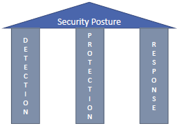
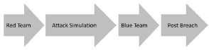
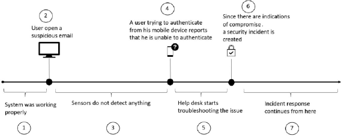
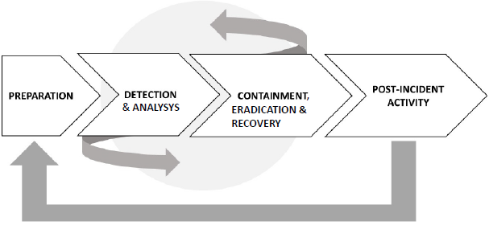
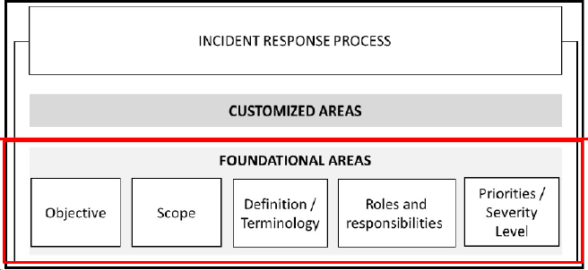
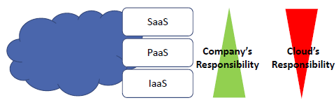

# Week 1

## Table of contents
---
1. [What is Cybersecurity?](#what-is-cybersecurity)

2. [Goals of Cybersecurity](#goals-of-cybersecurity)

3. [Security Posture](#security-posture)

4. [Current Threat Landscape](#current-threat-landscape)  
    4.1 [Remote Access](#remote-access)  
    4.2 [Bring Your Own Device (BYOD)](#bring-your-own-device-byod)  
    4.3 [Adoption of Cloud computing](#adoption-of-cloud-computing)  

5. [Credential](#credential)

6. [Applications (Apps)](#applications-apps)

7. [Cybersecurity Challenges, Threats and Mitigations](#cybersecurity-challenges-threats-and-mitigations)

8. [Red and Blue Team](#red-and-blue-team)

9. [Assuming Breach](#assuming-breach)

10. [Introduction to IR Process](#introduction-to-ir-process)  
    10.1 [Example of IR Process](#example-of-ir-process)  
    10.2 [Example of NIST IR Process](#example-of-nist-ir-process)  
    10.3 [Creation of IR Process](#creation-of-ir-process)  
    10.4 [Comparison of IR Process](#with-direct-comparison-of-ir-process)  
    10.5 [Incident Response Team](#incident-response-team)  
    10.6 [End User](#end-user)  
    10.7 [Incident response in the cloud](#incident-response-in-the-cloud)  
    10.8 [Threat life cycle management](#threat-life-cycle-management)  

11. [Cybersecurity Kill Chain](#cybersecurity-kill-chain)
---

 

## What is cybersecurity

- Set of technologies, practices and processes that are specifically designed to safeguard programs, network systems that connect computers, software and/or virutal data against any invasion or attempts to damage.  

    Cybersecurity is a broad area of security that encompasses  
    * Computer security
    * Network security
    * Software/Hardware security 
    * etc

 

---

## Goals of Cybersecurity 
***Recall C.I.A. triads***

- Secrecy 
    * Ways and means to limit number of princiapls who can access information, such as cryptography and access control.  
    ***Recall Biba, BLP models***

     

- Confidentiality 
    * Obligation to protect some other person's or organisation's secrets if happen to know them
    
     

- Privacy 
    * Ability and/or right to protect personal information and extends ability and/or right to prevent invasion of personal space

     

- Caution
    * *CONFIDENTIALITY* is often referred to *SECRECY* in ***CRYPTOGRAPHY***
    * Privacy **EQUALS** secrecy for benefit of individual
    * Confidentiality **EQUALS** secrecy for benefit of organisation

     

- Ultimately, to diminsh the risk of cyber attackts and protects individual and/or organisation from any kind of unauthorised exploitation of data, network systems and techonologues 

 

---

## Security Posture

Enhancing security posture of organisation requires:  

- Detection  

- Protection                  

- Response

- **DETECTION** and **RESPONSE** must be aligned to enhance overall security posture
    * Detection and Response are part of the [IR (Incident Response)](#Introduction-to-IR-Process) Process
    * Enhancing detection systems to quickly identify attack
    * Enhancing effectiveness of response process to reduce time between infection and containmennt

 

---

## Current Threat Landscape

Threat landscape is a set of threats that are continuously expanding and yet currently being faced by the organisation.  

- #### Remote Access
    * Remote access is the ability to access a computer or network from a remote location, such as a personal mobile phone or a tablet computer. Can be seen due
    to Covid-19 pandemic.  

     

- #### Bring Your Own Device (BYOD)
    * Most failures in BYOD occure due to poor planning and network architecture, which leads to an insecure implementation of BYOD.  

     

- Entry points for end user based on connectivity to be consider:
    1. On-premises and Cloud
    2. BYOD and cloud
    3. On-premises and BYOD
    4. Cloud and Personal devices

     

- #### Adoption of Cloud computing 
    1. IaaS (Infrastrure as a service)
        * E.g. AWS Elastic Computing (EC2), Google Compute Engine, Microsoft Azure, etc.

     

    2. PaaS (Platform as a service)
        * E.g. AWS Elastic Beanstalk, Heroku, Microsoft Azure, etc.
    
     
    
    3. SaaS (Software as a service)
        * E.g. Microsoft Office 365, Google Docs, Dropbox etc.
    
     

    ### **CAUTION**  
    PaaS:  
    IaaS:  
    * Extending on-premise infrasture with a cloud provider to use IaaS, company needs to evaluate the risks and benefits of this.  

     

    SaaS:  
    * A compromised personal device can compromise company's data by
        1. Opening corporate email from compromised device
        2. Accessing corporate SaaS applications from compromised device
        3. Using same credentials for personal and corporate account. 

     

    * Security Awareness Training:
        * Having techinical security controls is important to mitigate some threats against the end user, main protection is conduct Security Awareness Training

 

---
    
## Credential

- User's identity is the new perimeter. Stealing credentials is the preferred attack vector of cybercriminal

- Credential theft (Identity Theft) could be first step to gain opportunity to escalate privleges to Domain Administrator

- Authentication and authorisation of users and access rights

    * Authentication is the process of verifying the identity of a user.  
        
        1. MFA (Multi-factor authentication)
            * Using two or more factors such as a password, a biometric sensor, a smart card, fingerprint, Irises, face recongitions, voices, etc.  

        2. Continuous monitoring
            * Monitoring a user's behaviour and behaviour patterns to detect suspicious activity.  
            * ***Recall CSCI262, Statistical Anaylsis program!***  
     

    * Authorisation is the process of verifying that a user has the right to access a resource.  

 

---

## Applications (Apps)

- Security consideration:
    * In-House Application: Enforcing secure framework throughout SDLC. ***DevSecOps*** 
    
    * Application that users paying for as service: Vendor's security and compliance policy should be checked carefully to verify if company's security and compliance requirements are met.  

    * Personal application install on user device: users may be using an unsecure application   

    * Shadow IT: Programs or systems developed by individual departments that are not part of the company's IT infrastructure. IT managers do not know about such existence 

 

---

## Cybersecurity Challenges, Threats and Mitigations

| State of data               | Description                                          | Threats                                                      | Countermeasures               |
|-----------------------------|------------------------------------------------------|--------------------------------------------------------------|-------------------------------|
| At rest on user's device    | Data located on user's device                        | Unauthorised or malicious process could read, write the data | File level or disk encryption |
| At rest on-premise or cloud | Data located on-premise's hard drive or in the cloud | Unauthorised or malicious process could read, write the data | File level or disk encryption |
| In transit                  | Data being transferred from one host to another      | MITM attack, read, write or hijack data                      | SSL/TLS with valid certs      |

 

- Costly data breaches in order:
    1. Malware (viruses and Trojans)
    2. Lack of diligence and untrained employees
    3. Phishing and social engineering

        * Top Three (1., 2., 3.):  
    Usually correlated to human error, attacker uses social engineering to lead victim to a malicious website or means of phishing or spear phising attacks, causing victim to download malware. 
            ### **HUMANS ARE THE WEAKEST LINK IN CYBERSECURITY**  

     

    4. Targeted attack
        * An attacker with specific target in mind, such as a specific company, department, or individual. Attacker will devise a plan, subsequently performing reconnaissance to obtain necessary information to carry out attack  

        * An attacker may maintain persistence access to target's network, moving either laterally or vertically, or both.  

     

    5. Ransomeware
        * An attacker may use a ransom to obtain access to target's computer system. Such as WannaCry (May 2017). 
        
        *Attackers exploited Windows SMBv1 vulnerability (EternalBlue).

     

    6. State-sponsored attack (Government-sponsored attack)  
        * State/Government-sponsored attack is a type of cyber crime that is performed by a government agency. Intent is to steal information that can be used against the victim. 

        * Private sector organisation should not ignore tell-tale signs of a state-sponsored attack and should invest more in threat intelligence, machine learning and analytics to protect assets  

     

---

## Red and Blue Team

| Red Team                                                                                                        | Blue Team                                                                           |
|-----------------------------------------------------------------------------------------------------------------|-------------------------------------------------------------------------------------|
| Aware of trends and current attacks taking place                                                              | Wide variety of skillsets and composed of professional from different departments |
| Have coding skills to create own exploit                                                                        | Estimated Time to Detection (ETTD)                                                  |
| Mean Time To Compromise (MTTC) Minute that RT initiated attack to moment target has been compromised            | Estimated Time to Recovery (ETTR)                                                   |
| Mean Time to PrivEsc (MTPE) Minute that RT initiated attack to moment RT has administrative privilege on target | Metrics are not 100% precise                                                        |

 

- Upon Red Team's successful breaching, Blue Team will respond with:
    1. Save evidence:
        * Imperative to save evidence during such incidents to have tangible information to analyse, rationalise and take action to prevent future incidents
    
     

    2. Validate evidence:
        * Not every single alert or evidence will lead to valid attempt to breach system

        * If it does, needs to be catalogue as Indication of Compromise (IoC)

     

    3. Engage whoever is necessary to engage:
        * Blue Team must know what to do with IoC, which team should be aware of the compromise.

        * Engage all relevant teams which may vary from organisation

     

    4. Triage the incident
        * Possible engagment of law enforcement, warrant to perform futher investigation
    
     

    5. Scope the breach
        * Identify the affected users and the affected systems
    
     

    6. Create remediation plan
        * Isolation or evication of adversary
    
     

    7. Execution of remediation plan
        * Execution and recovery of breach
    
 

---

## Assuming Breach
***Fundamentally, if somebody wants to get in, they're getting in. Alright, good. Accept that***

- Change of methodology from **Preventing breach** to **ASSUMING BREACH**

 

- Traditional "prevent breach" approach does not provide ongoing testing.

 

- Red and Blue Team simulation must be a continuous process that will refined and improved with best practices over time

 

---

## Introduction to IR Process
***Recall Detection & Response from security posture***

- ***WITHOUT IR process*** it will result in:
    1. Bad security posture
    2. Waste of human resources

     

- ***DETECTION***:
    * Handle security incidents

     

- ***RESPONSE***:
    * Rapidly respond to incidents

     

### **Example of IR process**

 

- Given at Point 7, the IR process will
    * Take over the incident case
    * Documentation of every single step of process
    * Provide lessons learned with aim of improving security posture

     

- ### Example of NIST IR process:

 

- Successful IR Process
    * ALL IT personnel should be trained to handle security incident
    * ALL users should be trained to know core fundamentals of security
    * Integration between help desk system and IR team
    * Deploy sensors to detect and respond to security incidents
    * IR process must be compliant with laws and industry's regulation

 

### **Creation of IR Process**

 

| Action IR Process         | Definition                                                                                                                                                                             |
|---------------------------|----------------------------------------------------------------------------------------------------------------------------------------------------------------------------------------|
| Objective                 | - Purpose of this process        * Important to clearly define the purpose of the process        * Everyone should be aware of what this process is trying to accomplish   |
| Scope                     | - To whom this process apply        * Company level or department level                                                                                                        |
| Define/Terminology        | - Define what constitutes a security incident and provide examples   - Create own glossary using clearly define terminology                                                    |
| Roles & Responsibilities  | - Define users or groups with a certain level of authority   - Entire company should be aware                                                                                  |
| Priorities/Severity Level | - Functional impact of the incident on business         * Type of information affected         * Recoverability                                                            |

### With direct comparison of [IR process](#Example-of-IR-process)

 

| Action NIST IR       | Definition                                                                                                                                                                                                                                                                         |
|----------------------|------------------------------------------------------------------------------------------------------------------------------------------------------------------------------------------------------------------------------------------------------------------------------------|
| Preparation          | - Implementation of security controls based on initial risk assessment   - Implementation of other security controls such as endpoint protection, malware protection and network security   - Preparation phase will receive input from Post-Incident phase                |
| Detection & Analysis | - Able to detect attack vectors quickly with reduced false positive, dynamically learn more new threats and behaviours   - Trigger alert if suspicious activity is encountered   - Detection and analysis are done almost in parallel; an attack is on-going when detected |
| Containment          | - Isolate system or network that is under threat, focus on long-term contain which require temporary adjustment to allow system to be used in production while rebuilding clean system   - Restore affected system ASAP                                                        |
| Eradication          | - Removal of malware on infected devices, acknowledge root cause of the attack and steps to mitigate such attacks                                                                                                                                                                  |
| Recovery             | - Put affected systems back online   - Ensure affected systems are back to normal operations, test, check and track                                                                                                                                                            |
| Post-Incident        | - Documentation of Lesson Learned   - Documentation is the most valuable piece of information in this phase   - Documentation helps to refine the process through identification of gaps in current process and areas of improvement                                   |

 

### **Incident Response Team**

- Incident Response Team (IRT) is a team of people who are responsible for responding to security incidents.

     

- #### Outsource the Incident Response Team to a third party:
    * Finding right people for the job is difficult; outsourcing could be one of the solution
    * Third party could be a company or a private organization, however ensure that a well-defined  **Service-Level Agreement (SLA)** meets the severity levels is essential

### **End User**

- Important roles to indentify and report security incident

     

- Procedure of creating incident ticket

     

- Required to attend security awareness training

     

- **MITGATION: If end user is unable to replicate the incident, ensure that:**
    * System and network profiles are updated
    * Log-retention policy
    * Clock synchronization across all systems (E.g. using Network Time Protocol,NTP)
    * Instruct end user to contact support when issue is currently happening and provide them with environment to capture data

 

### **Incident Response in the Cloud**

***[Recall types of as-a-Service](#Adoption-of-Cloud-computing)***

- PaaS:
    * Provides platform that allow customers to develop, run and manage applications such as OS and middleware

 

- IaaS:
    * Customer to have full control of VM and all logs provided by the OS
    * Cloud provider have information of underlying network infrastrucutre and hypervisor logs
    * Customer to review cloud provider policy before requesting any data

 

- SaaS:
    * Contact cloud provider or open incident ticket via portal
    * Customer to review [SLA](#Outsource-the-Incident-Response-Team-to-a-third-party) to better understand ROE in IR scenario

 

- Follow up of IR process to include Cloud
    * Preparation: 
        * Update contact list including cloud provider contact information, on-call process

    * Detection & Analysis:
        * Include cloud provider solution for detection in order to assit during investigation

    * Containment:
        * Revisit cloud provider capabilities to isolate impacted system

 

### **Threat Life Cycle Management**

***[Recall NIST IR process's Detection & Containment](#Example-of-NIST-IR-process)***

| Action                   | Definition                                                                                                                                                                                                                                                                                                        |
|--------------------------|-------------------------------------------------------------------------------------------------------------------------------------------------------------------------------------------------------------------------------------------------------------------------------------------------------------------|
| Forensic data collection | - Threats come through the 7 domains of IT, more IT infrastructure organisation can see == more threats it can detect   - Collection of security event and alarm data   - Collection of log and machine data   - Collection of forensic sensor data                                               |
| Discovery                | - Search analytics       * Software-aided analytics       * Review reports and identify any known or reported exceptions from network and AV tools       * Labour intensive   - Machine analytics      * Software automation to perform analytics                                         |
| Qualification            | - Determine threats        * potential impact        * urgency of resolution       * Mitigation of threats   - Inefficient qualification may lead to true positives being missed and false-positive being included  - False-positive are waste of resources against non-existent threats  |
| Investigation            | - Qualified threats are fully investigated to determine if they caused the incident   - Threat might have damaged the organisation before being detected; check for any potential damages  - Continuous access to forensic data and intelligence about large amount of threat                         |
| Neutralisation           | - Removal or reduction of the impact of an identified threat  - Automated process to ensure higher throughput of deleting threats and ease information sharing and collaboration in organisation                                                                                                          |
| Recovery                 | - When all threats are neutralized, the risk is put under control  - Restore back to its prior state before being attacked; backtrack to last system restore point  - Ensure no backdoors are introduced and left around                                                                                  |

 

---

 

## Cybersecurity Kill Chain

- Cybersecurity kill chain: 
    * Method for modelling intrustions on computer network

     

- Consist of 5 stages:
    1. External Reconnaissance (Information Gathering)
    2. Compromising systen
    3. Lateral Movement
    4. Privilege Escalation
    5. Concluding mission

     
        
    - External Reconnaissance (Information Gathering)
        * Harvest as much information about target (Active & Passive)
        * Decide exploitation techniques suitable for each vulnerability

        * Information that attacker gathers:
            * Information is from outside target's network and systems
            * Information includes target's supply chain, obsolete device disposal and employee's social media activities
            * Anyone in organisation can be targeted; including suppliers and customers

         

        * Commonly used techniques to get entry point of organisation's network:
            * Social Engineering attacks
                * Phishing: Attacker sends target with carefully crafted email, causing them to reveal secret information or open network attacks
                * Phishing emails usually linked to malware installation
                * Claimed to be from a legitimate source 

     

    - Compromising 
        * Social Engineering (E.g. phishing, spam, etc.)
        
        * Stolen credentials
            * Attacker gains direct access to computers, servers, or devices within internal network 
        
         

        * Malware infection
            * Infect computer, server, bringing them under command of hacker
        
         

     

    - Lateral Movement
        * Popular scanning tools:
            * Metasploit
            * Kali Linux

         

        * Popular Network Scanning Tools 
            * Wireshark
            * Nmap
            * Aircrack-ng
            * Kismet
            * OWASP Zap
        
         

        * Password cracking tool:
            * Hydra
            * Hashcat
            * John the Ripper
            * Cain & Abel
        
         

     

    - Privilege Escalation
        * Vertical escalation
            * **Recall methods of privilege escalation on Linux and Windows**
            * User of higher authority (privilege)
            * Tools are used to escalate privileges
            * Buffer overflow attacks are common for vertical escalation
            * EternalBlue vulnerability
        
         

        * Horizontal escalation
            * User of equal or lower authority but usually with other permissions on other binaries or application that can run with higher authority 
            * Attacks such as session/cookie theft, XSS, password cracking, keylogging
            * Attacker will have several accounts at the same time
            * Attacker will have a well established remote access entry points to target system
            * Attacker will be able to avoid detection by system security

     

    - Concluding the mission
        * Exfiltration & Obfuscation
            * Data exfiltration E.g. email, file, credentials, etc.
            * Usually steal huge amount of data
            * Remove any tracks of the attacker
            * E.g. Ashley Madison (2015), Yahoo (2013, reportedin 2016), LinkedIn (2016)
            * Obfucsation via:
                - Attackers covering their track
                - Various techniques to confuse, deter or divert forensic investigation process
                - Dynamic code obfuscation (**Recall Metamorphic Virus!**)
                - Public Free Wifi. 

         

        * Sustainment
            * Deployment of rootkit, backdoor or persistency tools
            * Usually have multiple access points on target

         

        * Assault
            * Permanently disable target, or take control of target
            * Stuxnet attacks on Iranian nuclear facility; attacked by USB drive

         

---