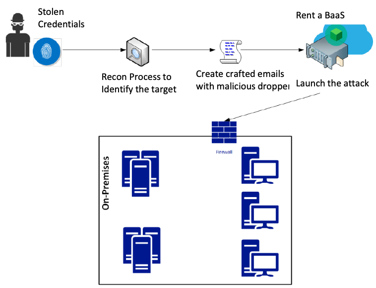

# Week 2

## Table of contents
---
1. [External Reconnaissance](#external-reconnaissance)  
    1.1 [Dumpster Diving](#dumpster-diving)  
    1.2 [Social Media](#social-media)  
    1.3 [Social Engineering](#social-engineering)  

2. [Compromising the system](#compromising-the-system)  
    2.1 [Current trends based on preferred attacks](#current-trends-based-on-preferred-attacks-and-mode-of-executions)  

3. [Compromising the system 2](#compromising-the-system-2)  
    3.1 [Core macro steps to compromise system](#core-macro-steps-to-compromise-system)  

4. [Chasing a User's Identity](#chasing-a-users-identity)  
    4.1 [Identity is the new parameter](#identity-is-the-new-parameter)  
    4.2 [Strategies for compromising a user's identity](#strategies-for-compromising-a-users-identity)  
    4.3 [Harvesting Credentials](#harvesting-credentials)  
---

 

## External Reconnaissance 
- Done outside of an organisation's network and systems
- Usually focuses on exploiting the carelessness of users of an organisation
- Possible to perform external reconnaissance in the following:

    * ## **Dumpster diving**
        * Organisation disposal of obsolete devices are not done properly (e.g. old printers, old computers, old software)

        * **Attackers can:**
            1. See internal setup of an organisation
            2. Openly-stored passwords on browsers
            3. Privileges and details of different users
            4. Access to bespoke systems used in networks
            
         

        * **Prevention methods (HDD)**
            1. Degaussing: Reducing or eliminating unwanted magnetic field (or data) stored on tape and disk media such as computer or laptop hardrive

            2. Using a crusher that pushes steel pistons up the center of the hard drive 
        
         

        * **Prevention methods (SSD)**
            1. Encrypt disk with long random key, forget the key and format the disk
            2. Perform an ATA-Secure wipe on SSD, assuming the feature is supported
        
         

     

    * ## **Social media**
        * Easiest way to find out huge amount of information about people
            1. Best place to mine data of specific target
            2. Data related to companies people work for
            3. Information about family members, relatives, friends, residences and contact information
        
         
        
        * **Attackers can:**
            1. Identity Theft; 
                * Create fake account of another person by using fake email address, photos of the person, up-to-date details of the identity theft victim. 
               
                * Using the fake account to target organisation high level officals, hacker can request network information, security information of the network, and other information about the organisation.
            
             
            
            2. Guess security questions through social media post or profile's information

            3. Spear phishing attacks

        * **Prevention methods**
            1. Create strong, multi-char password for all accounts
            2. Enter as little personal information as possible
            3. Never use personal information such as SSN, IC, current address or phone number
            4. Ensure privacy setting are of the highest level.
            5. Avoid downloading free apps using social media profiles
            6. Avoid accepting connections from social media profiles
            7. Verify any link sent to you by connections
            8. Google own name to find any possible forged accounts

         
     

    * ## **Social Engineering**
        * Most powerful method of reconnaissance
        * Company cannot completely protect itself for this threat
        * ### ***HUMANS ARE THE WEAKEST LINK***
        
         

        * ### **6 Levers of social engineering**
            1. Reciprocation
                * An attacker does something for the taget, in return, the taget feels the need to reciprocate the favour

                * Human nature to feel obligated to return favour to a person

            2. Scarcity
                * Threatening a short supply of something that target is in need of
                
            3. Consistency
                * Humans tend to honour promises or get used to usual flow of events

            4. Liking
                * Humans are to comply with request of people they like or appear attractive 

            5. Authority
                * Commonly used lever that has high succes rate
                
                * Humans are obedient to authority of those that are ranked above them even if they seem malicious 
                
            6. Validation
                * Humans will readily comply to do something if other people are doing the same; Herd mentality 

         

        * ### **Popular types of social engineering attacks**
            1. Pretexting
                * An elaborated lie that is well-researched that it appears to be legitimate for the the target
                
                * Impersonating someone of authority 

            2. Diversion theft
                * Attacker persuade delivery and transport companies that their deliveries are requested elsewhere

            3. Phishing
                * Attacker sends an email with a link to a fake website, designed to trick the target into clicking on a link to a legitimate website, target will enter sensitive information which is sent back to the attacker

                * Types of Phishing
                    1. Phone Phishing (Vishing)
                    2. Spear Phishing

            4. Baiting
                * Exploits the greed or curiosity of target
                * Dropping malware infected USB where people can easily find
                * USB will have fake sensitive information, which the malware will then run at the background without letting the target know

            5. Quid Pro Quo
                * Common method for low-level attackers
                * Call random number claiming to be from tech support, offer them asssistance, just so that the attackers can access victim's computer to launch malware
            
            6. Tailgating
                * Least common social engineering attack with significant success rate
                * Walking behind an employee with legitimate access to enter certain restricted area with physical access control

            7. Water holing
                * An attack strategy, attacker guess/observes which websites the group often uses and infects one or more of them with malware.
                * Victim is part of an organisation
                * Attacker may only attack users coming from specific IP address
                * Attacker may look for specific information
                * E.g. NotPetya attack, attack on US department of labour

 

---

 

## Compromising the system

- ### Current trends based on preferred attacks and mode of executions:
    1. ### **Extortion attacks**:
        * Extort money directly from victims
        * Threatening to release damaging information about victim to public

         

        * Ransomware: 
            1. WannaCry &#8594; Attacker asked for $300 within 72 hours through Bitcoin, money doubles and locked permanently after 7 days, attacker earned $50,000 since kill switch discovered

         

        * Extort money by threatening to hack sites
            1. Ashley Madison &#8594; Failed extorion by attackers, attackers then exposed millions of user data, company offered $11 million as compensation for 36 million user's data.
            
            2. United Arab Emirates Bank &#8594; Failed extortion by attackers, attackers demanded $3 million from bank, bank refused, user data with personal details of account ownders, transactions, and details of entities that they had transacted was released to public

         

        * Ideally, attackers are able to negotitate for more money if data they hold is more valuable to target than to third parties

     

    2. ### **Data manipulation attacks**:
        * Hackers compromising the system via data manipulation instead of deleting or modifying data
        
        * Modification of a single value can lead to far-reaching consequences.

        * Data manipulation attacks can happen on healthcare, financial and government sectors.

        * Data manipulation attacks can be used to provide misnformation to public
            1. Hackers were able to hack into offical Twitter account of Associated Press, tweeted a news story that Dow had dropped by 150 points, affecting any company that had a dependency on Dow.

            2. Data manipulation in bank can be catastrophic

         

        * Chinese spies are known to attack US defense contractor to network to steal blueprints, possibly manipulating data used by contractors
    
     

    3. ### **Backdoors**:
        * Juniper Networks found some firewalls had firmware with backdoors installed by hackers, which allow hackers to decrpyt traffic flowing through the firewalls

        * NSA was put in spotlight since backdoor had similarites to another one that was attributed to the agency ***(Recall EternalBlue)***
    
     

    4. ### **IoT devices attacks**:
        * Mirai attack &#8594; Commandeering large networks made up of IoT devices, and using them to perform DDoS

        * IoT devices are cheap and not adequately protected as manufactureres are not priortising security of their devices; Manufactureres focus on functionality than security
        
        * Users are lazy to change default security configurations. 

     

    5.  ### **Mobile device attacks**:
        * Gradual increase in malicious activity targeting mobile devices; 9 million to 18 million attacks blocked from 2015 to 2016

        * Mobile malware aims to:
            1. Send messages on vitcim's phone to generate revenues for hackers
            2. Steal personal information from victim's phone
            
        * Most Smartphone users are not concerned about hackers attacking their devices

        * Smartphones have browsers and web-support apps:
            1. Vulnerable to scripting attacks
            2. MITM attacks

        * BlueBorn Malware (September 2017)

     
    
    6. ### **Hacking every device**:
        * Target non-obvious devices which seems harmless in an organisation. E.g. Printers, scanners, laptops, etc.

        * Printer comes with inbuilt memory and basic security features, accessing printer may reveal
            1. Password authentication mechanism
            2. Senstive data that users send to printer
            3. Entry points into secure networks

        * Weeping Angels in WikiLeaks
            * Exploiting *Always On command system* of Samsung Smart TVs
            * Spying on people in room by recording their conversation
            * Transmitting conversation of viewers to CIA server

     

    7. ### **Hacking the cloud**:
        * Cloud provides convenient access to data and services ***(Recall that convenience compromise security)***
        * Cloud vulnerability is everything, storage space, CPU cores and network interface as they are shared
        
        * Security are left to cloud provider:
            1. Security environment is determined by vendor
            2. Security control of individual company is limited
            3. Use of shared platform with other people

         

        * Upward growth of incidences of cloud vendors and companies using the cloud being attack

        * Cloud are not direct target, hackers have to compromise user or system within an organisation
            1. Target &#8594; Credit card details of 70 million customers were stolen, started from a phising email but cloud data were leaked to server

            2. Home Depot &#8594; Details of 56 million credit cards and 50 million emails belonging to clients were compromised, hacker used malware to infect POS cloud system

            3. Sony Pictures &#8594; Hackers obtain organisation's cloud server employee information, financial details, sensitive data and unreleased fikms

            4. IRS &#8594; Details of 100,000 accounts were stolen from cloud server

 

---

 

## Compromising the system 2

- ### Core macro steps to compromise system
    1. Deploy payloads
        * Using metasploit:
            1. A framework console by using *msfconsole*, deploying payload by using *use* and *set* commands with IP address of target
            
            2. Generating payload for backdoor by using *msfvenom* CLI. It generates Windows CMD shell, reverse TCP stager, able to distribute payload via phishing methods

            3. Distribute payload by phishing emails

         

        * Exploiting vulnerability:
            1. Studying software to find expoitable vulnerabilites
            2. Vulnerablities can be errors in authentication code, bugs within account managemt system, logical error or unforeseen error by developers
            3. Database of vulnerabilites exists on computing devices and everyday devices

         

        * Zero-Day:
            1. Using advanced vulnerability discovery tools and techniques to identify vulnerabilities that are not yet known by developers

            2. ### **Fuzzing**
                * Uses an automated testing technique by throwing random, unexpected and invalid data as input to the program

            3. ### **Source code analysis**
                * Knowledgeable hacker can find vulnerabilities by analyzing source code, automated toos are available online too

            4. ### **Reverse engineering**
                * Generating asm source code from machine executable code, IDA Pro
            
            5. ### **Buffer overflows**
                * Caused by logical errors in codes of system which write data to buffer memory but not observe the memory restrictions of the buffer
            
            6. ### **Structed Exeception Handling**
                * Attacking SEH causes non-exsistent errors leading to system shutdown (DoS)
                * At times used with [Buffer overflows](#Buffer_overflows)

     

    2. Compromise OS system
        * Hackers are ***insider threats***, they can be physically close to the target or even use target machine when user is not attended

        * Kon-Boot &#8594; Allows attackers to bypass password authentication, free version of Kon-Boot are unable to bypass later versions of Windows OS 

        * Linux Live CD &#8594; Enables hacker to access all files contained in windows computer directly

        * Preinstalled applications &#8594; Compromising Windows programs by modifiying some commonly used applications, when running a malicious action is performed instead

     

    3. Compromise Web-based system
        * Common method of compromising web-based system:
            1. SQL Injection
                * A technique that allows hackers to inject malicious SQL commands into an unsanitised user input which can be used to perform malicious actions, getting database access, or even execute arbitrary commands.
             
             
           
            2. XSS
                * A technique that allows hackers to inject malicious HTML code into an unsanitised user input which can be used to perform malicious actions, cookie theft, or even execute arbitrary commands.

                * ***Recall Reflected, Stored and DOM based XSS***
            
             

            3. Broken Authentication
                * A weakness that allow attacker to capture or bypass authentication methods used in web app
                
                * Common attack used in public shared computers, especially in cyber cafes, stealing cookies when user did not log out
                
                * IDOR (Insecure Direct Object Reference)
              
             
              
            4. DDoS
                * Gaining access to botnets (agents), these agents are controlled by handler, which sends command to all agents to perform request to a certain IP address
                
                * DDoS are usually to bring down servers or create diversion

 

- ### Chasing a User's Identity
    
    According to the 2016 Data Breach Investigation Report from Verizon, 63% of confirmed data breaches happened due to weak, default, or stolen passwords.
     
    
    * ### **Identity is the new parameter**
        * Indicates that if each user/server/device/process has its unique identity, these identity resultantly prevents outsider access to the system and data.

        * Done by refusing access to processes/devices/servers that cannot offer identity with the correct credentials, hackers cannot gain access to the system.
        
        * Hence, hackers steal user credentials to gain access to the system.
        
        * Traditional network parameter is insufficient to secure an organisation's system.
        
        * Majority of credentials only consists of a username and a password
        
        * Many systems purely rely on username and password in order to function properly
        
        * Multi-Factor Authentication (MFA) is still not the default method of authentication despite gaining popularity

      

    * Growing trends of credential theft:
        * Hackers infiltrate network without noise using valid credentials

        * Hackers use banking Trojans to target users' bank credentials

        * E.g In June 2017, The Times reported that the email addresses and passwords of secretaries of the UK 
        government, were among the tens of thousands of government officials' credentials, were stolen, and later sold. Which is used to access privileged information and spear phishing.

         

    * BYOD 
        * Personal device has both the user's identity for his personal applications and corporate credentials for corporate-related applications
        * Users often use the same password for multiple credentials for a variety of applications

         

    * Vulnerability of Chrome (web browsers)
        * Users save the login credentials in Chrome's password manager (or any other browser that has such feature)
        * The browser's vulnerabilities can be exploited to steal a user's credentials, that are potentially related to their corporate credentials
        * In May 2017, a vulnerability in Chrome allowed attackers to automatically download a malicious file onto the victim's device that could be used to steal credentials

         

    * Attack workflow
        * Hackers can rent bots to launch the attack
        * Price of renting the bots is according to duration of the attack
        * "The price for 50,000 bots with attack duration of 3600 secs (1 hour) and 5 ~10‐minute cool‐down time is approximately $3,000 to $4,000 per 2 weeks."

          
        
         
        BaaS: Backend as a Service

         

    * Multifactor Authentication (MFA) failure
        * Many vendors usually offers 2FA to add another layer of protection
        * 2FA enhances the security of the authentication process, it is not bulletproof
        * An example of MFA Failure: SIM attack

         

    * ## Strategies for compromising a user's identity
        * Identity plays a big role in accessing privileged data or hijacking the data.
        * The attack plan of the **RED TEAM** should take the **[current threat landscape which includes 3 stages](./Week1.md#current-threat-landscape)** into consideration.

         

        1. **STAGE 1:** Who can potentionally attack us?
            * Red team performs a **self assessment** and understand the type of information the company has and who can benefit from obtaining it.
            * Might not be able to map all adverasaries 
            * According to the assessment, the red team can create a basic adversary profile for stage 2.

             
        
        2. **STAGE 2:** What are the most common attacks launched by these adversaries? 
            * Hacker groups have a pattern 
            * By analysing and understanding the pattern as well as how they are created, the red team can try to **emulate something similar during attack practises**

             

        3. **STAGE 3:** How are these attacks executed?
            * What the Red Team do is to be accurate with attacks in the reality.
            
            * It is pointless/not helpful if Red Team starts an attack without a purpose and evidence that other hacking groups will do the same. 

            * Hacker's mindest:
                * ***They will not stop if they fail to infiltrate the system on their first attempt, they will continue to find vulnerabilites to exploit till they successfully break into the system.***
            * The Red Team has a clearly defined aim. 
                * Successfully gaining access to the privileged information (with a hacker's mindset)
                * To be clear on the mission
                * Efforts made need to be organised and synchronise 
                * Or else, the attempts to infiltrate will get caught 

             

        * Important considerations in an on-premises environment & VM located in the cloud (IaaS):
            * Do not produce these steps in a production environment (isolate the red team operation).
            * Create an isolated lab to test any type of Red team operation.
            * After all tests are executed and validated, *a plan must be built to reproduce these tasks* in the production environment as part the Red Team attack exercise.
            * Before the attack execise is conducted, there must be agreement from the manager and make sure the command chain is aware of the attack exercise.
        
         

    * ## **Harvesting Credentials**

        Following methods to retrieve user credentials/identities:

        1. Using identified unpatched vulnerabilities
            * E.g. Vulnerability identified as CVE‐2017‐8563
                * Allows privilege escalation due to kerberoes authentication failure
                * Attackers can perform local privilege escalation and ultimately gain access to a local admin account through *lateral movement*
            
             
        
        2. Using the pass‐the‐hash attack
            * It gained popularity after Hernan Ochoa published the Pass‐The‐Hash Toolkit.
            * A password has a hash, which depends on the authentication method 
                * it is possible to be presented with the hash instead of the plaintext password.
            * Use the hashed password to perform an attack
            * Up to Window 7, this can be done manually and remotely using powershell, mimikatz, and Sysinternals.
                * Mimikatz is a tool for dumping hashes and clear text credentials from memory in Windows computers.
                * Sysinterals is used to remotely access and execute commands on Windows computers.
            
                     

        3. Brute force
            * Attacker tries many passwords/passphrases to gain access to the system (trial and error)
            * An oldest method.
            * Still valid to test 2 aspects of a system's defense mechanism
                1. Accuracy of the monitoring system: 
                    * A brute force attack produce a lot of noise, the defense security control system **is expected to be able to detect this activity while it is happening**.
                2. How strong is the system's password policy:
                    * Weak password policy is highly susceptible to brute force attack, if attackers can obtain credentials it is **a serious problem**

             

        4. Social Engineering
            * Sending phishing emails: 
                * Done with Social Engineering Toolkit (SET) comes along with Kali
                    * Applications menu &#8594; Exploitation Tools &#8594; Social Engineering Toolkit
                * Create Malware and send via email.
