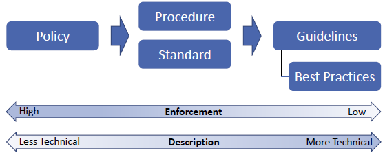

# Week 3

## Table of contents
---
1. [Lateral Movement & Privilege Escalation](#lateral-movement--privilege-escalation)  
    1.1 [Lateral movement](#lateral-movement)  
    1.2 [Sniffing Tools](#sniffing-tools)  
    1.3 [Avoiding Alerts](#avoiding-alerts)  
    1.4 [Performing Lateral Movement](#performing-lateral-movement)  
    1.5 [Privilege Escalation](#privilege-escalation)  
    
2. [Security Policy & Security Policy Enforcement](#security-policy--security-policy-enforcement)  
    2.1 [Reviewing Security Policy](#reviewing-security-policy)  
    2.2 [Case Study: UOW Cybersecurity Policy](#case-study-uow-cybersecurity-policy)  
    2.3 [Educating the End User](#educating-the-end-user)  
    2.4 [Policy Enforcement](#policy-enforcement)  
    2.5 [Preliminary: Active Directory (AD)](#preliminary-active-directory-ad)  
---

 

## Lateral Movement & Privilege Escalation

- ### Lateral movement
    * Attacker moving from device to device:
        1. Hoping to access high-valued data (or user)
        2. Looking at ways to gain additional control of victim's network

    * Attacks carried out ***WITHIN AN ORGANISATION'S*** network, systems and premises

    * This phase can last for long period of time; sophisicated attacks takes several months to hit desired target device

    * Involves scanning network for other resources, collecting and exploiting of credentials, or collection of more information for exfiltration

     

- ### Internal reconnaissance
    * Internal reconnaissance is:
        1. ***DONE ON SITE*** 
        2. ***PASSIVE ATTACK***
        3. Determine if security mechanisms are in place 
    
    * Attacker interacts with actual target system to find out information about vulnerabilities using **SNIFFING & SCANNING TOOLS** to find data servers and IP address of host to exploit/infect

     

- ### Sniffing Tools
    * ***ACT OF EAVESDROPPING ON TRAFFIC***
    
    * Designed to capture packets being transmitted over network and analyze them

    
    | Sniffing Tool Name | Description                                                                           |
    |--------------------|---------------------------------------------------------------------------------------|
    | Wireshark          | Popular sniffing tool with user-friendly interface and powerful packet interpretation |
    | Tcpdump            | Most powerful packet-filtering capabilities and selectively capture packets           |

    ---
    ---
    | Scanning Tool Name | Description                                                                                                                                                                                                                                                                                                                                                                |
    |--------------------|----------------------------------------------------------------------------------------------------------------------------------------------------------------------------------------------------------------------------------------------------------------------------------------------------------------------------------------------------------------------------|
    | Nmap               | Map out hosts in network to find ports with valuable informations                                                                                                                                                                                                                                                                                                          |
    | Nessus             | 1. Best network scanners and vulnerability scanners for ***WHITE HAT***   2. Scans networks and shows connected devices with misconfigurations and missing patches   3. Displays devices with default, weak or no password   4. Recovers passwords from some devices by launching external too to help with dictionary attack against targets in network   |    

     

- ### Avoiding Alerts
    * Network Intrusion Detection System (NIDS)
        * Shield systems to prevent internal recon

        * Limited capability when hackers scanning individual targets

     

    * Host-based Intrusion Detection System (HIDS)
        * Able to detect and block attacks from a single host

        * If there are too many host, network administrator will not consider HIDS

     

    * Security tools can ***IDENTIFY SIGNATURES OF HACKING TOOLS***

     

    * Using legitimate tools for lateral movement
        * Security systems ignore legitimate tools

        * Allow hackers to move around in highly secured networks

        * E.g. download file from web using PowerShell

     

- ### Performing Lateral Movement
    
    1. Sysinternal  
        * ***LEGITIMATE SYSTEM ADMIN TOOLS, IGNORED BY AV***

        * ***DOES NOT ALERT USERS ON REMOTE SYSTEM WHEN IN OPERATION***

        * Suite of tools that allow admin to control Windows computers from remote terminal

        * Attackers use it to ***UPLOAD, EXECUTE, INTERACT WITH EXECUTABLES*** on remote hosts. Commands can be automated using scripts.

        * Able to reveal, kill or stop any running process
    
     

    2. File Sharing
        * Used when attackers are performing lateral movement in compromised networks to capture most of the data available in network

        * Using legitimate file sharing protocol gives attackers advantage of low probability of detection; legitimate traffic are not usually monitored

        * Can be used to ***PLANT MALWARE*** in shared environment

        * Super effective if attacker has admin privileges

     

    3. Remote Desktop (Windows)
        * ***LEGITIMATE SYSTEM ADMIN TOOLS, IGNORED BY AV***

        * Can be abused by attackers for lateral movement
        
        * Can be launched when hackers have ***COMPRIMISED A COMPUTER INSIDE A NETWORK*** and allows to steal data, disabling security software or install malware

        * Pros: 
            1. Full interactive GUI 
            2. Fully encrypted, ***OPAQUE TO ANY MONITORING SYSTEM***

         

        * Cons: 
            1. User working on remote computer can see if an external peron has logged on to the computer; ideally use when no users are ***PHYSICALY*** on target

     

    4. PowerShell
        * Powerful built-in Object-Oriented scripting language

        * Breaches made by PowerShell:
            1. Deploy .ps1 (PowerShell) scripts to run as scheduled task on Windows

            2. Scripts runned by PowerShell does not trigger AV

            3. Scripts once executed, download malware and run from RAT (remote access tool)

     

    5. Windows Management Instrument (WMI)
        * ***LEGITIMATE SYSTEM ADMIN TOOLS, IGNORED BY AV***

        * Framework can be used remotely to:
            1. Start process remotely
            2. Query system information
            3. Store persistent malware

        * Key tool in a famous hack on Sony Picture in 2014

        * [WMImplant](https://github.com/FortyNorthSecurity/WMImplant) an example of hacking tool based on WMI framework

     

    6. Schedule Task (Windows)
        * needs SYSTEM user privileges to run

        * Attacker can steal data over time without raising alarms
    
     

    7. Remote Registry
        * Gives control over both hardware and software of Windows

        * Can be remotely edited to disable auto-start of certain programs and protection mechanisms, to install configuration that supports uniterruptible execution of malware

     

    8. #### Active Directory (AD)
        * Developed for Windows Domain Networks

        * ***DIRECTORY-BASED IDENTITY-RELATED SERVICES***

        * Richest source of information for devices connected to domain network; ***HIGH VALUE TARGET!***

        * Stores name of users in network with roles in organisation

        * Allows admin to change password and privileges for users in network

        * Known vulnerabities such as MS14-068 to get admin privilege
        
     

    9. Breached Host Analysis
        * Attacker look around on breached computer for any information that can be used to gain further access. E.g. passwords stored in browsers, text files, etc.

     

    10. Central Administrator Consoles
        * Attacker able to control device of interest with least amount of effort instead of breaking it every time. 

        * Key targets:
            1. ATM controllers
            2. POS management system
            3. Network administration tools
            4. [Active Directory](#Active-Directory-AD)

     

    11. Email Pillaging
        * Huge amount of sensitive information about an organisation is stored in emails in the correspondence between employees

        * Attacker can collect information about individual users to spear phish them

     

- ### Privilege Escalation
    * Act of exploiting bug, design flaw or configuration oversight in OS or software to ****GAIN ELEVATED ACCESS**** 

    * Attackers exploit the privileges of user accounts to achieve greater objective:
        1. Mass deletion
        2. Corruption
        3. Data theft
        4. Disabling computers
        5. Destroying hardware

     

    * System developers have been employing ***PRINCIPLE OF LEAST PRIVILEGE***, allowing user to perform its job with required privilege.

    * Attackers usually compromise low-privilege accounts, then having to upgrade to higher privilege to perform their objective

    * Requires attacker to use combiniation of skills and tools to heighten privilege.

    * Privilege Escalation technique depends on:
        1. Skill of hacker
        2. Intended outcome of privilege escalation process

     

    * **Two classifications of privilege escalation:**
        1. ***HORIZONTAL PRIVILEGE ESCALATION***
            * Attacker uses a normal account to access other normal account 
            
            * Usually facilitated with tools and techniques that steals login credentials where hackers compromise a system

         

        2. ***VERTICAL PRIVILEGE ESCALATION***
            * Attacker uses a normal account to access an account with higher privilege than an administrator or system developer

            * Difficult but rewarding as attacker can acquire system rights on compromised system

            * Higher chance of staying undetected while performing actions on network system; with superuser privileges, admins are unable to stop and interfere with attack

            * Admin access should be limited and normal users should not have administrative access to systems.

            * Remote users have admin access to enable them to troubleshoot and solve issues. Giving remote users admin access should be cautious to ensure it is not used for privilege escalation.

            * Vertical privilege escalation methods in different OS:
                1. Windows &#8594; Buffer overflows
                2. Mac &#8594; Jailbreaking
                3. Linux &#8594; Rootkit
                4. Web-based &#8594; RCE in backend

             

            * Attacker should avoid alerts
                * Avoid raising alarms that victim system has been compromised

                * Disable system security if possible before performing this phase

                * Use legitimate tools to perform privilege escalation (LOTL)

             

            * Using valid administrator accounts: 
                1. Attackers gain unauthorised access to administrator can login to senstive systems or create own login credentials

                2. Attackers exploit programming errors, introduce vulnerabilites to bypass security mechanisms

                3. Some system accepts insecure default password

            * Access Token Manipulation:
                1. Windows uses access tokens to determine owners of all running process

                2. OS login in **ADMIN USER** as **NORMAL USER**, but ***EXECUTES THEIR PROCESS WITH ADMIN PRIVILEGES***. 
                    * E.g. Windows uses the ***RUN AS ADMINISTRATOR*** command to execute the specific processes as administrator; if attacker can fool the system into believing that processes are started by admin, the process can be run as admin without intererence with ***FULL LEVEL ADMIN PRIVILEGES***
                
                 

                3. ATM example: Attacker ***COPY ACCESS TOKENS FROM EXISTING PROCESS*** that are started by admin users to a new Windows process, then executes the new process as admin

            * Bypassing User Account Control (UAC):
                1. Gate between normal users and admin users
                2. Give permissions to program to eleveate privileges and run with admin privileges
                3. Windows will prompt a dialog box asking if the program should be run as admin

                 
            
            * Programs running as admin ***WITHOUT PROMPTING USERS***
                1. *rundll32.exe* is used to load custom DLL that loads a COM object with elevated privileges

                2. *netplwiz.exe* leads to Windows command execution with admin privileges
     

 

---

 

## Security Policy & Security Policy Enforcement

- ## Reviewing Security Policy
    
    * Security policy is a ***LIVING DOCUMENT THAT NEEDS TO BE REVISED, UPDATED REGULARLY OR ON-DEMAND!***

     

    * Questions to ask regarding security policy
        1. Do you have a security policy?
        2. How do you enforce this policy?
        3. How often do you review your security policy?

     

    * What security polices should include:
        1. ***INDUSTRY STANDARDS, PROCEDURES AND GUIDELINE***
            * Necessary to support information risks in daily operations
        
         

        2. ***WELL-DEFINED SCOPE***
            * Must be stated in scope section of policy whether policy applies to certain group of people or everyone including contractors

     

    * Foundation of security policy should help provide the security traid (***RECALL C.I.A TRAIDS!***)

    * Requirements from users:
        1. Users are to protect and ensure applicability of security traid in data and systems

        2. Users must be aware of responsibilities and consequences of violating these policies

    
    

     

    * ### **Policy**:
        1. Basis of everything, setting high-level expectations and used to guide decisions and achieve outcomes

        2. Must for all participants; cannot be too technical

        3. Must enforced by proper authority

     

    * ### **Procedure**:
        1. Document with procedural steps to outline how something must be done

     

    * ### **Standard**:
        1. Document that establish technical requirements that must be followed; everyone must comply with certain standards that were previously established

        2. Document must provide enough technical details to give accurate and detailed explanation of requirements to relevant personnel E.g. security engineers or security management officers

        3. All requirements in this document must cover its associated standards documents if they need technical specifications

     

    * ### **Guidelines**:
        1. Optional but can be additionally recommended guidance

        2. Guidelines must be aligned with [policy](#policy) and [standard](#standard) documents. Usually written to give more specific details with practical examples such as best practices

        3. Used to guide someone who have substantial knowledge of IT but not specialised in cybersecurity domain

     

    * ### **Best practices**:
        1. Best practices to be implemented by entire company or specific departments within company

        2. Established per role; all webservers should have best security practices from vendor applied prior to being deployed in production

        3. Make sure all documents are synchronised, managed and have upper management sponsorship, an organisation-wide security program is needed

     

    * NIST Special Publication (SP) 800
        * Present information of interest of computer security community, comprising ***GUIDELINES, RECOMMENDATIONS, TECHNICAL SPECIFICATIONS, ANNUAL REPORTS*** if NIST's cybersecurity activtives

     

    * #### NIST SP 800-53
        * Bare minimum and mandatory federal standard for Federal Information and Information System in response to FISMA
        
        * Organisations have flexibility in applying baseline security controls in accordance with guidance provided in SP 800-53
        
        
     

- ## Case Study: UOW Cybersecurity Policy
    
    1. [UOW Cyber security policy](https://www.uow.edu.au/about/policy/it/index.html)
    2. [IT Server security policy](https://www.uow.edu.au/about/policy/UOW002314.html#P93_3366)

     

    * Definitions:
        1. Cyber security &#8594; practice of defending computing devices, networks and stored data from unauthorised access, use, disclosure, disruption, modification or destruction

        2. User - Any person using any IT Facilities & Services
    
     
        
    * Application & Scope 
        
        For [UOW Cyber security policy](https://www.uow.edu.au/about/policy/it/index.html):

        1. Policy applies to all Users of IT Facilities & Services at UOW

        2. All users should be aware of this policy, their responsibilities and legal obligations

        3. All users to comply with policy and bounded by law to observe applicable statutory legislation

        For [IT Server security policy](https://www.uow.edu.au/about/policy/UOW002314.html#P93_3366): 
        
        1. Servers connected to University network

        2. Servers that are operated for, or on behalf of University regardless of which network they are connected to, ***IaaS or PaaS***

        3. ***THIS POLICY DOES NOT APPLY TO PROCURED SERVICES: SaaS***

     

    * Policy Responsibilities
        1. Users of IT Facilities & Services
        
        2. Individual users's responsibilities:
            * Using IT Facilities & Services according to IT policies 

            * Aware of security requirement of IT Facilities & Services they use and take every precaution to safeguard their access against unauthorised use

            * Immediately reporting any known, suspected security incidents and breaches to IMTS.
     

- ## Educating the End User

    * ***UNEDUCATED USER IN SECURITY PRACTICES CAN CAUSE TREMENDOUS DAMAGE TO ORGANISATION!***

    * #### Security Awareness Training  
        * Shown in diagram of [NIST SP 800-53](#NIST-SP-800-53) under ***MANGEMENT &#8594; AWARENESS TRAINING***

        * Should deliver Awareness training to all employees with constant updates to include new attack techniques and considerations

        * Security Awareness Training are usually delivered online via company's intranet. 
        
        * Training should be: ***WELL-CRAFTED, RICH IN VISUAL CAPABILITIES, CONTAINS SELF-ASSESMENT AT THE END TO BE EFFECTIVE***

     

    * Contents for [Security Awareness Training](#security-awareness-training)
        * Real-world examples
            * Users remember things easily if real scenarios are shown. E.g. How phishing email looks like, how to identify one

        * Practice
            * Users interacting with computer to identify spear-phishing or fake social media campagin

     

    * Training outcomes
        * All users should acknowledge their successful training
        * All users are aware about security threats and countermeasures
        * All users are aware of consequences of violating company's security policy

     

    * The problem of BYOD
        * Many users using own device to access organisation's information, easy targets for attackers.

        * Attackers are able to compromise user's system, gaining close access to company's data as they are not isolated most of the time

        * Ideally BYOD should not be allowed in enviroments where maximum confidentiality is required.

     

    * Case study: Symantec Internet Security Threat Report Volume 22
        * ***SPAM CAMPAIGNS ARE TOP CAUSE OF MALWARE INFESTATION; SOCIAL ENGINEERING TECHNIQUES***

        * Social media platforms are used to launch social engineering attacks.
            * In 2015, diet spam operation on Twitter that used hundreds of thousands of fake accounts that were impersonating legitmate accounts to build big follower base, spread false propaganda about weight-loss solutions

         

        * Common word used in major malware campagins was "INVOICE". Typical approach to entice user to click file or link to compromise the system
    
     

    * Social media guidelines for users
        * ***SOCIAL MEDIA PLAYS AN IMPORTANT ROLE IN SOCIAL ENGINEERING ATTACKS***

        * Security program must be in line with HR and legal requirements on how an organisation should handle social media posts and give guideles to employee on how to handle their own social meida presence

        * Defining a set of guidlines to employees on how to use social emdia is the definition of appropriate business behaviour
    
     

    * Dealing with defamatory and inappropriate post
        * Guidelines to deal with defamatory and inappropriate post. 
            * E.g. Pornographic, prorietary issues, harassment or post that creates hostile work environment

        * These are imperative for most social media guidelines, shows that employers are diligents in promoting a wealth social environment within an organisation
     

- ## Policy Enforcement
    * Based on network architecture diagram
        * What ***END POINTS*** are
        * What ***SERVERS*** an organisation has
        * How information flows
        * Where information is stored
        * Who has and should have data access
    
    * Many companies fail to enforce polices fully as they think of enforcing policies at endpoints and servers

    * Holistic approach is needed to tackle every single component that is active in network including switches, printers and IoT devices

    * Application Whitelisting
        * Dictates that ***ONLY LICENSED SOFTWARE IS ALLOWED TO RUN IN USER'S COMPUTER***

        * Running unlicensed software should be prevented and use of licensed software that is not authroised by IT should be restricted

        * Policy enforcement ensure only authorised apps will run on system

     
    
    * Tool for policy enforcement:
        * [Microsoft AD](#preliminary-active-directory-ad)
            * ***GROUP POLICY OBJECT (GPO)***:
                1. Deployment of group policies can be segmented using OU, assigning polices per OU
                
             

            * ***PREVENTION OF SECURITY BREACHES: IMPORTANT GROUP POLICY SETTINGS***
                1. Set limimts on computer's Control Panel
                    * Prevent non-admin users modifying sysconfig

                2. Prevent Windows from storing LAN Manager Hash
                    * Prevent ***PASS-THE-HASH*** attack
                
                3. Control access to Command Prompt
                    * Can be used to run commands that give high-level access to users and evade other system restrictions

                4. Disable forced system restarts
                    * Prevent important settings and unsaved work from being lost

                5. Disallow removable meida drives
                    * Very prone to infection and may contain malwares

                6. Restrict software installations
                    * Prevent unwanted apps to have potential to compromise system 

                7. Disable guest account
                    * Attacker can use Guest account to access computers

                8. Set minimum password length to higher limits
                    * Regular user: 12 char
                    * Admin user: 15 char

                9. Set maximum password age to lower limits 
                    * Recommendation: 42 days
                
                10. Disable Anonymous SID(Security IDentifier) enumeration
                    * Older versions of Windows, users can query SIDs to find important users and groups

     

- ## Preliminary: Active Directory (AD)
    * Purpose:
        * Arrange all network objects including users, computers and other items into logical hierarchical structure

        * Provide authentication and authorisation for users, computers and other items

    | AD Logical Architecture  | Description                                                                                                   |
    |--------------------------|---------------------------------------------------------------------------------------------------------------|
    | Objects                  | Smallest entity in AD, each object has own attributes. E.g. name, address, phone                          |
    | Organisational Unit (OU) | Subdomain which is a container for several objects. E.g. OU1 holds employees objects, OU2 holds servers objects   |
    | Domain                   | Collections of objects within an AD network, with Hierarchical DNS E.g. sales.company.com which holds OU1, OU2   |
    | Tree                     | Collections of domains. E.g. company.com is ***root***, sales.company.com is ***child***                       |
    | Forest                   | Collections of trees. E.g. company.com and market.com forms a tree                                            |
    ---
    ---
    | AD Trust relationship   | Description                                                              |
    |-------------------------|--------------------------------------------------------------------------|
    | Transitive Two-Way  | Default relationship between parent domain and child domain              |
    | One-Way Trust           | Users in Domain A can access resources in Domain B but not the other way |
    | Transitive Trust        | Can be used to ***EXTEND*** trust relationships with other domains       |
    | Non-Transitive Trust    | Can be used to ***DENY*** trust relationships with other domains         |
    ---

     

    * Group Policy
        * Feature of Windows NT family of OS that centrally controls working environment of user accounts and computer accounts.

        * Created to overcome problem with Windows registry
            * Registry is similar to login script that stores program and system settings

            * Change in registry is permanent, if user has new job title, different registry is needed.

            * Group policy allows reversal of any previous configurations made for specific users

            * Admin only needs to worry about configuring the required changes

    * Execution of GPO
        1. Collection of setting that define how a system will look, behave for defined group of users

        2. Admin distributes GPO through AD to servers and users in OU

        3. Admin only needs to worry about configuring the required changes
     