# Week 4

## Table of Contents
---
1. [Network Segmentation](#Network-Segmentation)  
    1.1 [Segmenting the Network](#Segmenting-the-Network)  
    1.2 [Defence in Depth Approach](#defence-in-depth-approach)  
    1.3 [Physical Network segmentation](#physical-network-segmentation)  
    1.4 [Virtual Local Area (Logical) Network segmentation](#Virtual-Local-Area-Logical-Network-Segmentation)  
    1.5 [Virtual Network segmentation](#virtual-network-segmentation)  
    1.6 [Discovering Network](#discovering-network)  
    1.7 [Securing Remote Access to the Network](#securing-remote-access-to-the-network)  
    1.8 [Case study: Amazon AWS](#case-study-amazon-aws)  

2. [Active Sensors](#active-sensors)  
    2.1 [Detection Capabilities](#detection-capabilities)  
    2.2 [Major IoCs](#major-iocs)  
    2.2 [Intrusion Detection System (IDS)](#intrusion-detection-system)  
    2.2 [Intrusion Prevention System (IPS)](#intrusion-prevention-system-ips)
    *    2.2.1 [IPS Detection Modes](#ips-detection-modes)  
    
    2.3 [Behavior Analytics (BA) On-Premises](#behavior-analytics-ba-on-premises)  
---

## Network Segmentation

- ### Segmenting the Network

    * What is Network sSgmentation?
        - The act/practice of **SPLITTING NETWORK INTO MULTIPLE SUBNETWORKS** in computer networking
        - Each subnetwork is a ***SEGMENTED, ISOLATED*** and deployed with ***MECHANISMS TO MITIGATE INTRUSTION*** 

     

    * 3 Types of network segmentations:
        1. [Physical Network segmentation](#physical-network-segmentation)
        2. [Virtual Local Area (Logical) Network segmentation](#Virtual-Local-Area-Logical-Network-Segmentation)
        3. [Virtual Network segmentation](#virtual-network-segmentation)

     

    * Reasons for Network Segmentation:
        - ***PERFORMANCE*** &#8594; High bandwidth applications
        - ***SECURITY*** &#8594; Users should not be able to talk directly to the database server

 

- ### Defence in Depth Approach  
    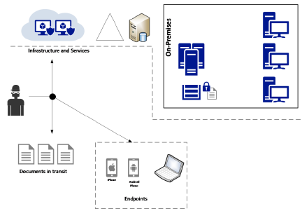
    * Defence in depth approach is to ensure:
        1. Multiple layers of protection 
        2. Each layer has its own set of security controls, end up delaying the attack
        3. Sensors available in each layer will alert users if anything is detected

     

    * Purpose of Defence in depth approach:
        1. Break attack kill chain before mission has been fully executed

     

    * Implementation of Defence in depth approach (Consist of 3 sections):   
        1. Infrastructure and Services
            * Services can be provided based on the form of infrastructure
            
            * 2 forms of infrastructure:
                1. On-premises
                2. [IaaS of cloud computing](/Week1.md#Adoption-of-Cloud-computing)

             

            * Attacker can target organisation's infrastructure and services
            * All services offered by organisation is needed to be enumerated to idnetify the possible attack vectors:
                1. Identify which assets that organisation has
                2. Specify that potential attackers and possible attack techniques

             

            * Add security controls to mitigate vulnerabilities
                1. Patch management
                2. Server protection via security policies
                3. Network isolation
                4. backups

             

            * Threat modelling and implementation of security control must be considered in ***HYBRID ENVIRONMENT (ON PREMISES + IaaS)*** if organisation leverage their services using IaaS
            * Goal of infrastructure and services is to reduce
                1. Vulnerability count and severity ***(RECALL NESSUS SCANNER)***
                2. Reduce time of exposure
                3. Increase difficulty
                3. Cost of exploitation

         

        2. [Documents in transit](/Week1.md#Cybersecurity-Challenges-Threats-and-Mitigations)
            * Documents can be any type of data
            * Usually vulnerable when data is in transit
            * Must be protected by ***ENCRYPTION*** &#8594; Encryption in transit should be done in both public and internal networks
            * Other security controls for monitoring and access control must be included 
            * ***NOTE:*** Adding different layers of protection and detection is the entire essence of ***DEFENCE IN DEPTH APPROACH***
            
             

            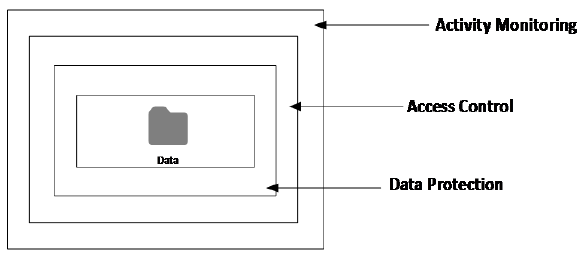

             

            ### Data in transit example
            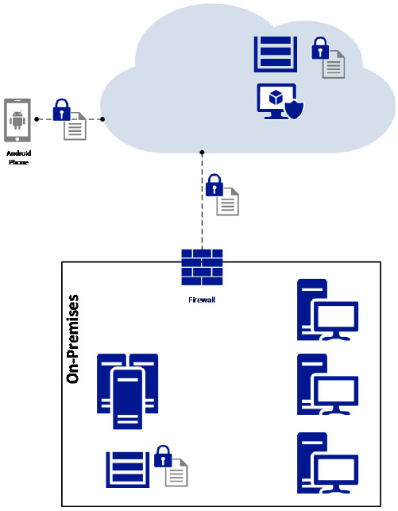

             

            * Document was originally ***ENCRYPTED*** at rest in a server located on-premises
            * User request for document, and user was authenticated in the cloud
            * Document then travelled via the Internet then to the cloud
            * Document remains ***ENCRYPTED*** throughout till it reaches the user's device
            * Document remains ***ENCRYPTED*** at rest in the user's device local storage
        
         

        3. Endpoints
            * Endpoint &#8594; ***ANY*** device that can consume data
            * Assume that endpoint can be mobile and/or IoT devices
            * Perform threat modelling to uncover all attack vectors and plan mitigation efforts accordingly
            * Example of countermeasures for endpoints include
                1. Seperation of corporate and personal data/app (isolation)
                2. Use of TPM (Trusted Platform Module) hardware protection
                3. OS Harderning
                4. Storage encryption

 

- ### Physical Network Segmentation

    * The network will grow according to the demand, and its security features are rarely revisted as the network expands
    * Obtaining an accurate view of what is currently implemented in the network is difficult for that blue team
    * The first step to set up an appropriate physical network segmentation is to understand the ***LOGICAL DISTRIBUTION OF RESOURCES ACCORDING TO THE COMPANY'S NEEDS***
    * Size of the company should also be taken into account when selecting a type of network segmentation. 

    * Establishing physical network segmentation:
        * ***NO*** data flow between the subnetworks unless there is another switch or router between the separated subnetworks
        
         

        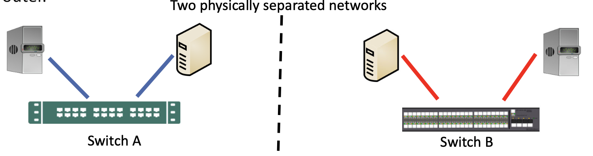

     

    * There are also issues with physical network segmentation:
        * Efficiency &#8594; What if there are only 2 hosts in each subnetwork, but the switch has 24 ports?
        * Scalability &#8594; What if there are too many hosts for a switch to handle?

    * Mixed VLAN
        * There is no perfect solution for network segmentation based on VLANs.
        * Based on the diagram below:

         

        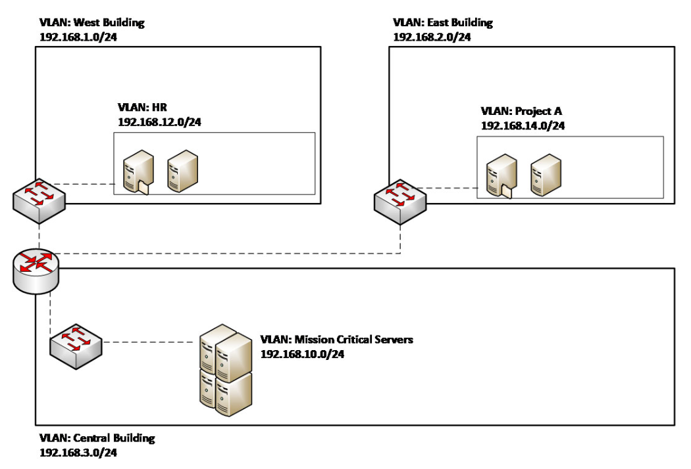

     

    * Best practices for security of network segmentation
        * ***DISABLE PORTS THAT ARE NOT USED***
        * Use SSH to managed switches and routers
        * Restrict access to management interface
        * Leverage security capabilities to prevent MAC flooding attacks
        * Leverage port-level security to prevent DHCP snooping attacks
        * Update switch's and router's firmware and OS

 

- ### Virtual Local Area (Logical) Network Segmentation
    * The subnetworks are ***SEPERATED LOGICALLY NOT PHYSICALLY***
    * VLAN 1 cannot communicate to VLAN 2 without a ***ROUTER***

     

    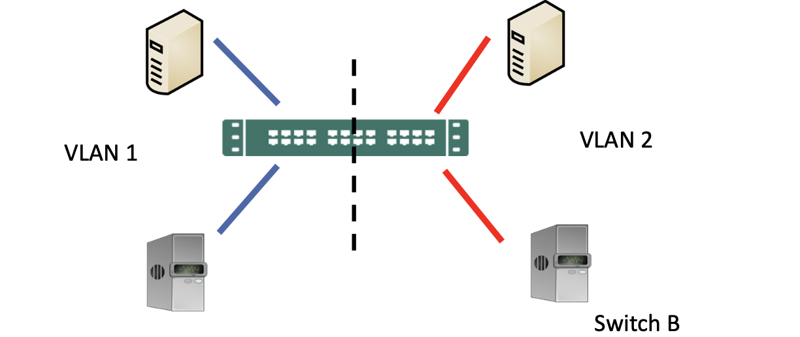
     

    * For small and medium-sized organizations based on the department
        * Easier for resources to be aggregated according to their departments. E.g. resources for financial department, HR, operations, etc.
        * Isolates resources per departments
    
     

    * Limitation for this approach: 
        * Complication will occur when different departments wants to access common resources file (E.g. File server)
        * Will require cross VLAN access which needs multiple rules (access conditions, more maintenance)
        * Large network usually avoid VLAN
    
     

    * VLAN based on other aspects
        * **Business objectives**
            * Create VLANs that have resources based on common business objectives
        * **Level of sensitivity**
            * Create VLANs based on up-to-date assesment of reousces, with risk level of High, Medium or Low
        * **Location**
            * For large organisations, sometimes it is better to organise the resources based on locations
        * **Security Zones**
            * This type of segmentation is usually combined with others for specfic purposes. E.g. One security zone for all servers that are accessed by partner
    
 

- ### Virtual Network Segmentation
    * Security must be embedded even in virtual networks of Virtual Machines (VMs) created/managed by a hypervisors (E.g.VirtualBox, VMware) in a server

     

    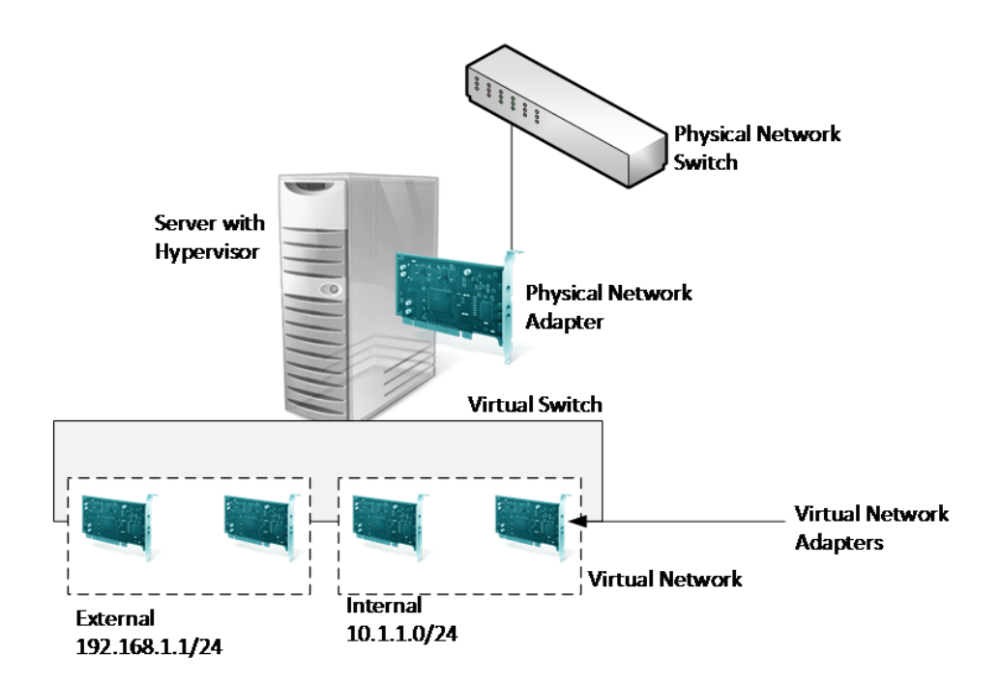

    * Planning virtual network segmentation
        * Best to take ***VENDOR-AGNOSTIC*** approach, core principles of virtual netowkr segementation are same regardless of platform

        * Isolation in virtual switch &#8594; Traffic from one virtual network is not seen by other virtual network. 
        * Each virtual network can have its own subnet, and all VM within the virtual network can communicate among themselves but unable to traverse to other virtual network

        * Communications between 2 or more virtual networks requires a ***ROUTER*** that has multiple virtual networks adapters

        * Possible to implement virtual switch level, some security inspections using virtual extensions

        * Using virtual switch level some extensions allows inspecting packets before transferring it to other network &#8594; Benefical for overall network security strategy

     

    * Network security of virtual network
        * Traffic originated in one VM can often traverse to physical network and reach another host connected to corporate network
        
        * ***MAC address (arp poisoning) prevention*** &#8594; Prevent malicious traffic from being sent from a spoofed MAC address

        * ***DHCP Guard*** &#8594; Prevents VM from acting or responding as a DHCP server

        * ***Router Guard*** &#8594; Prevents VM from issuing router advertisement and redirection messages

        * ***PORT ACL (Access Control List)*** &#8594; Allows user to configure specific ACL based on MAC or IP address

 

- ### Discovering Network
    * Internal reconnaissance technique used to discover network structure in the organisation
        * Nmap or traceroute is useful to discover and identify network structure
        * Commercial tools such as Network Sonar Wizard can provide more graphical outs to users including network structure diagram and geographic location of network hosts and devices

 

- ### Securing Remote Access to the Network
    * Scenarios that requires remote access:
        1. WFH employees
        2. Employees travelling, and requires remote access to company's resources

     

    * Requirements of remote access:
        1. Segmentation plan

        2. NAC (Network Access Control) system: to evaluate remote system before allowing access to the network
            - **NAC Definition: An approach to computer security that attempts to unify endpoint security technology (such as antivirus, host intrusion prevention, and vulnerability assessment), user or system authentication and network security enforcement.**

        3. Evaluation criteria for the remote system
            - If the remote system has the latest patches (ie. up-to-date security patches)?
            - If antivirus is enabled on the remote system? 
            - If the remote system has personal firewall enabled?
            - If the remote system is compliant with mandate security policies
    
     

    * 1st example of NAC system: 

        * In the example, the NAC is responsible for the following:
            - the validation of current health state of remote devices
            - the performing of ***software-level segmentation*** - by allowing only source devices to communicate to predefined resources located on-premises (main network)

         

        

     

    * 2nd example of NAC system:

        * In this example, the company has segmentated the remote devices in a VLAN, and a firewall is installed between the VLAN and the main network to control network traffic.
        * Usually implemented when companies want to restrict type of user access when they access the main network remotely. 

         

        

     

    * Site-to-site VPN
        * VPN (Virtual Private Network) establishes a secure encrypted tunnel between two remote sites.

        * VPN usually uses IPSec protocol, some software VPN uses the TLS (Transport Layer Security) protocol.
            - IPSec: encrypts and authenticate data packets to provide a **secure encrypted communication** between devices over an IP network.
            - **note**: encryption is not mandatory, ESP (Encapsulation Security Protocol) + authentication in Tunnel mode provides the strongest security. 
            - Transport mode only protects the payload, Tunnel mode protects the payload and the IP header.
        * Site-to-site VPN a common method for organisations that have remote locations is to have a ***a secure private channel of communication between the main corporation network and the remote network*** 
         

     

    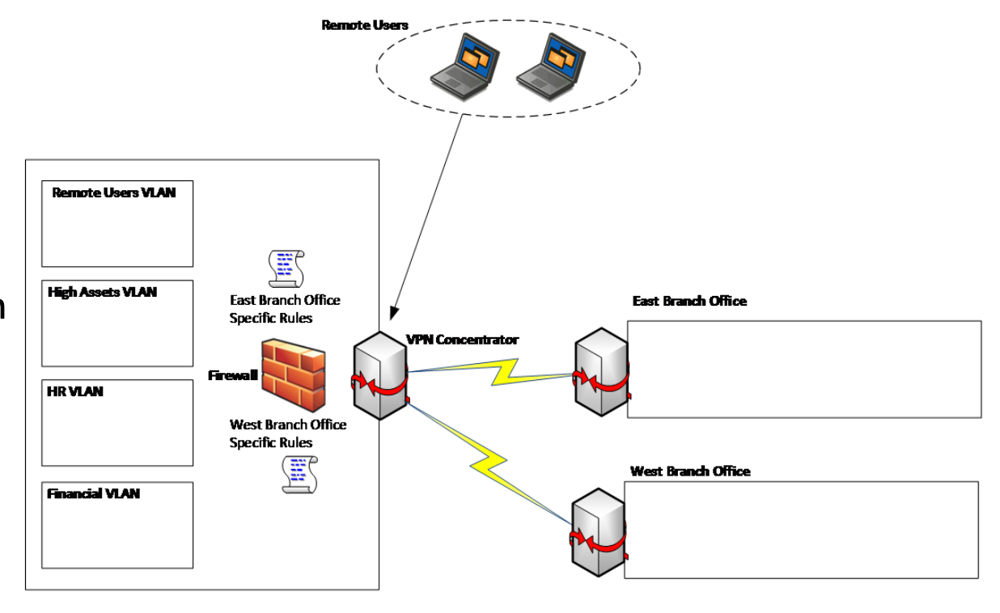

    * Example:
        * Each remote branch office will have its own set of rules in the firewall. Hence, when site-to-site VPN is established, **the remote branch will not be able to access the entire main network**. It can only access some segments. 

        * The **"need-to-know" principle** has to be applied when planning a site-to-site VPN. Which is ***only allowing access to what is needed***.
        (If the East Branch office DOESNT NEED to access the HR VLAN, then the office SHOULD NOT have access to it)

 

- ### Case study: Amazon AWS
    * AWS provides several security capabilties and services to increase privacy and control network access
        1. ***Network Firewalls*** &#8594; Built into Amazon Virtual Private Cloud (VPC)

        2. ***Web Application Firewall(WAF)*** &#8594; Create private networks and control access to instances and applications

        3. ***TLS across all services*** &#8594; Customer-controlled encryption in transit with TLS

        4. ***Private, or dedicated connections*** &#8594; Connectivty options that enable private or dedicated connections from office or on-premises environments

        5. ***Automatic encryption*** &#8594; Encryption of all traffic on AWS global and regional networks between AWS secured facilities
<!-- End of Network Segmentation chapter -->

 

---

 

## Active Sensors

- ### Detection Capabilities
    * New apporach to detection systems that Blue Team must leverage series of techniques including:
        1. Data correlation from multiple data sources
        2. Profiling
        3. Behavior Analytics
        4. Anomaly Detection
        5. Activity Evaluation
        6. Machine Learning

    * Relation to defense in depth approach
        * Detection is one layer of defense
        * Needs to aggregated with other layers to enhance security posture

    * Traditional defender mindset vs new approach
        * Traditional defender mindset &#8594; Focuses on monitoring ***ONLY HIGH PROFILE USERS***

        * Must look across all user accounts, profile them and understand their normal behavior
            * Attackers will look to compromise regular user, stay dormant in network, continue to move laterally then escalate privilege
        
        * Blue Team must have detection mechanisms in place to indentify behaviours across all devices, locations and raise alerts based on ***DATA CORRELATION***

        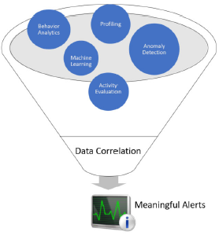
    
    * Indicator of Compromise (IoC)
        * Artifact observed on networks or in OS that indicates computer intrusion with high confidence
        
        * With new threats found in the wild, threats have pattern of behaviour and leave footprint in target systems

        * IoC helps organisation to identify and mitigate threats or at least stop it in earliest stages

 

- ### Major IoCs
    * Unusal outbound traffic
        * Compromised systems often connect to C2 servers and traffic may be visible before any damages is done

        * Watch for activity within network and look for traffic leaving perimeter is nescssary

    * Anomalies in privileged user account activity
        * Changes in behavior of privileged user accounts; comprimsed by attacker or to leapfrog other users

        * Monitor log for anomalies; time of activity, systems accessed, volume accessed

    * Geographic irregularities
        * Geographic irregularities in log-ins, access patterns

        * Connections to countries a company not conducting business in

    * Log-in red flags
        * Attackers probing network and system

        * Attempted and successfull log-in activity after hours indicates it isn't employee accessing data

    * Sudden increase in database read volume
        * Attacker probing data stores to exfiltrate information

        * Attacker attempts to extract full credit card database generate huge amount of read volumn

    * Large number of request for same file
        * Large number of request of same file, indication of trying different exploits to find a working one

        * Single user or IP making huge request for "join.php"

    * Mismatched port-application traffic
        * Application using unsual port, sign of C2 traffic masquerading as normal application behaviour

        * C2 communications masked as DNS request over port 80 instead of port 53

    * DNS request anomalies
        * Large spike in DNS requests from specific host indicator of generating C2 traffic

        * Pattern of DNS requests to external hosts is necessary 

    * Suspicious registry or system file change
        * Malware writers establish persistence within an infected host via registry changes

        * Attacker tamper host system files

    * Mobile device profile changes
        * Managed mobile device gains new configuration profile not provided by organisation

        * Hostile profile installed on device via (spear)-phishing attack

    * Wrong placement of data
        * Attacker frequently aggregate data at collection points in system before exfiltration

        * Files in odd place such as root folder of recycle bin

    * Web traffic with inhumane behaviour
        * Web traffic does not match normal human behaviour

        * 30-40 browser windows to different sites
    
- ### Intrusion Detection System
    * Intrusion detection system is a system that ***MONITORS NETWORK OR SYSTEM FOR MALICIOUS ACTIVITY OR POLICY VIOLATIONS*** and ***TRIGGERS ALERTS***

    * IDS Policy:
        * Who should monitor IDS?
        * Who have administrative access to IDS?
        * What's the IDS update policy?
        * Where should IDS be deployed?
        * How incidents will be handled based on alerts generated by IDS?

    * Types of IDS:
        * [Host-Based IDS](#host-based-intrusion-detection-systems-hids)
        * [Network-Based IDS](#network-based-intrusion-detection-systems-nids)
        * [Signature-Based Intrusion Detection Systems](#signature-based-intrusion-detection-systems-sids)
        * [Behaviour-Based Intrusion Detection Systems](#behaviour-based-intrusion-detection-systems-bids)
        

     

    * Core capabilities of IDS
        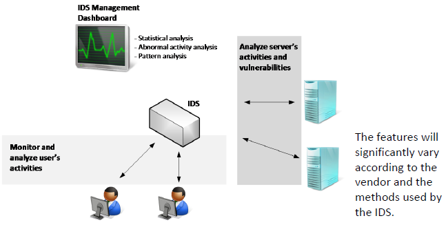
            
    * #### Host-Based Intrusion Detection Systems (HIDS)
        * IDS runs on individual host/devices
        * Monitors inbound and outbound packets ***FROM DEVICES ONLY***, alerts users or admins if suspicious activity is detected

        * HIDS take snapshot of existing system files and matches previous snapshot. If critical changes are detected, HIDS alerts admin

        * Usually seen on ***MISSION-CRITICAL MACHINES***

     

    * #### Network-Based Intrusion Detection Systems (NIDS)        
        * IDS that detects intrusion for network segement that is installed
        
        * NIDS ***ARE PLACED AT STRATEGIC POINT OR POINTS WITHIN NETWORK*** to monitor traffic to and from all devices on network  

        * NIDS performs analysis of passing traffic on entire subnet and matches traffic that is passed on subnets to library of known attacks. Identified attack or abnormal traffic is alerted to admins

        * Placement of NIDS are critical to gather valuable traffic

        * ***PRIORITISE NETWORK SEGMENTS WHEN PLANNING NIDS PLACEMENT***
            1. DMZ/Perimeter:
                * DMZ adds an additional layer of security to an organisation's LAN. External network node can access what is exposed in DMZ, rest of the network is protected from firewall. E.g. FTP, mail, DNS Server

            2. Core corporate network

            3. Wireless network

            4. Virtualisation network

            5. Other critical network segments

     

    *  #### Signature-Based Intrusion Detection Systems (SIDS)
        * IDS queries database of previous attack's signatures such as byte sequence in network traffic used by malware to trigger alert

        * Database requires ***CONSTANT UPDATES*** to keep up with new attacks

     

    * #### Behaviour-Based Intrusion Detection Systems (BIDS)
        * IDS works by creating ***BASELINE MODEL OF TRUSTWORTHY ACTIVITY*** through machine-learning and compare new behaviour against the model

        * Anomaly-based intrusion detection system (AIDS) introduced to detect unknown acctacks, due to rapid development of malware

        * AIDS approach may suffer from false positives, unknown legitimate activity maybe classified as malicious 

        * 2 major AIDS:
            1. User and Entity Behaviour Analytics (UEBA)

            2. Network Traffic Analysis (NTA)
                * Deals with insider threats and external attacks

     

- ### Intrusion Prevention System (IPS)
    * IPS same concept of IDS but ***PREVENTS INTRUSION*** by taking ***CORRECTIVE ACTIONS***

    * Primary usage: 
        * Identify possible incidents, loggin information about them and reporting attempts

    * Other uses:
        * Identifying problems with security policies
        * Documenting exisiting threats
        * Deterring individuals from violating security policies
    
    * Types of IPS (Same as IDS):
        * Host-Based IPS
        
        * Network-Based IPS
        
        * ### IPS Detection Modes
            * Rule-Based IPS:
                * IPS will compare traffic against rules to determine if it is a threat
                * E.g. Snort: Able to block threats by leveraging rule-based detection

             

            * Anomaly-Based IPS:
                * Extension of [Anomaly-Based IDS](#behaviour-based-intrusion-detection-systems-bids)
                * User Behaviour Analytics (UEBA) plays an important role
                * Anomaly is based on waht IPS categorise as anomalous
                * Takes a sample network traffic at random time, perform and compare with baseline. 

     

- ### Behavior Analytics (BA) On-Premises
    * Basic functionality:
        * Look at patterns of human behaviour, apply algorithms and statistical analysis to detect meaningful  nomalies from those patterns

        * Behaviour analytics tracks system's user instead of devices or security events

        * Big data platforms like Apache Hadoop increase behaviour analytics functionality by allowing them to analyse petabytes worth of data to detect insider threats and APT

     

    * User and Entity Behaviour Analytics (UEBA)
        * 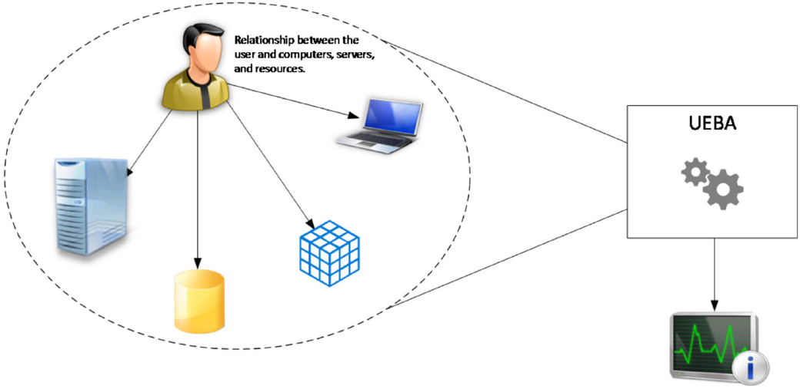

        * Referred as **any technologies based on behaviour analytics**

        * The most important advantages is the capability to detect attacks in the early stages and take corrective action to counter the attack.

        * Cybersecurity process that takes note of normal conduct of usrs to spot any anomalous behaviour or instances that deviate from baseline patterns

        * Importance of UEBA placement:
            1. Same principles of IDS placement, location to install UEBA vary according to company's need and vendor's requirements

        * Importance of BA on-premises:
            1. Core business still running on-premises
            2. Critical data located on-premises
            3. Majority users are working and key assets located on-premises
            4. Attacker silenty infiltrate on-premises network, move laterally, escalate privileges, 
            maintain connectivity with C2 until mission ends

         

        * Case Study:
            1. Suspicious behaviuour of administrators:
                * System knows what servers users usually access, OS used, resources accessed and geo-location

                * Microsoft Advance Threat Analysis (ATA), uses UEBA to detect suspicious behaviour

            2. Pass-The-Ticket attack:
                * Infect target with computer with malware that allows attacker to leverage user accounts to access other network resources

                * Get access to account with elevated privileges, access to Domain Controller (DC)

                * Log into DC and dump password hash for Kerberos Ticket Granting Ticket (TGT), account, use it to create Golden Ticket to gain access to network resources (Usually use ***Mimikatz*** to attack)

                * Detection of Pass-The-Ticket Attack: 
                    * Look for attack pattern and what attacker is trying to do

            3. Warning misconfiguration:
                * Attackers take advantage of misconfiguration other than vulnerabilities. 

                * Bad protocol implementation and lack of hardening. UEBA will not detect system lacking of secure configuration

                * E.g. Usage of Lightweight Directory Access Protocol (LDAP) without encryption
                
