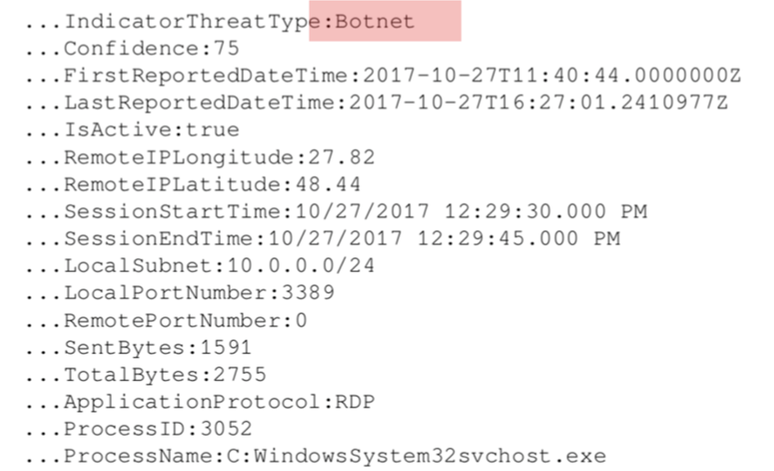
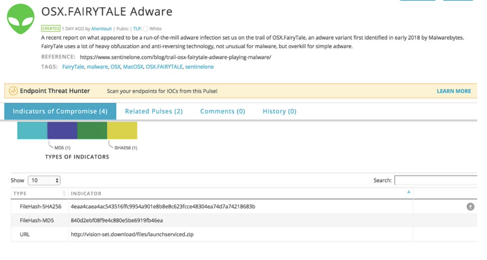
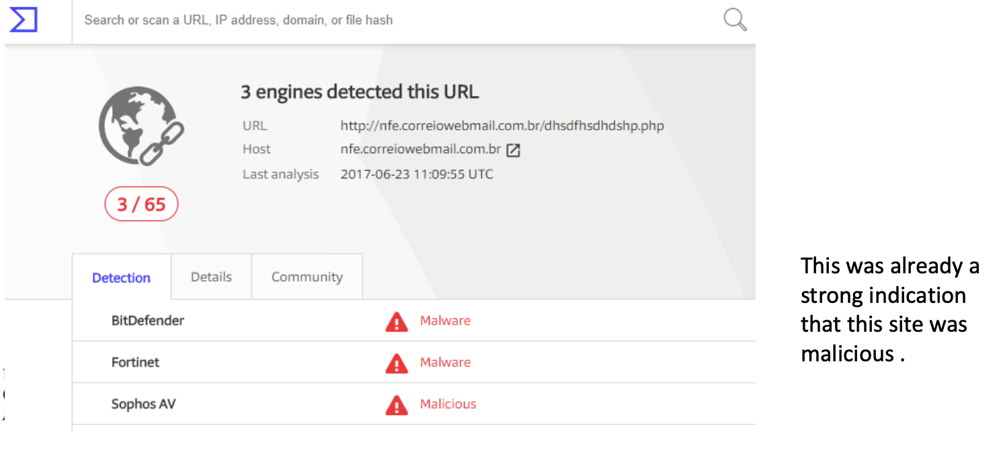
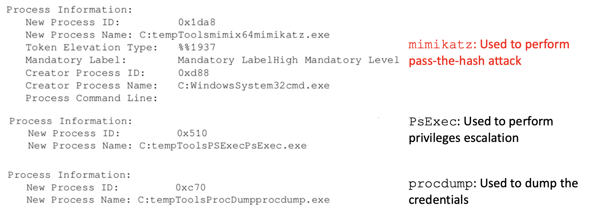
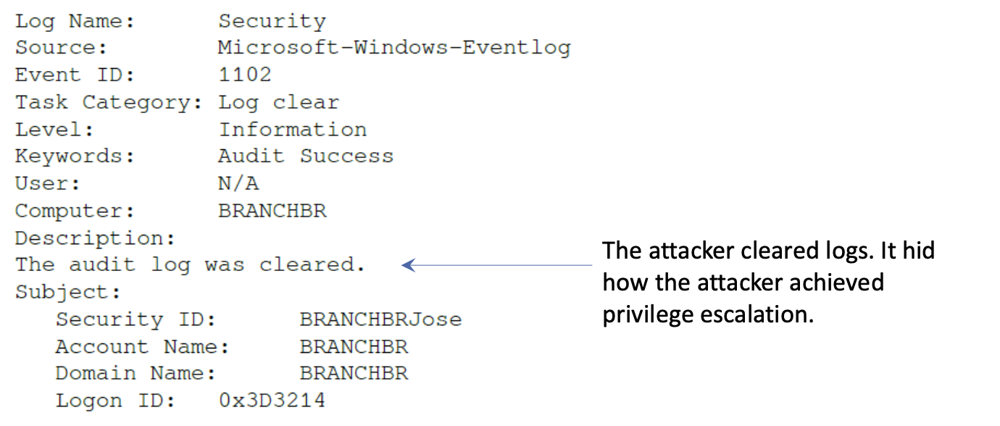
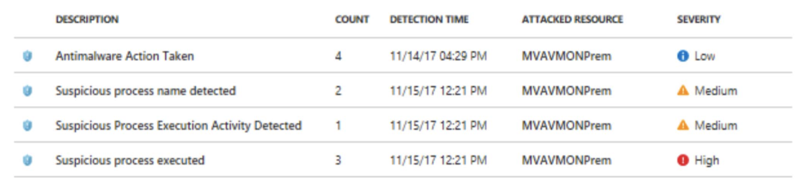
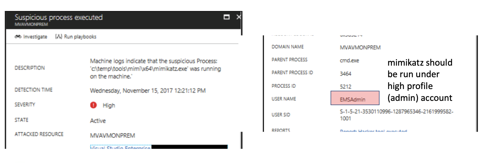

# Week 5

## Table of Contents
---
1. [Threat Intelligence](#threat-intelligence) <br>
    1.1 [Introduction to Threat Intelligence](#introduction-to-threat-intelligence) <br>
    1.2 [Levels of Cyber Threat Intelligence](#levels-of-cyber-threat-intelligence) <br>
    1.3 [Microsoft Threat Intelligence](#microsoft-threat-intelligence) <br>
    1.4 [Open Source Tools for Threat Intelligence](#open-source-tools-for-threat-intelligence) <br>
    1.5 [Leveraging Threat Intelligence to Investigate Suspicious Activity](#leveraging-threat-intelligence-to-investigate-suspicious-activity) <br>
    1.6 [Overview: Investigating an Issue](#overview-investigating-an-issue) <br>
    * 1.6.1 [Scoping the issue](#scoping-the-issue)
    * 1.6.2 [Key artifacts](#key-artifacts)
    * 1.6.3 [On-Premises compromised system](#on-premises-compromised-system)
    * 1.6.4 [Cloud-Based compromised system](#cloud‐based-compromised-system-hybrid-cloud)
    * 1.6.5 [Search and you shall find it](#search-and-you-shall-find-it) <br>
    
    1.7 [Lessons ](#lessons-learned)

2.  [Recovery Process](#recovery-process) <br>
     2.1 [Disaster Recovery Plan](#disaster-recovery-plan) <br>
     2.2 [Live Recovery](#Live-recovery) <br>
     2.3 [Contingency Plan](#contingency-plan) <br>
     2.4 [Best Practices for Disaster Recovery](#best-practices-for-disaster-recovery) <br>

---
## Threat Intelligence

- ## Introduction to Threat Intelligence

    * Threat intelligence refers to Cyber Threat Intelligence (CTI) 

    * Using CTI towards the data collected can bring more meaningful results and reveal actions that are not detectable by traditional sensors

    * Which enables the organisation to take proactve measures against the known and unknown threats. (Targeted attacks requires targeted defense)

    * Areas where information collected from CTI can be used:
        * Profiling motivations:
            * A question to ask: which type among the 3 is most likely to target our organisation?
                1. **Cyber-crime**: One of the main motivations is to obtain financial gain from the victims
                2. **Hactivism**: Ranges from expression of political preference to simply an expression for a particular cause
                3. **Cyber espionage**: There are a growing number of cyber espionage cases as a part of bigger state‐sponsored campaigns

            <br>
            
        * Detetction can be improved by learning more about the attackers

        <br>

        * Analysing the attacker tactics: 
            * Attacker methodologies, tools and strategies of the attacker
        
        <br>

        * Analysing the attacker techniques: 
            * Specific malwares used

        <br>

        * Accessing operations: 
            * Assessment on the organisation's ability to determine future cyber-threats

    <br>

    * Scoping the adversary
        * Using intelligence-led approach has long been accepted as best practice in the realm of conventional security

        * Without it, organisations will invariably defend against **too little**, as they do not understand the threats they face, or **try to defend against all potential** threats - an sustainable approach that may impair the organisation's ability to operate effectively.

    * CTI ensures that organisations have their ability to ***prevent, detect, and respond to realistic, contemporary, and accurate attacks***

    * Bank of England's CBEST:
        * The first intelligence-led cyber security testing frameworks, ensures organisations are tested on their ability of CTI

        * The principle has since expanded, both internationally to other financial sectors, and to other regulated sectors in the UK. The scheme includes:
            * TIBER‐NL (Threat Intelligence Based Ethical Red‐teaming Netherlands) for the Dutch financial sector
            * TBEST for the UK telecoms sector
            * TIBER‐EU for the European financial sector
            * iCAST (Intelligence‐led Cyber Attack Simulation Testing) for Hong Kong’s financial sector
            * GBEST for UK government departments
            * ATTEST for the UK aviation industry

<br>

---

- ## Levels of Cyber Threat Intelligence

    * **OPERATIONAL THREAT INTELLIGENCE:**
        * Threat intelligence related to details of ***potential impending operations against an organisation***.

        * CTI providers will generally supply operational threat intelligence in *a combination of human and machine‐readable formats*.
            * E.g. Chatter from cyber activists discussing potential targets for an upcoming campaign, or data leaked or sold on a dark web forum that could be used in an operation against the company.

    <br>

    * **TACTICAL THREAT INTELLIGENCE:**
        * Threat intelligence related to the ***Techniques, Tactics and Procedures (TTP’s) used by threat actors***.
            - Indicator of Compromise (IOCs) are the main deliverables for tatical threat intelligence providers.

        * Particularly useful for updating signature-based defence systems to defend against known attack types, but can also prove useful for more proactive measures.

        * Particularly useful to network defenders such as Network Operations Centers (NOCs)

        * CTI providers will generally supply IOCs in machine‐readable formats, whereas intelligence on TTPs will be in human‐readable formats, and will require human assimilation and action

    <br>

    * **STRATEGIC THREAT INTELLIGENCE:**
        * Threat intelligence related to informing the broader changes in the threat landscape.
        
        * Useful for senior (C-suite) decision makers.

<br>

---

- ## Microsoft Threat Intelligence

    * For example, Microsoft consumes threat intelligence through different channels, such as
        * The Microsoft Threat Intelligence Center, which aggregates data from:
            * Honeypots, malicious IP addresses, botnets, and malware detonation feeds
            * Third-party sources (threat intelligence feeds)
            * Human‐based observation and intelligence collection
        
        <br>

        * Intelligence coming from the consumption of their service

        * Intelligence feeds generated by Microsoft and third parties

        <br>

    * CASE STUDY - Azure Security Center
        * Provides threat intelligence as well as other functionalities.

            

    * Botnets
        * Network of compromised computers that can be accessed emotely and used for malicious activity

        * Botnets work by **infecting tens of thousands of computers that lie dormant (called zombies) until commanded to action by the attacker**.

        * These compromised machines can communicate with each other or with a bot‐herder and can act in a coordinated way based on commands.

<br>

---

- ## Open Source Tools for Threat Intelligence

    * There are variouse open source tools for tatical threat intelligences:
        * Quick IP validation: https://fraudguard.io/

        * Malware inspection: https://vms.drweb.com/ (Note that malwr.com in the textbook is not available.)

        * Threat intelligence exchange: https://otx.alienvault.com/

        

<br>

---

- ## Leveraging Threat Intelligence to Investigate Suspicious Activity

    * Challenges of interpreting many security alerts:
        * According to Microsoft's Lean on the Machine report, an average large organization has to look through 17,000 malware alerts each week, taking on average 99 days for an organization to discover a security breach.

        * End up randomly prioritizing, and in some cases even ignoring, future alerts.

    <br>

    * Threat intelligence assisting Incident Response (***RECALL INCIDENT RESPONSE***)
        * The Blue Team *works primarily on the defense system*, they do collaborate with the incident response team by providing the right data that can lead them to find the root cause of the issue.

    <br>

    * Alert Triage
        * ***Process of determining the most important threat that must be alerted.***

        * Failing/delaying this process can lead to a domino effect, because if triage fails at this level, the operation will also fail.

    <br>

    * The alert triage usually happens at Network Operations Center (NOC).

    <br>

    * Questions at the end of the triage:
        1. Which systems were compromised?

        2. Where did the attack start?
        
        3. Which user account was used to start the attack?

        4. Did it move laterally?
            * If yes, what were the systems involved in this movement?

         <br>       

        5. Did it escalate privilege?
            * If yes, which privilege account was compromised?

         <br>       

        6. Did it try to communicate with command and control?
            * If yes, was it successful?
                - If it was, did it download anything from there?
                - If it was, did it send anything to there?
         
         <br>       

        7. Did it try to clear evidence?
            * If it did, was it successful?

<br>

---

- ## Overview: Investigating an Issue

    1. ### Scoping the issue

        * **SCOPING** in the incident investigation
            * ***Process that determines if a given incident is security-related***

        * Reasons for scoping
            * ***NOT EVERY incident is a security‐related***. Therefore it's vital to scope the issue prior to start an investigation.
            
            * Sometimes, the symptoms may lead the investigator to initially think they are security‐related, but as the investigator ask more questions and collect more data, it turns our that the problem was not really related to security.

        * Scoping example:
            * Users reporting systems running “slow”: Rather than dispatching a security responder to initiate an investigation, basic performance troubleshooting should be conducted.

            * During this initial scoping stage, it is also **IMPORTANT TO DETERMINE FREQUENCY OF THIS ISSUE**.
                * If the issue is not currently happening, the investigator may need to configure the environment to collect data when the user is able to reproduce the problem.

            * Make sure to document all the steps and provide an accurate action plan for the end use.
        
        <br>
        
        ---

    2. ### Key artifacts

        * More data doesn't necessarily mean better investigation.

        * Data collection should focus on obtaining ***VITAL and RELEVANT*** artifacts from the target system.
            * *TOO MUCH DATA can DEVIATE security team from the **ROOT CAUSE** of the problem.*
        
        <br>

        * In a ***WINDOWS*** system, information is usually located in the registry key.

        * It can be retrieved by PowerShell command 
            ```
            Get-ItemProperty
            ```
        
        <br>

        * Key artifacts in ***WINDOWS SYSTEM***:
            * To determine the ***LOCATION (TIME ZONE)*** of the machine
                * information is located in the registry key at:
                
                ```
                HKEY_LOCAL_MACHINE\SYSTEM\CurrentControlSet\Control\TimeZone Information
                ```
            
            <br>

            * To determine ***NETWORKS VISITED*** by machine
                * information is located in the registry key at:
                
                ```
                HKEY_LOCAL_MACHINE\SOFTWARE\Microsoft\Windows NT\CurrentVersion\NetworkList\Signatures\Unmanaged and Managed
                ```
            
            <br>

            * USB usage
                * information is located in the registry key at:
                
                ```
                HKEY_LOCAL_MACHINE\SYSTEM\CurrentControlSet\Enum\USBSTOR 
                and
                HKEY_LOCAL_MACHINE\SYSTEM\CurrentControlSet\Enum\USB
                ```
            
            <br>

            * To determine any ***MALICIOUS SOFTWARE*** configured to start when Windows starts
                * review the registry key at:
                
                ```
                HKEY_LOCAL_MACHINE\SOFTWARE\Microsoft\Windows\CurrentVersion \Run 
                and 
                HKEY_LOCAL_MACHINE\SYSTEM\CurrentControlSet\Services
                ```
                * Look for random name services and entries that are not part of the computer's profile pattern.
                
                * Msinfo32 also can be used.
            
            <br>

        * In addition, traffics and processes dumps can be collected, if this is live investigation.

        <br>

        * All security events can be captured. Examples:
            * A change has been made to Windows Firewall exception list.
            
            * The audit log was cleared.

            * Logging‐on success or failure.

            * A registry value was modified.

            * An attempt was made to access an object (e.g. unauthorized access to the filesystem): This log can be used to drill down who performed this change.
            
            <br>

            * A new process has been created: The malware and ransomware have a cmd.exe [command]. This will create a new process.

            * A scheduled task was enabled or updated.

            * The user account
                * enabled, created, or locked‐out account. 
                * password reset.
                * denied remote access.
                
                <br>

            * Policies
                * Log policy changed.
                * Domain policy changed.
                * Changes in security‐enabled global (or local) group.

                <br>

    <br>
        
    ---

    3. ### On‐premises compromised system

        * ***COMPROMISE*** by phising email:
            * End user (victim) was received the content of the email, which triggered the victim to click the image in the email.

            * Victim tried to download but couldn’t. Only had a glimpse of a quickly opening and disappearing window.

            * Victim ignored the email.
        
        <br>

        * ***DETECTION***:
            * Couple days later, victim receive an automated report from IT saying that he accessed a suspicious site and he should call support to follow up on this ticket.
            
            * Victim submitted the suspicious mail as an evidence.

        <br>

        * ***INVESTIGATION STEPS***:
            1. URL which was linked in the image was investigated.

                

            2. The next step is to review the event logs. The meaningful logs are:

                

                <br>

                

        <br>

        * *Summary of the case*:
            * Started from a phishing email.

            * Email had an embedded image that had a hyperlink to a site that was compromised.

            * A package was downloaded and extracted in the local system, this package contained many tools, such as mimikatz, procdump, and psexec.

            * *This computer was not part of the domain, so only local credentials were compromised.*

    <br>
        
    ---

    4. ### Cloud‐based compromised system (Hybrid cloud)

        * Compromised by phishing email – Cloud version
            * In this hybrid scenario, the compromised system is located on‐premises and the company has a cloud‐based monitoring system

            * User received a phishing email, clicked on the hyperlink, and got compromised.

            * The **difference now is that there is an active sensor monitoring the system**, which will trigger an alert to SecOps, and the user will be contacted. **The users don't need to wait days to realize they were compromised; the response is faster and more accurate.**

            * Example of the active sensor is Azure Security Center and four events were recorded.

            

            * Although antimalware software captured the malware, the attacker kept going and succeeded as the last three events show.

            * Last three events are related to the serious mimikatz process.

            * The image below shows a mimikatz process, which was executed (as shown in the previous image on the 4 events recorded by Azure Security Center).

            

    <br>
        
    ---

    5. ### Search and you shall find it

        * In a real‐world scenario, the amount of data that gets collected by sensors and monitoring systems can be overwhelming.
            * Security monitoring system that can aggregate all these logs, digest them, and rationalize the result.

            * You also need searching capabilities to be able to keep digging up more important information.

            * It is important to be used to those search capability of the platform that you are using and familiar with commands to further analysis.

            * Also, the platform should provide **efficient visualizing and searching interfaces**.
        
    ---

- ## Lessons learned
    * Every time an incident comes to its closure
        * Each step that was done during the investigation should be documented.

        * Key aspects of the investigation that need to be either reviewed to improve or fix should be identified.
    
    * The lessons learned are crucial for the continuous improvement of the process and to avoid making the same mistakes again.

    * The Blue Team should create an extensive report to document the lessons learned and how this will be used to improve the defense controls.

    * Lessons learned from the examples: Attacks against a user's credential are a growing threat and the solution is not based on a silver bullet product, instead, it is a combination of tasks, such as:
        1. Reducing the number of administrative level accounts and eliminating administrative accounts pn local computers. - Regular users shouldn't be administrators on their own workstation. 

        2. Using MFA (multifactor authentication) as much as possible. Adjusting the organization’s security policies to restrict login rights.

        3. Having a plan to periodically reset the Kerberos TGT (KRBTGT) account. This account is used to perform a golden ticket attack.

---

<br>

## Recovery Process

- ### Disaster Recovery Plan

    * Benefits of disaster recovery plan

        1. ***SENSE OF SECURITY***
            * Assures continued ability to function in face of disaster.
        
        <br>

        2. ***REDUCED DELAYS IN RECOVERY PROCESS***
            * Easier to recover from a disaster in a coordinated way.
        
        <br>
        
        3. ***GUARANTEED RELIABILITY OF STANDBY SYSTEMS***
            * Ensures standby sysstems are always available to restore business during disasters.
        
        <br>
        
        4. ***PROVIDING STANDARD TEST PLANS***
            * Standard test plan for all business operations.
        
        <br>
        
        5. ***MINIMISING TIME TAKEN FOR DECISIONS***
            * Reduced time to make decisions.
        
        <br>
        
        6. ***MITIGATING LEGAL LIABILTIES***
            * Avoid legal liabilities during disasters.

    <br>
        
    * Disaster Recovery Planning Process
        1. Forming A Disaster Recovery (DR) team
            * All-inclusive, involving members from all departments and representative from top-level management

            * Determine scope of the recovery plan, regarding the oeprations of their department

            * Oversee successful development and implementation of the plan

        <br>

        2. Performing Risk Assesment
            * Conduct risk assesment and identify natural and man-made risk affecting operations closely related to IT infrastructure

            * Evaluate sensitive files and servers by listing threats that they are exposed to and impact those threats may have

            * Fully aware of impact and consequences of multiple disaster scenarios; have consideration of ***WORST-CASE*** scenarios
        
        <br>

        3. Prioritising Processes & Operations
            * Department representative to identify critical needs that should be prioritised in event of disaster

            * Most organisation will no posses sufficient resources to respond to all needs during disaster, some criteria need to be set to determine which requires organisation's resources and attention first

            * Key areas need to be prioritised:
                1. Functional operations
                2. Information flow
                3. Accessibility & Availbility of computer used
                4. Senstive data 
                5. Existing policies

            <br>

            * Determine ***MAXIMUM POSSIBLE TIME*** each department operation ***WITHOUT CRTICAL SYSTEMS***
                * Critical systems: Systems that support different operations in an organisation
            
            * Establishing priorities: 
                1. Critical needs of each department
                2. Identify key process that needds to take place
                3. Identify and rank underlying process and operations

            * 3 Level of priority:
                1. Essential
                2. Important
                3. Non-essential

        <br>

        4. Detemining recovery strategies
            *  Formulate recovery strategies to cover all aspects of organisation including:
                * Hardware
                * Software 
                * Databases
                * Communication channels
                * Customer services
                * End-user systems

        <br>

        5. Collecting data
            * Collect information about organisation 
            * Include information about:
                * Inventory forms
                * Policies and procedures
                * Communication links
                * Important contanct details
                * Customer care number of service providers
                * Details of hardware and software resources organisation has
                * Backup storage sites and backup schedule with backup retention duration

        <br>

        6. Creating disaster recovery plan


        <br>

        7. Testing plan
            * Applicability and reliabity of plan to be thoroughly tested to identify any challenges or errors

            * Testing provides a platform for DR team and users to perform necessary checks to better understand of response plan

            * To prove that the plan is ***PRACTICAL AND EFFECTIVE*** for end-users and DR team

        <br>

        8. Obtaining approval
            * To be submiited to top management for approval
            * Approval on 2 grounds:
                1. Assurance that plan is consistent with organisation's policies, procedures and other contingency plans

                2. Plan is subject to annual reviews

        <br>

        9. Maintaining the plan
            * Good disaster recovery plan must be updated often

            * Disaster recovery plan should be updated based on need rather than rigid schedule

            * Setting up of updating schedule; make provisions for updates when they are needed

        <br>

    * Challenges of Disaster Recovery Plan
        * Lack of approval by top-management 
            * Top management usually take disaster recover planning as mere drill for fake event that never happens, therfore not priortising the recovery plan

        <br>
        
        * Incompleteness of ***RECOVERY TIME OBJECTIVE(RTO)***
            * RTO are key determiners of ***MAXIMUM ACCEPTABLE DOWNTIME*** for an organisation. 

            * Difficult to have cost-effective plan within RTO
        
        <br>

        * Outdated plans
            * Difficult to keep disaster recovery plans updated. ***OUTDATED PLANS MAY BE INEFFECTIVE AND UNABLE TO RECOVER THE ORGANISATION*** when new threat vectors happens

<br>

---

- ### Live Recovery

    * Need for live recovery

        * Traditional recovery mecahnisms:
            * Affected system to be taken offline, restore files, bring system back online
            
            <br>

        * Disaster affect system that are in use    
            * Some organisation have systems that cannot tolerate being taken offline for recovery

            * Systems are structually built in a way that they cannot be brought down for recovery

    * 2 ways to live recovery
        1. Installing a clean system:
            * Install a clean system with right configurations and uncorrupted backup files on top of faulty system

        2. Data recovery tools
            * Recover valuable data in exisiting system
            * May run update on all exisiting configuration to replace with right ones
            * Allows system to change without affecting underlying files; allow recovery to be done without complete system restore

<br>        

---

- ### Contingency Plan

    * Plan B; Alternative course of action if disaster occurs

    * Contingency planning process: 
        1. Identification of risk IT infrastructure is subjected to
        2. Remediation strategies to reduce impact of risk significantly

    <br>

    * Need for contingency planning
        * Existence of many risk that organisation face; from natural disasters to careless actions of users

        * Impossible to eliminate all risks

    <br>

    * Sound contingency plan requirements:
        1. Reliable execution plans and resonable updating schedules
        2. Integration between contingency plan and other business continuity plans
        3. Have recovery strategies and Recovery Time Objective (RTO)
        4. Developed exercise, training and updating task

    <br>

    * Need for IT contingency planning process:
        * Prepare for future ***UNFORTUNATE EVENTS*** to ensure organisation are in position to respond to them timely and effectively

        * Enables organisation to keep going despite unfortunate events such as:
            * Hardware failure
            * Cybercrime
            * Natural disasters
            * Unprecedented human errors

    <br>

    * IT Platforms contingency plan must resolve:
        1. Workstation, laptops and smartphone
        2. Servers and websites
        3. Intranet and WAN
        4. Distrbuted system (if anyone)
        5. Server room or firms (if anyone)

    <br>

    * 5 steps of IT contingency planning process:

        1. Development of contingency planning policy
            * Good contingency plan ***MUST BE BASED ON CLEAR POLICY*** that defines organisation's contingency objective and specify employee's responsibilities
                    
            <br>   

            * All senior employess should develop site-wide, agreed-upon contingency planning policy to outline roles and responsibilities
                    
            <br>   
                
            * Key elements of contingency planning policy:
                1. Scope of contingency plan will cover
                2. Resources required
                3. Training needs of employees
                4. Testing, exercising and maintenance schedules
                5. Backup schedules and storage locations
                6. Defined roles and responsibilities of employees part of contingency planning

        <br>   

        2. Conducting business impact analysis (BIA)
            * An analysis that predicts ***CONSEQUENCES OF DISRUPTION OF BUSINESS FUNCTION*** and process, gather information needed to develop recovery strategies

            * Benefits of BIA:
                * Characterise an organisation's system requirements and their interdependencies

                * Correlate different systems with critical services that they offer

                * Organisation can identify individual consequences of disruption to each system
                
                <br>

                
                
                <br>

                * 3 Steps of BIA: 
                    1. ***Identify critical IT resources***:
                        * Resources that support ***CORE*** business process
                            * E.g. Personal Identifiable Information (PII), Payroll processing, transaction processing, etc. are critical

                        * Critical resources are usually servers, network and communication channels (Different business have distinct critical resources)
                        
                        <br>

                    2. ***Identify disruption impacts***:
                        * For each indentified critical resource, identify allowable outages times 

                        * ***MAXIMUM ALLOWABLE OUTAGE TIME*** is time of unavailability of  resources which business that feel no major impacts

                        * Each business have different maximum allowable outage time. 
                            * E.g. E-commerce shop have less maximum allowable outage time than manufacturing industry

                        <br>

                        * Organisation need to observe key processes and come up with estimates of maximum allowable outage time

                        * Best outage time estimates can be obtained by ***BALANCING COST OF DISRUPTION AND COST OF RECOVERING AN IT RESOURCE***

                    <br>

                    3. ***Developing recovery priorites***:
                        * Prioritise resources that should be restored first

                        * Critical resources such as ***COMMUNICATION CHANNELS*** and ***NETWORKS*** are almost always the first priority

                        * Some organisation may prioritise restoration of production lines instead of network


        <br>   

        3. Identify preventive controls
            * Uncovered impacts in ***BIA*** can be ***mitigated*** through ***DETECT, DETER, REDUCE*** impact of disruption to system

            * If preventive measurements are feasible and not costly, it should be placed to assist recovery of system. It may be too costly to place preventive measures for all disruption. 

            * Preventative controls range from power interruptions to fire
        
        <br>   

        4. Developing recovery strategies
            * Strategies used to ***RESTORE IT INFRASTRUCTURE IN QUCK & EFFECTIVE MANNER***

            * Recovery strategies must be developed with focus on information obtained from ***BIA***

            * Recovery strategies must consist of combination of methods that are complementary and cover entire threat landscape facing an organisation

            <br>

            * **BACKUPS** ***(RECALL DIFFERENTIAL BACKUP VS FULL BACKUP!)***:
                * Occasional backups should be done

                * Backup interval should be short enough to capture reasonably recent data

                * Able to recover lost-data in disaster

                * Backup policies should be created and implemented. Polices can be:
                    * Backup storage site 
                    * Naming convention for backups
                    * Rotation frequency
                    * Methods for transmission of data to backup sites

                <br>

                * Cloud backups
                    * | Advantage    | Disadvantage |
                      |--------------|--------------|
                      | Cost         | Privacy      |
                      | Reliability  | Security     |
                      | Availability |              |
                      | Size         |              |
                
                <br>

            * ***ALTERNATIVE SITES***:
                * Contingency plan should have alternative facility for continual business operation

                * Categorisation based on ownership:
                    * Owned by organisation
                    * Acquired by agreements with internal or external entities
                    * Commercially acquired through leases
                
                <br>

                * Categorisation based on readiness to continue business operation
                    * Cold Sites:
                        * Supportive resources ready
                        * Require installation of IT equipment & telecommunication services

                    <br>

                    * Warm Sites:
                        * Partially equipped and kept in ready state
                        * Require preparation through staffing to be operational

                    <br>

                    * Hot Sites:
                        * Adequately equipped and staffed to be operational

                    <br>

                    * Mirrored Sites:
                        * Exact replicas of main sites
                
                <br>

            * ***EQUIPMENT REPLACEMENT***:
                * Replacement of damaged hardware or software due to disaster

                * 3 Options to choose from:
                    1. Vendor Agreement
                        * Vendors are notifed to respond to disaster with necessary replacement

                    <br>

                    2. Equipment Inventory
                        * Organisation purchase replacements for critical IT equipment in advance and stores them safely. Replace equipment when disaster strikes

                    <br>

                    3. Any exisiting compatible equipment as replacement
                        * Use equipment that is compatible to replace damage equipment.
                        * Borrowing equipment from alternative sites
                
                <br>

            * ***PLAN TESTING, TRAINING AND EXERCISING!***
                * TESTING
                    * ***TESTING SHOULD BE DONE IN WORST-CASE SCENARIO!***
                    * ***CONDUCTED THROUGH CLASSROOM OR FUNCTIONAL EXERCISE!***
                    * Test of contingency plans must focus on
                        * Speed of recovery from backup and alternative sites
                        * Collaboration between recovery personnel 
                        * Performance of recovered systems on alternative sites
                        * Ease of restoring normal operation

                <br>

                * TRAINING
                    * Theorectical training is used to supplement practical training and reinforce what employees learned during exercise

                    * Conduct training annually at least

                <br>

                * EXERCISING
                    * CLASSROOM
                        * Least costly, employees are walked through the recovery operations in class before doing practical exercise

                    <br>

                    * FUNCTIONAL
                        * More demanding and require disater to be mimicked and staff to be taught practically how to respond to disaster
        <br>   

        5. Plan maintenance
            * Contingency plan ***MUST*** be ***MAINTAINED*** adequately to respond to an organisation's current risk, requirement, organisation structure and policies

            * Plan ***MUST*** be ***REVIEWED REGULARLY & UPDATED IF NECESSARY***, updates ***MUST BE*** documented

            * Review ***MUST BE DONE AT LEAST ANNUALLY*** and all changes noted must be effected ***WITHIN A SHORT PERIOD OF TIME***. To prevent occurrence of disaster that organisation is not yet prepared of

        <br>   
---

- ## Best Practices for Disaster Recovery
    * ***HAVING OFFSITE LOCATION*** to store archived backup
        * E.g. Cloud is a ready solution for safe off-site backup

    <br>

    * Keep record of ***ANY CHANGES*** made to IT infrastructure to ease process of reviewing suitability of contingency plan against new system

    <br>

    * ***PROACTIVE MONITORING OF IT SYSTEMS***, to determine disaster is occurring early enough and start recovery process 

    <br>

    * ***IMPLEMENTING FAULT TOLERANT SYSTEM***, that can withstand certain degree of exposure to disaster
        * E.g. Using Redundant Array of Independent Disk (RAID) of achieving redundancy, good to test integreity of backups to ensure there are no errors

    <br>

    * ***REGULARLY TEST PROCESS OF RESTORING SYSTEM FROM BACKUPS***
        * ***ALL*** IT staff needs to be ***FULLY KNOWLEDGEABLE ABOUT THE RESTORATION PROCESS***